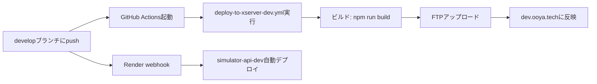
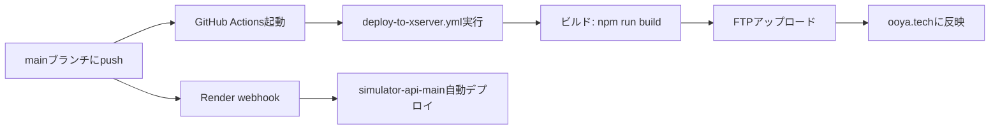

# 環境構成仕様書

最終更新日: 2025年7月28日

## 🏗️ 環境構成概要

本プロジェクトは3つの環境で構成されています：

| 環境 | 用途 | 公開URL | ブランチ | 自動デプロイ |
|------|------|---------|----------|------------|
| **開発環境** | ローカル開発 | http://localhost:5173 | develop | ❌ |
| **テスト環境** | 動作確認・検証 | https://dev.ooya.tech | develop | ✅ |
| **本番環境** | 本番運用 | https://ooya.tech | main | ✅ |

### 公開URL詳細

| 環境 | ドメイン | 用途 | アクセス制限 |
|------|----------|------|------------|
| **テスト環境** | dev.ooya.tech | 開発チームでの動作確認、ステークホルダーへのデモ | Basic認証あり |
| **本番環境** | ooya.tech | エンドユーザー向け本番サービス | なし |

## 📦 システム構成

### フロントエンド（React + Vite）

| 環境 | ホスティング | ビルドコマンド | 環境変数ファイル |
|------|------------|--------------|----------------|
| **開発** | ローカル | `npm run dev` | `.env.development` |
| **テスト** | Xserver (dev.ooya.tech) | `npm run build` | `.env.development` |
| **本番** | Xserver (ooya.tech) | `npm run build` | `.env.production` |

### FTPサーバー設定

| 環境 | FTPホスト | デプロイ先パス | 認証情報 |
|------|-----------|--------------|----------|
| **テスト** | sv12825.xserver.jp | `/home/xs565244/ooya.tech/public_html/dev.ooya.tech/` | GitHub Secrets使用 |
| **本番** | sv12825.xserver.jp | `/home/xs565244/ooya.tech/public_html/` | GitHub Secrets使用 |

**GitHub Secrets設定**:
- `FTP_SERVER`: sv12825.xserver.jp
- `FTP_USERNAME`: xs565244@sv12825.xserver.jp
- `FTP_PASSWORD`: （設定済み）

### バックエンド（FastAPI）

| 環境 | ホスティング | サービス名 | API URL |
|------|------------|----------|---------|
| **開発/テスト** | Render.com | real-estate-app | https://real-estate-app-rwf1.onrender.com |
| **本番** | Render.com | simulator-api-main | https://real-estate-app-1-iii4.onrender.com |

### データベース（Supabase）

| 環境 | プロジェクト | URL | 用途 |
|------|------------|-----|------|
| **開発/テスト** | ⚠️ 未分離 | https://gtnzhnsbdmkadfawuzmc.supabase.co | 開発・テスト共用 |
| **本番** | ⚠️ 未分離 | https://gtnzhnsbdmkadfawuzmc.supabase.co | 本番環境 |

> ⚠️ **注意**: 現在、Supabaseは本番とテスト環境で同じプロジェクトを使用しています。データの分離が必要です。

## 🔄 デプロイフロー

### 1. 開発環境（ローカル）
```bash
# フロントエンド起動
cd bolt_front
npm run dev

# バックエンド起動（オプション）
cd backend/simulator-api
uvicorn app:app --reload
```

### 2. テスト環境（dev.ooya.tech）


**ワークフローファイル**: `.github/workflows/deploy-to-xserver-dev.yml`
- トリガー: developブランチへのpush
- デプロイ先: `/home/xs565244/ooya.tech/public_html/dev.ooya.tech/`
- 認証: Basic認証あり（.htaccess）

### 3. 本番環境（ooya.tech）


**ワークフローファイル**: `.github/workflows/deploy-to-xserver.yml`
- トリガー: mainブランチへのpush
- デプロイ先: `/home/xs565244/ooya.tech/public_html/`
- 認証: なし

## 🔧 環境変数設定

### フロントエンド環境変数

#### .env.development（開発・テスト環境用）
```env
VITE_API_URL=https://real-estate-app-rwf1.onrender.com  # 開発用API
VITE_SUPABASE_URL=https://dev-project.supabase.co
VITE_SUPABASE_ANON_KEY=your-dev-anon-key
```

#### .env.production（本番環境用）
```env
VITE_API_URL=https://real-estate-app-1-iii4.onrender.com  # 本番用API
VITE_SUPABASE_URL=https://gtnzhnsbdmkadfawuzmc.supabase.co
VITE_SUPABASE_ANON_KEY=eyJhbGci...  # 本番用キー
```

### バックエンド環境変数（Renderで設定）
```env
PYTHON_VERSION=3.9
SUPABASE_URL=xxx  # 将来実装用
SUPABASE_SERVICE_KEY=xxx  # 将来実装用
```

## 📋 運用ルール

### ブランチ戦略
```
main
  └── 本番環境用（安定版のみ）
develop
  └── 開発・テスト環境用（新機能開発）
feature/*
  └── 機能開発用（developにマージ）
```

### デプロイの流れ
1. **機能開発**: feature/* ブランチで開発
2. **テスト**: develop にマージ → dev.ooya.tech で動作確認
3. **本番反映**: main にマージ → ooya.tech に自動反映

### 環境別の違い

| 項目 | テスト環境 | 本番環境 |
|------|----------|----------|
| **Basic認証** | あり | なし |
| **デバッグモード** | 有効 | 無効 |
| **エラー表示** | 詳細 | 最小限 |
| **キャッシュ** | 無効 | 有効 |
| **API制限** | なし | あり（予定） |

## ⚠️ 注意事項

### 1. 環境変数の管理
- `.env.*` ファイルはGitにコミットしない
- 本番用のキーは絶対に開発環境で使わない
- Supabaseのキーは環境ごとに分ける（※現在未対応）

### 将来的な改善点
1. **Supabaseの環境分離**
   - 開発用Supabaseプロジェクトの作成
   - テストデータと本番データの完全分離
   - 環境別のRow Level Security設定

2. **API認証の実装**
   - JWTトークンによる認証
   - 環境別のAPIキー管理

### 2. デプロイ時の確認事項
- **テスト環境**: Basic認証が正しく設定されているか
- **本番環境**: 不要なデバッグ情報が含まれていないか
- **両環境共通**: APIのURLが正しく設定されているか

### 3. Renderの制限事項
- **無料プラン**: 15分アクセスなしでスピンダウン
- **月間制限**: 750時間/月
- **コールドスタート**: 30-60秒かかる場合あり

## 🚀 新規開発者向けセットアップ

### 1. リポジトリのクローン
```bash
git clone https://github.com/startup-test-test/real-estate-app.git
cd real-estate-app
```

### 2. フロントエンドセットアップ
```bash
cd bolt_front
npm install
cp .env.development.example .env.development  # 環境変数設定
npm run dev
```

### 3. バックエンドセットアップ（オプション）
```bash
cd backend/simulator-api
pip install -r requirements.txt
uvicorn app:app --reload
```

### 4. 環境変数の設定
開発用の環境変数は、チームリーダーから共有を受けてください。

## 📞 連絡先

環境構成に関する質問は、開発チームまでお問い合わせください。

---
作成日: 2025年7月28日
作成者: 開発チーム