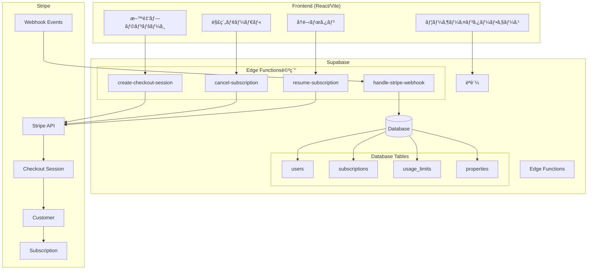
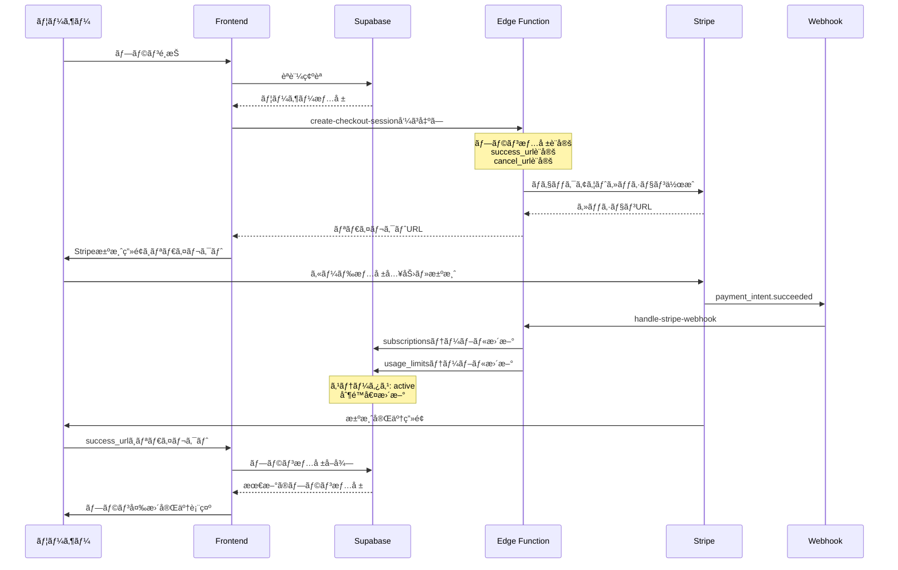
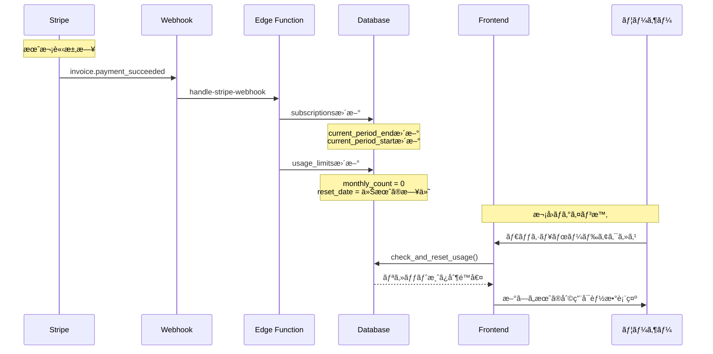
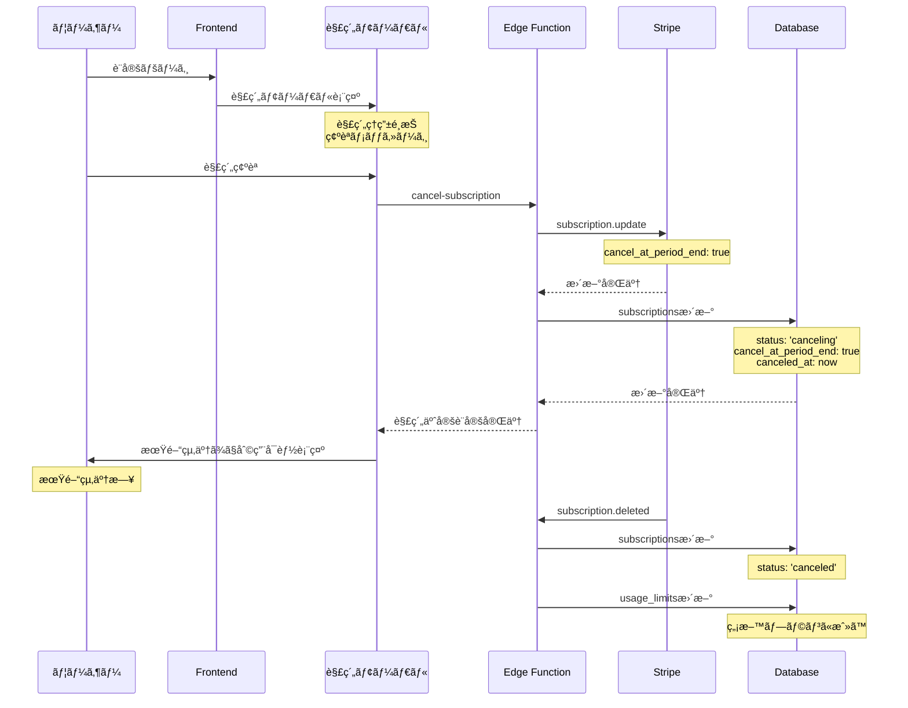
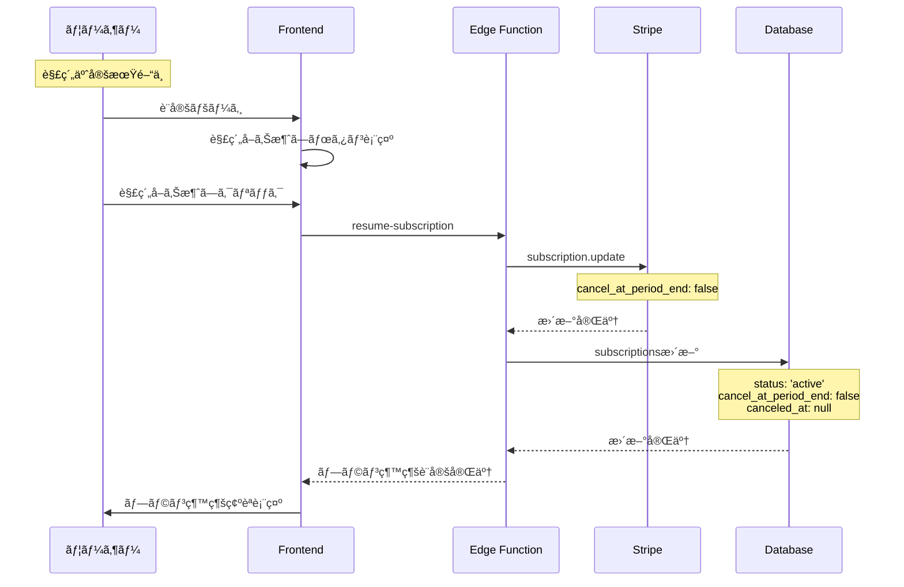
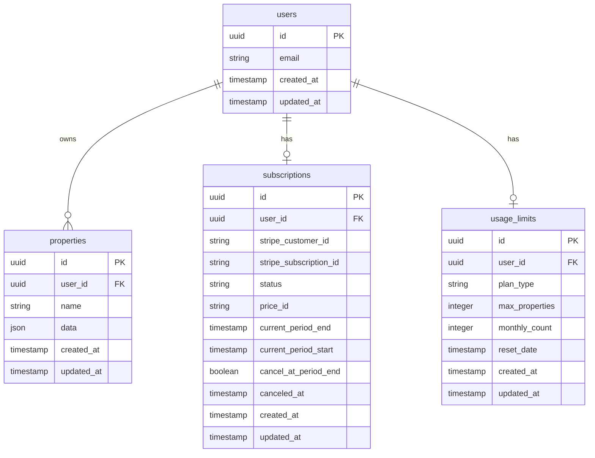
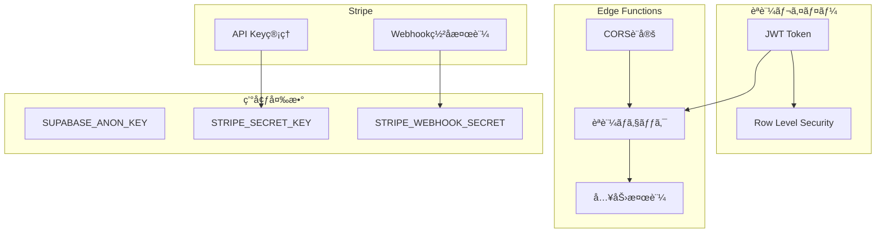
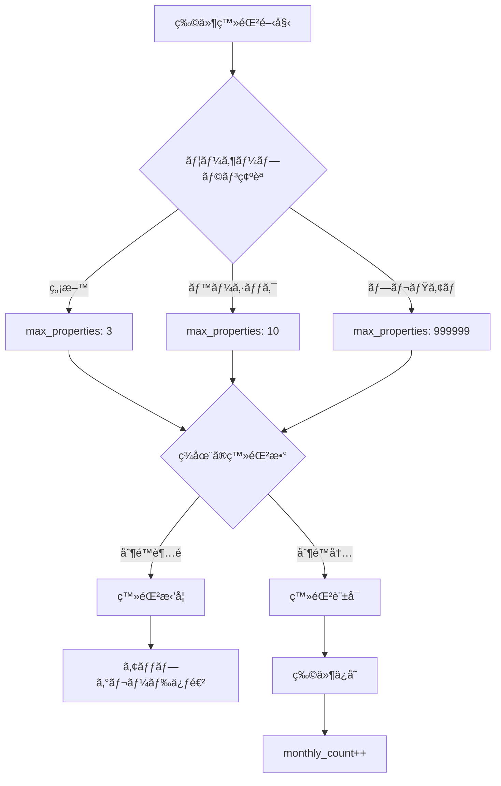
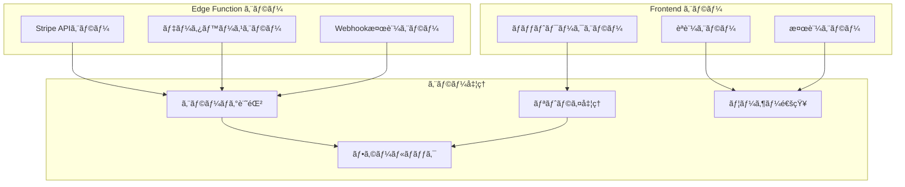

# 📊 Supabase/Stripe 月é¡èª²é‡‘システムアーキテクãƒãƒ£

作æˆæ—¥: 2025-08-15  
最終更新: 2025-08-15

## ğŸ—ï¸ ã‚·ã‚¹ãƒ†ãƒ å…¨ä½“ã‚¢ãƒ¼ã‚­ãƒ†ã‚¯ãƒãƒ£

```mermaid
graph TB
    subgraph "Frontend (React/Vite)"
        UI[ユーザーインターフェース]
        PlanPage[料金プランページ]
        CancelModal[解約モーダル]
        ResumeBtn[å†é–‹ãƒœã‚¿ãƒ³]
    end
    
    subgraph "Supabase"
        Auth[èªè¨¼]
        DB[(Database)]
        EdgeFunc[Edge Functions]
        
        subgraph "Edge Functions詳細"
            CreateCheckout[create-checkout-session]
            HandleWebhook[handle-stripe-webhook]
            CancelSub[cancel-subscription]
            ResumeSub[resume-subscription]
        end
        
        subgraph "Database Tables"
            Users[users]
            Subscriptions[subscriptions]
            UsageLimits[usage_limits]
            Properties[properties]
        end
    end
    
    subgraph "Stripe"
        StripeAPI[Stripe API]
        Checkout[Checkout Session]
        Customer[Customer]
        Subscription[Subscription]
        Webhook[Webhook Events]
    end
    
    UI --> Auth
    PlanPage --> CreateCheckout
    CancelModal --> CancelSub
    ResumeBtn --> ResumeSub
    
    CreateCheckout --> StripeAPI
    StripeAPI --> Checkout
    Checkout --> Customer
    Customer --> Subscription
    
    Webhook --> HandleWebhook
    HandleWebhook --> DB
    CancelSub --> StripeAPI
    ResumeSub --> StripeAPI
    
    DB --> Users
    DB --> Subscriptions
    DB --> UsageLimits
    DB --> Properties
```

## 💳 æ–°è¦ãƒ—ラン購入フロー

```mermaid
sequenceDiagram
    participant U as ユーザー
    participant F as Frontend
    participant S as Supabase
    participant E as Edge Function
    participant ST as Stripe
    participant W as Webhook
    
    U->>F: プランé¸æŠ
    F->>S: èªè¨¼ç¢ºèª
    S-->>F: ユーザー情報
    F->>E: create-checkout-session呼ã³å‡ºã—
    Note over E: プラン情報設定<br/>success_url設定<br/>cancel_url設定
    E->>ST: ãƒã‚§ãƒƒã‚¯ã‚¢ã‚¦ãƒˆã‚»ãƒƒã‚·ãƒ§ãƒ³ä½œæˆ
    ST-->>E: セッションURL
    E-->>F: リダイレクトURL
    F->>U: Stripe決済画é¢ã¸ãƒªãƒ€ã‚¤ãƒ¬ã‚¯ãƒˆ
    
    U->>ST: カード情報入力・決済
    ST->>W: payment_intent.succeeded
    W->>E: handle-stripe-webhook
    E->>S: subscriptionsテーブル更新
    E->>S: usage_limitsテーブル更新
    Note over S: ステータス: active<br/>制é™å€¤æ›´æ–°
    
    ST->>U: 決済完了画é¢
    U->>F: success_urlã¸ãƒªãƒ€ã‚¤ãƒ¬ã‚¯ãƒˆ
    F->>S: プラン情報å–å¾—
    S-->>F: 最新ã®ãƒ—ラン情報
    F->>U: プラン変更完了表示
```

## 🔄 月次更新フロー

```mermaid
sequenceDiagram
    participant ST as Stripe
    participant W as Webhook
    participant E as Edge Function
    participant DB as Database
    participant F as Frontend
    participant U as ユーザー
    
    Note over ST: 月次請求日
    ST->>W: invoice.payment_succeeded
    W->>E: handle-stripe-webhook
    E->>DB: subscriptionsæ›´æ–°
    Note over DB: current_period_endæ›´æ–°<br/>current_period_startæ›´æ–°
    
    E->>DB: usage_limitsæ›´æ–°
    Note over DB: monthly_count = 0<br/>reset_date = 今月ã®æ—¥ä»˜
    
    Note over F,U: 次å›ãƒ­ã‚°ã‚¤ãƒ³æ™‚
    U->>F: ダッシュボードアクセス
    F->>DB: check_and_reset_usage()
    DB-->>F: リセット済ã¿åˆ¶é™å€¤
    F->>U: æ–°ã—ã„月ã®åˆ©ç”¨å¯èƒ½æ•°è¡¨ç¤º
```

## ⌠解約フロー

```mermaid
sequenceDiagram
    participant U as ユーザー
    participant F as Frontend
    participant M as 解約モーダル
    participant E as Edge Function
    participant ST as Stripe
    participant DB as Database
    
    U->>F: 設定ページ
    F->>M: 解約モーダル表示
    Note over M: 解約ç†ç”±é¸æŠ<br/>確èªãƒ¡ãƒƒã‚»ãƒ¼ã‚¸
    U->>M: 解約確èª
    M->>E: cancel-subscription
    E->>ST: subscription.update
    Note over ST: cancel_at_period_end: true
    ST-->>E: 更新完了
    
    E->>DB: subscriptionsæ›´æ–°
    Note over DB: status: 'canceling'<br/>cancel_at_period_end: true<br/>canceled_at: now
    
    DB-->>E: 更新完了
    E-->>M: 解約予定設定完了
    M->>U: 期間終了ã¾ã§åˆ©ç”¨å¯èƒ½è¡¨ç¤º
    
    Note over U: 期間終了日
    ST->>E: subscription.deleted
    E->>DB: subscriptionsæ›´æ–°
    Note over DB: status: 'canceled'
    E->>DB: usage_limitsæ›´æ–°
    Note over DB: 無料プランã«æˆ»ã™
```

## 🔄 解約å–り消ã—フロー

```mermaid
sequenceDiagram
    participant U as ユーザー
    participant F as Frontend
    participant E as Edge Function
    participant ST as Stripe
    participant DB as Database
    
    Note over U: 解約予定期間中
    U->>F: 設定ページ
    F->>F: 解約å–り消ã—ボタン表示
    U->>F: 解約å–り消ã—クリック
    F->>E: resume-subscription
    E->>ST: subscription.update
    Note over ST: cancel_at_period_end: false
    ST-->>E: 更新完了
    
    E->>DB: subscriptionsæ›´æ–°
    Note over DB: status: 'active'<br/>cancel_at_period_end: false<br/>canceled_at: null
    
    DB-->>E: 更新完了
    E-->>F: プラン継続設定完了
    F->>U: プラン継続確èªè¡¨ç¤º
```

## 📊 データベース構造

```mermaid
erDiagram
    users ||--o{ properties : owns
    users ||--o| subscriptions : has
    users ||--o| usage_limits : has
    
    users {
        uuid id PK
        string email
        timestamp created_at
        timestamp updated_at
    }
    
    subscriptions {
        uuid id PK
        uuid user_id FK
        string stripe_customer_id
        string stripe_subscription_id
        string status
        string price_id
        timestamp current_period_end
        timestamp current_period_start
        boolean cancel_at_period_end
        timestamp canceled_at
        timestamp created_at
        timestamp updated_at
    }
    
    usage_limits {
        uuid id PK
        uuid user_id FK
        string plan_type
        integer max_properties
        integer monthly_count
        timestamp reset_date
        timestamp created_at
        timestamp updated_at
    }
    
    properties {
        uuid id PK
        uuid user_id FK
        string name
        json data
        timestamp created_at
        timestamp updated_at
    }
```

## 🔠セキュリティ構æˆ

```mermaid
graph TD
    subgraph "èªè¨¼ãƒ¬ã‚¤ãƒ¤ãƒ¼"
        JWT[JWT Token]
        RLS[Row Level Security]
    end
    
    subgraph "Edge Functions"
        CORS[CORS設定]
        Auth[èªè¨¼ãƒã‚§ãƒƒã‚¯]
        Validation[入力検証]
    end
    
    subgraph "Stripe"
        WebhookSig[Webhookç½²å検証]
        APIKey[API Key管ç†]
    end
    
    subgraph "環境変数"
        SupabaseKeys[SUPABASE_ANON_KEY]
        StripeKeys[STRIPE_SECRET_KEY]
        WebhookSecret[STRIPE_WEBHOOK_SECRET]
    end
    
    JWT --> RLS
    JWT --> Auth
    CORS --> Auth
    Auth --> Validation
    WebhookSig --> WebhookSecret
    APIKey --> StripeKeys
```

## 🯠プラン別制é™ç®¡ç†

| プラン | 月é¡æ–™é‡‘ | 物件登録数 | シミュレーション | リセット |
|-------|---------|-----------|---------------|---------|
| **無料プラン** | Â¥0 | 3件ã¾ã§ | 制é™ãªã— | æœˆåˆ |
| **ベーシック** | Â¥500 | 10件ã¾ã§ | 制é™ãªã— | æœˆåˆ |
| **プレミアム** | Â¥1,500 | ç„¡åˆ¶é™ | 制é™ãªã— | - |

### 制é™ãƒã‚§ãƒƒã‚¯ãƒ•ãƒ­ãƒ¼

```mermaid
graph TD
    Start[物件登録開始] --> Check{ユーザープラン確èª}
    Check -->|ç„¡æ–™| Free[max_properties: 3]
    Check -->|ベーシック| Basic[max_properties: 10]
    Check -->|プレミアム| Premium[max_properties: 999999]
    
    Free --> Count{ç¾åœ¨ã®ç™»éŒ²æ•°}
    Basic --> Count
    Premium --> Count
    
    Count -->|制é™å†…| Allow[登録許å¯]
    Count -->|制é™è¶…é| Deny[登録拒å¦]
    
    Deny --> Upgrade[アップグレード促進]
    Allow --> Save[物件ä¿å­˜]
    
    Save --> UpdateCount[monthly_count++]
```

## 🚨 エラーãƒãƒ³ãƒ‰ãƒªãƒ³ã‚°

```mermaid
graph TD
    subgraph "Frontend エラー"
        NetworkError[ãƒãƒƒãƒˆãƒ¯ãƒ¼ã‚¯ã‚¨ãƒ©ãƒ¼]
        AuthError[èªè¨¼ã‚¨ãƒ©ãƒ¼]
        ValidationError[検証エラー]
    end
    
    subgraph "Edge Function エラー"
        StripeError[Stripe APIエラー]
        DBError[データベースエラー]
        WebhookError[Webhook検証エラー]
    end
    
    subgraph "エラー処ç†"
        Retry[リトライ処ç†]
        Logging[エラーログ記録]
        UserNotify[ユーザー通知]
        Fallback[フォールãƒãƒƒã‚¯]
    end
    
    NetworkError --> Retry
    AuthError --> UserNotify
    ValidationError --> UserNotify
    
    StripeError --> Logging
    DBError --> Logging
    WebhookError --> Logging
    
    Logging --> Fallback
    Retry --> Fallback
```

## 📠é‡è¦ãªå®Ÿè£…ãƒã‚¤ãƒ³ãƒˆ

### 1. Webhook処ç†ã®å†ªç­‰æ€§
- åŒã˜ã‚¤ãƒ™ãƒ³ãƒˆãŒè¤‡æ•°å›é€ä¿¡ã•ã‚Œã¦ã‚‚çµæœãŒåŒã˜ã«ãªã‚‹ã‚ˆã†å®Ÿè£…
- イベントIDを記録ã—ã¦é‡è¤‡å‡¦ç†ã‚’防ã

### 2. 月次リセット処ç†
- `check_and_reset_usage`関数ã§è‡ªå‹•ãƒªã‚»ãƒƒãƒˆ
- タイムゾーン考慮（JST）

### 3. プラン変更時ã®æ—¥å‰²ã‚Šè¨ˆç®—
- StripeãŒè‡ªå‹•ã§æ—¥å‰²ã‚Šè¨ˆç®—
- å³åº§ã«ãƒ—ラン切り替ãˆ

### 4. 解約時ã®æŒ™å‹•
- 期間終了ã¾ã§åˆ©ç”¨å¯èƒ½
- 解約å–り消ã—å¯èƒ½æœŸé–“ã®è¨­å®š

### 5. エラー時ã®ãƒ•ã‚©ãƒ¼ãƒ«ãƒãƒƒã‚¯
- Stripeエラー時ã¯æ—¢å­˜ã®ãƒ—ラン維æŒ
- ユーザーã¸ã®é©åˆ‡ãªãƒ•ã‚£ãƒ¼ãƒ‰ãƒãƒƒã‚¯

## 🔧 開発・テスト環境

| 環境 | Stripe | Supabase | URL |
|-----|--------|----------|-----|
| **開発** | テストモード | 開発プロジェクト | localhost:5173 |
| **ステージング** | テストモード | 開発プロジェクト | dev.ooya.tech |
| **本番** | 本番モード | 本番プロジェクト | ooya.tech |

## 📚 関連ファイル

### Frontend
- `/src/pages/PricingPlans.tsx` - 料金プランページ
- `/src/components/CancelSubscriptionModal.tsx` - 解約モーダル
- `/src/utils/subscriptionManager.ts` - プラン管ç†ãƒ¦ãƒ¼ãƒ†ã‚£ãƒªãƒ†ã‚£

### Edge Functions
- `/supabase/functions/create-checkout-session/` - 決済セッション作æˆ
- `/supabase/functions/handle-stripe-webhook/` - Webhook処ç†
- `/supabase/functions/cancel-subscription/` - 解約処ç†
- `/supabase/functions/resume-subscription/` - å†é–‹å‡¦ç†

### Database
- `/supabase/migrations/20240812_stripe_tables.sql` - Stripeテーブル定義
- `/supabase/migrations/20250813_fix_monthly_reset.sql` - 月次リセット関数

---

作æˆè€…: Claude Code  
レビュー: 未実施