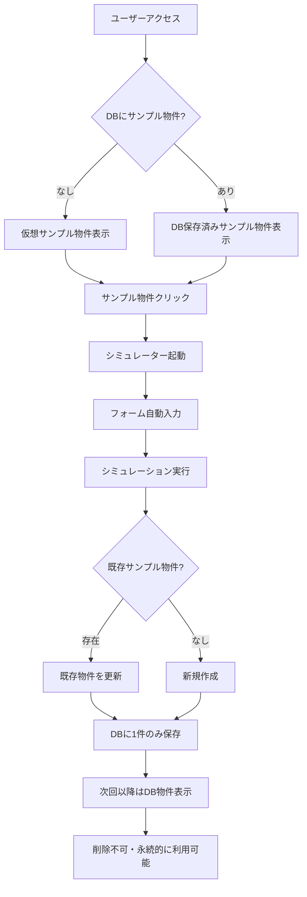

# サンプル物件機能仕様書

## 📅 作成情報
- **作成日**: 2025年9月11日
- **更新日**: 2025年9月13日
- **バージョン**: 1.1
- **作成者**: AI Assistant

## 🎯 機能概要
全ユーザーがシミュレーション機能を体験できるよう、事前設定済みのサンプル物件を提供する機能。ワンクリックで完全なシミュレーション体験を可能にし、サービスの価値を即座に理解してもらうことを目的とする。削除不可の永続的な学習リソースとして機能する。

## 📋 機能仕様

### 1. サンプル物件の表示

#### 1.1 表示条件（v1.1更新）
- **全ユーザー対象**: DBにサンプル物件が存在しない全ユーザーに表示
- **DBチェック**: DBに既にサンプル物件が存在する場合は、フロントエンドの仮想サンプル物件は非表示
- **重複防止**: 常に1つのサンプル物件のみ表示
- **永続性**: 一度DBに保存されたサンプル物件は削除不可

#### 1.2 表示場所
- **マイページ**: 物件一覧の最初に表示
- **識別要素**: 
  - 青色の「サンプル」バッジ
  - 物件名：【サンプル】シミュレーション
  - 説明文：「これはサンプル物件です」

### 2. サンプル物件のデータ

#### 2.1 基本情報
```javascript
{
  id: 'sample-property-001',  // 仮想ID
  propertyName: '【サンプル】シミュレーション',
  location: '東京都サンプル住所',
  propertyType: 'RC造',
  propertyImageUrl: 'https://images.unsplash.com/photo-1545324418-cc1a3fa10c00?w=800&q=80'
}
```

#### 2.2 物件詳細データ
| 項目 | 値 | 説明 |
|------|-----|------|
| 購入価格 | 2,800万円 | リアルな投資用ワンルーム価格 |
| 月額賃料 | 12.5万円 | 渋谷区の相場を反映 |
| 表面利回り | 5.36% | 都心部の標準的な利回り |
| 建物構造 | RC造 | 鉄筋コンクリート造 |
| 築年数 | 10年 | 2014年築設定 |
| 専有面積 | 25.5㎡ | ワンルームの標準サイズ |
| 土地持分 | 18.2㎡ | 区分所有の土地持分 |
| ローン金額 | 2,520万円 | 頭金10%設定 |
| 金利 | 2.3% | 現実的な投資用ローン金利 |
| 借入期間 | 35年 | 標準的な借入期間 |

#### 2.3 シミュレーション結果
| 指標 | 値 | 説明 |
|------|-----|------|
| 実質利回り | 4.12% | 経費控除後の利回り |
| IRR | 8.7% | 内部収益率 |
| DSCR | 1.23 | 返済余裕率 |
| 月間CF | 15,800円 | 月間キャッシュフロー |
| 年間CF | 189,600円 | 年間キャッシュフロー |
| 10年後売却益 | 545万円 | 売却想定利益 |

### 3. 機能動作

#### 3.1 クリック時の動作
1. マイページでサンプル物件をクリック
2. シミュレーターページに遷移（`/simulator?view=sample-property-001`）
3. 全フォームフィールドに自動入力
4. 物件画像も自動表示
5. すぐにシミュレーション実行可能

#### 3.2 シミュレーション実行時
1. **初回実行**: 新規物件としてDBに保存
2. **2回目以降**: 既存のサンプル物件を更新（重複作成しない）
3. **保存メッセージ**: 通常の物件と同じ扱い

### 4. 削除制御

#### 4.1 削除不可設定
- **対象**: 
  - ID が `sample-property-001` の物件
  - 物件名が「【サンプル】」で始まる物件
- **動作**: 
  - 削除ボタンクリック時にアラート表示
  - メッセージ：「サンプル物件は削除できません。\n\nサンプル物件は体験用のため、削除することはできません。」

#### 4.2 UI表示
- **フロントエンド仮想物件**: 削除ボタンを「削除不可」に変更
- **DB保存済み物件**: 削除ボタンはあるが、クリック時にアラート

### 5. 実装ファイル

#### 5.1 データ定義
- `/bolt_front/src/data/sampleProperty.ts`
  - サンプル物件のマスターデータ
  - 表示判定関数
  - チュートリアル完了状態管理

#### 5.2 表示制御
- `/bolt_front/src/pages/MyPage.tsx`
  - サンプル物件の表示/非表示制御
  - 削除制御
  - 重複防止ロジック

#### 5.3 自動入力
- `/bolt_front/src/pages/Simulator.tsx`
  - URLパラメータ判定
  - フォーム自動入力処理
  - 保存時の重複防止

#### 5.4 画像表示
- `/bolt_front/src/components/ImageUpload.tsx`
  - currentImageUrl変更時の自動更新

## 🔄 データフロー（v1.1更新）



## 🎯 期待効果（v1.1更新）

### ユーザー体験向上
1. **即座の価値体験**: 全ユーザーが機能を体験可能
2. **学習コスト削減**: 入力の手間なく結果を確認
3. **信頼性向上**: リアルな数値で説得力のある結果
4. **永続的な学習リソース**: いつでも基準となるサンプルを参照可能
5. **統一された体験**: 全ユーザーが同じチュートリアルを利用可能

### ビジネス効果
1. **コンバージョン向上**: 初回離脱率の削減
2. **理解促進**: サービス価値の即座の理解
3. **エンゲージメント**: 実際の物件登録への誘導
4. **サポート効率化**: 全員が同じサンプルを持つため説明が容易

## ⚠️ 注意事項

### 運用上の注意
1. サンプル物件のデータは定期的に見直し、市場実態に合わせて更新
2. サンプル物件の削除は管理画面からも不可
3. ユーザーのサンプル物件はユーザーごとに1つのみ

### 技術的注意
1. `sample-property-001` はDBには存在しない仮想ID
2. DBに保存時は実際のUUIDが付与される
3. 物件名の「【サンプル】」プレフィックスで識別

## 📊 メトリクス

### 計測項目
1. サンプル物件のクリック率
2. シミュレーション実行率
3. サンプル物件から実物件登録への転換率
4. 初回ユーザーの継続率

### 成功指標
- 初回離脱率: 50%以下
- サンプル物件体験率: 80%以上
- 実物件登録転換率: 30%以上

## 📝 v1.1更新内容（2025年9月13日）

### 主な変更点
1. **対象ユーザーの拡大**: 
   - 変更前：新規ユーザー（登録物件0件）のみ
   - 変更後：DBにサンプル物件がない全ユーザー

2. **「使い方を確認」ボタン**:
   - 変更前：サンプル物件がある場合のみ表示
   - 変更後：全ユーザーに表示

3. **実装コード変更**:
   ```javascript
   // MyPage.tsx 613行目
   // 変更前
   const showSample = !hasSampleInDB && simulations.length === 0;
   // 変更後
   const showSample = !hasSampleInDB;
   ```

### 変更理由
- 既存ユーザーもチュートリアル機能を利用できるようにするため
- 永続的な学習リソースとして全ユーザーに提供
- サポート時の説明を容易にするため

## 🔄 今後の改善案

### 短期
1. 複数のサンプル物件パターン（地方物件、一棟物件など）
2. サンプル物件の結果説明ポップアップ
3. チュートリアルの改善とカスタマイズ

### 中長期
1. AIによる推奨物件提案
2. ユーザーの興味に応じたサンプル物件の自動選択
3. インタラクティブなガイド機能

---

**初版レビュー**: 未実施  
**初版承認**: 未実施
**v1.1更新**: 2025年9月13日 実装済み