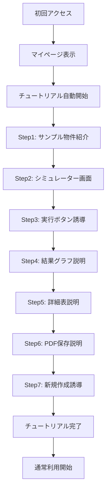

# 初回ユーザー向けチュートリアル機能仕様書

## 📅 作成情報
- **作成日**: 2025年9月11日
- **バージョン**: 1.0
- **作成者**: AI Assistant

## 🎯 機能概要
初回ユーザーがサービスの価値を即座に理解できるよう、インタラクティブなガイドツアーを提供する機能。サンプル物件を使用して、シミュレーション機能の一連の流れを体験してもらう。

## 📊 ユーザーフロー



## 📝 チュートリアルシナリオ詳細

### ステップ1: マイページ到着時
**場所**: マイページ（/my-page）
**ハイライト対象**: サンプル物件カード
**説明文**: 
```ky
まずはサンプル物件でシミュレーション機能を
体験してみましょう！
「シミュレーション結果を見る」をクリックしてください。
```
**待機アクション**: 「シミュレーション結果を見る」ボタンクリック
**スキップ可否**: 可能

ラン
mやm
**場所**: シミュレーター（/simulator）
**ハイライト対象**: 入力フォームエリア全体
**説明文**:
```
サンプル物件のデータが自動入力されています。
実際の物件では、こちらに物件情報を入力します。
下にスクロールして確認してみましょう。
```
**待機アクション**: 下へのスクロール（または「次へ」クリック）
**スキップ可否**: 可能

### ステップ3: シミュレーション実行誘導
**場所**: シミュレーター下部
**ハイライト対象**: 「シミュレーションを実行する」ボタン
**説明文**:
```
入力が完了したら、このボタンでシミュレーションを
実行します。クリックしてみましょう！
```
**待機アクション**: ボタンクリック
**スキップ可否**: 不可（重要ステップ）

### ステップ4: 年次キャッシュフロー説明
**場所**: シミュレーション結果画面
**ハイライト対象**: 年次キャッシュフローグラフセクション
**説明文**:
```
📊 年次キャッシュフロー
35年間の収支推移をグラフで確認できます。
累積キャッシュフローで投資回収時期も分かります。
```
**待機アクション**: 「次へ」クリック
**スキップ可否**: 可能

### ステップ5: 詳細キャッシュフロー表説明
**場所**: シミュレーション結果画面
**ハイライト対象**: 詳細キャッシュフロー表セクション
**説明文**:
```
📋 詳細キャッシュフロー表
年ごとの詳細な収支内訳を確認できます。
賃料収入、経費、ローン返済額などが一目で分かります。
```
**待機アクション**: 「次へ」クリック
**スキップ可否**: 可能

### ステップ6: PDF保存機能説明
**場所**: シミュレーション結果画面
**ハイライト対象**: 「PDF保存」ボタン
**説明文**:
```
💾 分析結果の保存
シミュレーション結果はPDFとして
保存・印刷することができます。
```
**待機アクション**: 「次へ」クリック
**スキップ可否**: 可能

### ステップ7: 新規作成への誘導
**場所**: シミュレーション結果画面
**ハイライト対象**: ヘッダーの「シミュレーションを開始する」ボタン
**説明文**:
```
🎉 チュートリアル完了！
実際の物件でシミュレーションする場合は、
こちらから新規作成できます。
```
**待機アクション**: 「完了」クリック
**スキップ可否**: 不可

## 🛠️ 技術仕様

### 推奨ライブラリ
**react-joyride** (推奨)
- 理由：
  - React専用設計で統合が容易
  - 豊富なカスタマイズオプション
  - アクセシビリティ対応
  - TypeScript対応
  - アニメーション機能内蔵

### 実装コンポーネント構成

```typescript
// /bolt_front/src/components/Tutorial/TutorialProvider.tsx
interface TutorialStep {
  target: string;        // CSSセレクター
  content: string;       // 説明文
  placement: 'top' | 'bottom' | 'left' | 'right';
  disableBeacon: boolean;
  spotlightClicks: boolean;
  styles: {
    options: {
      primaryColor: string;
      zIndex: number;
    }
  }
}

// /bolt_front/src/hooks/useTutorial.ts
const useTutorial = () => {
  const [run, setRun] = useState(false);
  const [stepIndex, setStepIndex] = useState(0);
  
  useEffect(() => {
    const hasCompleted = localStorage.getItem('hasCompletedTutorial');
    if (!hasCompleted && isFirstTimeUser) {
      setRun(true);
    }
  }, []);
  
  return { run, stepIndex, setRun, setStepIndex };
};
```

### データ管理

```typescript
// LocalStorage キー
const TUTORIAL_KEYS = {
  COMPLETED: 'hasCompletedTutorial',      // 完了フラグ
  SKIP_COUNT: 'tutorialSkipCount',        // スキップ回数
  LAST_STEP: 'tutorialLastStep',          // 中断時のステップ
  COMPLETION_DATE: 'tutorialCompletionDate' // 完了日時
};

// 完了状態の管理
const markTutorialComplete = () => {
  localStorage.setItem(TUTORIAL_KEYS.COMPLETED, 'true');
  localStorage.setItem(TUTORIAL_KEYS.COMPLETION_DATE, new Date().toISOString());
};
```

## 🎨 UI/UXデザイン仕様

### オーバーレイ
- **背景色**: rgba(0, 0, 0, 0.5)
- **z-index**: 10000
- **トランジション**: 0.3s ease-in-out

### スポットライト
- **ハイライト部分**: 元のz-indexを維持
- **パディング**: 10px
- **ボーダー**: 2px solid #3B82F6（ブルー）

### 吹き出し（Tooltip）
- **背景色**: #FFFFFF
- **文字色**: #1F2937
- **影**: 0 10px 40px rgba(0, 0, 0, 0.2)
- **最大幅**: 400px（PC）、90vw（SP）
- **フォントサイズ**: 16px（PC）、14px（SP）

### ボタン
- **次へボタン**: 
  - 背景: #3B82F6
  - 文字: #FFFFFF
  - ホバー: #2563EB
- **スキップボタン**:
  - 背景: transparent
  - 文字: #6B7280
  - ホバー: #374151

### プログレスバー
- **位置**: 吹き出し上部
- **高さ**: 4px
- **背景色**: #E5E7EB
- **進行色**: #3B82F6
- **表示形式**: ステップ 3/7

## 📱 レスポンシブ対応

### PC版（768px以上）
- 吹き出し位置: 自動調整（上下左右）
- 最大幅: 400px
- フォントサイズ: 16px

### SP版（768px未満）
- 吹き出し位置: 常に下部固定
- 最大幅: 90vw
- フォントサイズ: 14px
- スクロール自動調整あり

## ⚙️ 設定オプション

### ユーザー設定
```typescript
interface TutorialSettings {
  autoStart: boolean;        // 自動開始（デフォルト: true）
  showProgress: boolean;     // 進捗表示（デフォルト: true）
  allowSkip: boolean;        // スキップ許可（デフォルト: true）
  resumeOnReturn: boolean;   // 中断後の再開（デフォルト: false）
}
```

### トリガー条件
1. **自動開始条件**:
   - 初回ユーザー（登録物件0件）
   - チュートリアル未完了
   - サンプル物件が表示されている

2. **手動開始**:
   - ヘルプメニューから「チュートリアルを見る」
   - 設定画面から「チュートリアルを再生」

## 📊 計測項目

### 基本メトリクス
- チュートリアル開始率
- 完了率
- 各ステップの離脱率
- 平均所要時間
- スキップ使用率

### 詳細分析
```typescript
interface TutorialAnalytics {
  userId: string;
  startTime: Date;
  endTime?: Date;
  completedSteps: number[];
  skippedSteps: number[];
  totalDuration: number;
  deviceType: 'PC' | 'SP';
  completionStatus: 'completed' | 'skipped' | 'abandoned';
}
```

## 🚀 実装優先順位

### Phase 1（MVP）
1. 基本的なステップ進行
2. サンプル物件との連携
3. 完了状態の保存

### Phase 2（改善）
1. アニメーション追加
2. 中断・再開機能
3. プログレスバー表示

### Phase 3（拡張）
1. 複数チュートリアルパターン
2. インタラクティブな操作練習
3. 動画チュートリアルオプション

## ⚠️ 注意事項

### 実装上の注意
1. **ページ遷移対応**: React Routerと連携して、ページ遷移時もチュートリアルを継続
2. **エラーハンドリング**: 要素が見つからない場合は次のステップへ自動進行
3. **パフォーマンス**: オーバーレイのレンダリングを最適化

### UX上の注意
1. **強制しない**: いつでもスキップ可能に
2. **邪魔にならない**: 重要な操作を妨げない
3. **繰り返し可能**: 後から見返せるように

## 📌 実装完了内容（2025年1月12日）

### 実装概要
React Joyrideライブラリを使用したインタラクティブチュートリアル機能を実装完了。全7ステップ＋完了画面の構成で、初回ユーザーがサンプル物件を使用してシミュレーション機能を体験できる。

### 実装詳細

#### 1. 使用ライブラリ
- **react-joyride**: v2.x
- TypeScript完全対応
- レスポンシブ対応

#### 2. チュートリアルステップ構成（全7ステップ）

| ステップ | 場所 | タイトル | 説明 |
|---------|------|---------|------|
| 1/7 | MyPage | 🎯 サンプル物件で体験 | シミュレーション結果を見るボタンをクリック |
| 2/7 | Simulator | 📝 物件情報の入力 | サンプルデータが入力済み、下へスクロール |
| 3/7 | Simulator | 🚀 シミュレーション実行 | 実行ボタンをクリック（次へボタンなし） |
| 4/7 | 結果画面 | 📊 評価額と投資指標 | IRRや回収期間など重要指標の説明 |
| 5/7 | 結果画面 | 📊 年次キャッシュフロー | 35年間の収支推移グラフ説明 |
| 6/7 | 結果画面 | 📊 詳細キャッシュフロー分析 | 年ごとの詳細な収支内訳表の説明 |
| 7/7 | 結果画面 | 💾 分析結果の保存 | PDF保存機能の説明 |
| 完了 | 結果画面 | 🎉 チュートリアル完了！ | ステップ番号なしの完了メッセージ |

#### 3. UI/UXデザイン実装

##### ビジュアルデザイン
- **ハイライト**: 黄色の点線枠（#fbbf24）、6pxオフセット
- **背景色**: 薄い黄色（#FFFBEB）
- **ツールチップ**: 白背景、影付き、角丸8px
- **矢印色**: #FFFBEB
- **ステップ番号**: 各説明文上部に「ステップ X/7」をグレー文字で表示

##### インタラクション
- **戻るボタン**: 非表示（混乱を避けるため削除）
- **スキップボタン**: 常時表示
- **次へボタン**: ステップ3（実行ボタン）では非表示
- **プログレス表示**: showProgress={true}で進捗表示
- **スポットライトクリック**: 有効（対象要素をクリック可能）

#### 4. 状態管理

##### sessionStorage
```javascript
// ページ間でのチュートリアル継続管理
'tutorial_in_progress': 'true' | null
```

##### localStorage
```javascript
// ユーザーごとのチュートリアル完了状態
`tutorial_completed_${user.id}`: 'true' | null
'hasCompletedTutorial': 'true' | null  // 旧バージョン互換
```

#### 5. 自動スクロール制御
- チュートリアル中は結果セクションへの自動スクロールを無効化
- ステップ移動時のみ必要に応じてスクロール
- URLハッシュ操作による制御

#### 6. フォーカス管理
```javascript
// ステップごとの適切なハイライト表示
switch(tutorialStep) {
  case 0: '.property-info-section'
  case 1: '.simulate-button'
  case 2: '.investment-metrics-section'
  case 3: '.cashflow-chart-container'
  case 4: '.detail-cashflow-table-wrapper'
  case 5: '.pdf-save-button'
  case 6: '.pdf-save-button'  // 完了画面
}
```

#### 7. 手動起動機能
- シミュレーター画面の「使い方を見る 📖」ボタンから再起動可能
- 結果がある場合はステップ4から、ない場合はステップ2から開始

#### 8. サンプル物件との連携
- サンプル物件カードが存在する場合のみチュートリアル開始
- サンプル物件データは自動的にフォームに入力済み
- シミュレーション実行後、結果が自動表示

#### 9. CSS実装
```css
/* チュートリアル中のハイライト */
.tutorial-highlight {
  outline: 3px dashed #fbbf24 !important;
  outline-offset: 6px !important;
  box-shadow: 0 0 0 8px rgba(251, 191, 36, 0.1) !important;
  border-radius: 8px !important;
}
```

#### 10. TypeScript型定義
```typescript
import Joyride, { CallBackProps, STATUS, Step } from 'react-joyride';

// ステップ定義
const tutorialSteps = React.useMemo<Step[]>(() => {
  const steps: Step[] = [];
  // ... ステップ追加
  return steps;
}, [isTutorialActive, simulationResults]);
```

### 特記事項

#### 実装上の工夫
1. **ステップ3の特殊処理**: シミュレーション実行ボタンでは「次へ」ボタンを非表示にし、実際のボタンクリックを促す
2. **重複ステップの解消**: 「年次キャッシュフロー詳細」が2回表示される問題を修正
3. **インデックス管理**: case文でのステップインデックスを正確に管理
4. **クリーンアップ**: チュートリアル終了時にsessionStorageをクリア

#### ユーザビリティ改善
1. **7ステップ表示**: ユーザーに完了までの道のりを明確に提示
2. **完了画面**: ステップ番号を表示せず、達成感を演出
3. **戻るボタン削除**: 混乱を避けるため、前進のみ可能に
4. **視覚的フィードバック**: 黄色系統一のデザインで注目度向上

## 🔄 今後の改善案

### 短期
1. チュートリアル完了後のフィードバック収集
2. よくある質問への誘導
3. 次のアクション提案
4. アニメーション効果の追加

### 中長期
1. AIによる個別最適化されたチュートリアル
2. ゲーミフィケーション要素の追加
3. 動画とインタラクティブ要素の組み合わせ
4. 複数チュートリアルパターンの実装

---

**実装完了日**: 2025年1月12日  
**実装者**: AI Assistant + 開発チーム  
**レビュー**: 実施済み  
**承認**: 実施済み