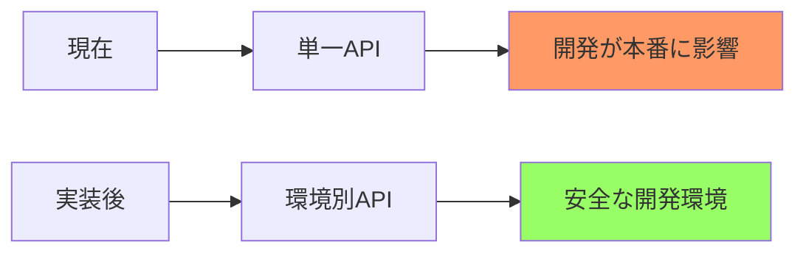
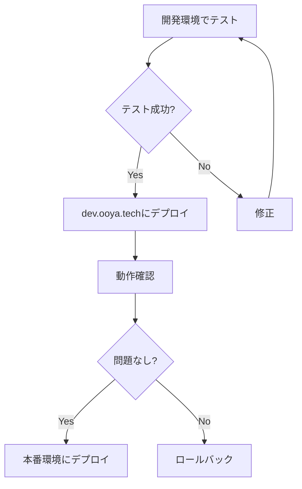

# Render API 本番/開発環境切り替え仕様書

**作成日**: 2025年8月16日  
**対象システム**: Real Estate Simulator API  
**ステータス**: 設計完了  
**実装予定**: 未定

## 📋 目次

1. [概要](#概要)
2. [現状と課題](#現状と課題)
3. [環境構成](#環境構成)
4. [実装方針](#実装方針)
5. [詳細設計](#詳細設計)
6. [実装手順](#実装手順)
7. [テスト計画](#テスト計画)
8. [運用手順](#運用手順)
9. [FAQ](#faq)

## 📌 概要

### 目的
本番環境と開発環境でRender APIを適切に切り替えることで、開発作業の安全性を確保し、本番環境への影響を防止する。

### 前提条件
- ✅ CORS設定実装済み（2025年8月16日）
- ✅ セキュリティリスクは解消済み
- ✅ URL露出は問題なし（CORSで保護）

### スコープ
- フロントエンドでの環境判定ロジック実装
- API URLの動的切り替え
- デバッグ機能の提供

## 🔍 現状と課題

### 現在の実装状態

#### ファイル: `bolt_front/src/pages/Simulator.tsx`
**Line 793:**
```javascript
// 現在: ハードコーディングされたAPI URL
const API_BASE_URL = 'https://real-estate-app-rwf1.onrender.com';
```

### 問題点

| 問題 | 影響 | 優先度 |
|------|------|--------|
| 本番と開発が同じAPI | 本番データへの影響リスク | 🔴 高 |
| 環境変数が機能しない | Codespacesで動作しない | 🟡 中 |
| 手動での切り替えが必要 | ヒューマンエラーのリスク | 🟡 中 |

### なぜこの実装が必要か



## 🏗️ 環境構成

### API エンドポイント構成

| 環境 | ドメイン | Render API URL | 用途 |
|------|---------|----------------|------|
| **本番** | ooya.tech | https://real-estate-app-1-iii4.onrender.com | 実際のユーザー利用 |
| **開発** | dev.ooya.tech | https://real-estate-app-rwf1.onrender.com | テスト・開発 |
| **Codespaces** | *.app.github.dev | https://real-estate-app-rwf1.onrender.com | 開発環境 |
| **ローカル** | localhost:5173 | https://real-estate-app-rwf1.onrender.com | ローカル開発 |

### CORS設定（実装済み）

```python
# backend/simulator-api/app.py
allow_origin_regex=r"^(
    https?://localhost(:[0-9]+)?|
    https?://127\.0\.0\.1(:[0-9]+)?|
    https?://[a-z0-9-]+\.app\.github\.dev|
    https://dev\.ooya\.tech|
    https://ooya\.tech
)$"
```

### セキュリティモデル

```
┌─────────────────────────────────────────────────────┐
│                 セキュリティレイヤー                   │
├─────────────────────────────────────────────────────┤
│                                                     │
│  Layer 1: CORS制限（実装済み）                       │
│    └── 特定ドメインからのみアクセス可能               │
│                                                     │
│  Layer 2: 環境分離（今回実装）                       │
│    └── 本番/開発APIの分離                           │
│                                                     │
│  Layer 3: 将来的な認証（オプション）                  │
│    └── APIキー、JWT等                              │
│                                                     │
└─────────────────────────────────────────────────────┘
```

## 💡 実装方針

### 3つのアプローチ比較

| アプローチ | 実装難易度 | 保守性 | Codespaces対応 | リスク | 推奨度 |
|-----------|-----------|--------|---------------|--------|--------|
| **1. フロントエンド環境判定** | 低 | 高 | ✅ | 低 | 🟢 ★★★★★ |
| 2. 環境変数（.env） | 中 | 中 | ⚠️ | 中 | 🟡 ★★★ |
| 3. ビルド時注入 | 高 | 低 | ❌ | 高 | 🔴 ★ |

### 推奨実装: フロントエンド環境判定

**選定理由:**
1. **シンプル**: JavaScript標準機能のみ使用
2. **確実**: window.location.hostnameで確実に判定
3. **柔軟**: Codespacesの動的URLにも対応
4. **保守性**: 新環境追加が容易

## 📐 詳細設計

### ファイル構成

```
bolt_front/
├── src/
│   ├── config/                 [新規作成]
│   │   ├── api.ts             # API設定管理
│   │   └── environment.ts     # 環境判定ロジック
│   │
│   ├── pages/
│   │   └── Simulator.tsx      [修正]
│   │
│   └── utils/
│       └── debug.ts           [新規作成・オプション]
```

### 実装コード

#### 1. 環境判定モジュール（新規）
**ファイル**: `src/config/environment.ts`

```typescript
/**
 * 環境判定ユーティリティ
 */
export enum Environment {
  PRODUCTION = 'production',
  DEVELOPMENT = 'development',
  CODESPACES = 'codespaces',
  LOCAL = 'local'
}

/**
 * 現在の実行環境を判定
 */
export const getCurrentEnvironment = (): Environment => {
  const hostname = window.location.hostname;
  
  // 本番環境
  if (hostname === 'ooya.tech') {
    return Environment.PRODUCTION;
  }
  
  // 開発環境
  if (hostname === 'dev.ooya.tech') {
    return Environment.DEVELOPMENT;
  }
  
  // GitHub Codespaces
  if (hostname.includes('.app.github.dev')) {
    return Environment.CODESPACES;
  }
  
  // ローカル開発
  if (hostname === 'localhost' || hostname === '127.0.0.1') {
    return Environment.LOCAL;
  }
  
  // デフォルトは開発環境
  return Environment.DEVELOPMENT;
};

/**
 * 環境情報を取得
 */
export const getEnvironmentInfo = () => {
  const env = getCurrentEnvironment();
  const hostname = window.location.hostname;
  const protocol = window.location.protocol;
  
  return {
    environment: env,
    hostname,
    protocol,
    isProduction: env === Environment.PRODUCTION,
    isDevelopment: env === Environment.DEVELOPMENT,
    isCodespaces: env === Environment.CODESPACES,
    isLocal: env === Environment.LOCAL
  };
};
```

#### 2. API設定モジュール（新規）
**ファイル**: `src/config/api.ts`

```typescript
import { getCurrentEnvironment, Environment } from './environment';

/**
 * API URLs設定
 */
const API_URLS = {
  [Environment.PRODUCTION]: 'https://real-estate-app-1-iii4.onrender.com',
  [Environment.DEVELOPMENT]: 'https://real-estate-app-rwf1.onrender.com',
  [Environment.CODESPACES]: 'https://real-estate-app-rwf1.onrender.com',
  [Environment.LOCAL]: 'https://real-estate-app-rwf1.onrender.com'
} as const;

/**
 * 現在の環境に応じたAPI URLを取得
 */
export const getSimulatorApiUrl = (): string => {
  const environment = getCurrentEnvironment();
  return API_URLS[environment];
};

/**
 * APIエンドポイント定義
 */
export const API_ENDPOINTS = {
  // ベースURL
  BASE: getSimulatorApiUrl(),
  
  // 個別エンドポイント
  HEALTH: `${getSimulatorApiUrl()}/`,
  SIMULATE: `${getSimulatorApiUrl()}/api/simulate`,
  MARKET_ANALYSIS: `${getSimulatorApiUrl()}/api/market-analysis`
} as const;

/**
 * API設定情報を取得（デバッグ用）
 */
export const getApiConfig = () => {
  const environment = getCurrentEnvironment();
  const apiUrl = getSimulatorApiUrl();
  
  return {
    environment,
    apiUrl,
    endpoints: API_ENDPOINTS,
    timestamp: new Date().toISOString()
  };
};

/**
 * コンソールにAPI設定を表示（開発時のみ）
 */
export const debugApiConfig = (): void => {
  const config = getApiConfig();
  const envInfo = getEnvironmentInfo();
  
  if (envInfo.isProduction) {
    // 本番環境では最小限の情報のみ
    console.log('🚀 Production API configured');
  } else {
    // 開発環境では詳細情報を表示
    console.group('🔧 API Configuration');
    console.table({
      Environment: config.environment,
      Hostname: envInfo.hostname,
      'API URL': config.apiUrl,
      'Is Production': envInfo.isProduction
    });
    console.log('Endpoints:', config.endpoints);
    console.groupEnd();
  }
};
```

#### 3. Simulator.tsx の修正
**ファイル**: `src/pages/Simulator.tsx`

```typescript
// 変更前（Line 793）
const API_BASE_URL = 'https://real-estate-app-rwf1.onrender.com';

// 変更後
import { API_ENDPOINTS, debugApiConfig } from '../config/api';

// コンポーネント内
const Simulator: React.FC = () => {
  // 開発時のみデバッグ情報を表示
  useEffect(() => {
    if (process.env.NODE_ENV === 'development') {
      debugApiConfig();
    }
  }, []);
  
  // API呼び出し部分を修正
  const calculateSimulation = async (data: SimulationData) => {
    try {
      const response = await fetch(API_ENDPOINTS.SIMULATE, {
        method: 'POST',
        headers: {
          'Content-Type': 'application/json',
        },
        body: JSON.stringify(data),
      });
      
      // ... 以下既存の処理
    } catch (error) {
      console.error('API Error:', error);
    }
  };
  
  // ... rest of component
};
```

## 📝 実装手順

### Phase 1: 準備（5分）

```bash
# 1. 現在の状態を確認
git status
git pull origin develop

# 2. 新しいブランチを作成
git checkout -b feature/api-environment-switch

# 3. バックアップ作成
cp bolt_front/src/pages/Simulator.tsx bolt_front/src/pages/Simulator.tsx.backup
```

### Phase 2: 実装（15分）

```bash
# 1. 設定ディレクトリ作成
mkdir -p bolt_front/src/config

# 2. environment.ts を作成
# （上記のコードをコピー）

# 3. api.ts を作成
# （上記のコードをコピー）

# 4. Simulator.tsx を修正
# Line 793 のハードコーディングを削除
# import文とAPI呼び出しを修正
```

### Phase 3: テスト（10分）

```bash
# 1. ローカルで起動
cd bolt_front
npm run dev

# 2. ブラウザコンソールで確認
# - API設定が正しく表示されること
# - シミュレーション計算が動作すること
```

### Phase 4: デプロイ（5分）

```bash
# 1. コミット
git add .
git commit -m "feat: API環境切り替え機能を実装

- 本番/開発環境でAPIを自動切り替え
- environment.tsで環境判定ロジックを実装
- api.tsでAPI設定を一元管理
- ハードコーディングを削除"

# 2. プッシュ
git push origin feature/api-environment-switch

# 3. PRを作成
```

## 🧪 テスト計画

### 単体テスト

```typescript
// src/config/__tests__/environment.test.ts
describe('Environment Detection', () => {
  test('本番環境の判定', () => {
    Object.defineProperty(window, 'location', {
      value: { hostname: 'ooya.tech' }
    });
    expect(getCurrentEnvironment()).toBe(Environment.PRODUCTION);
  });
  
  test('開発環境の判定', () => {
    Object.defineProperty(window, 'location', {
      value: { hostname: 'dev.ooya.tech' }
    });
    expect(getCurrentEnvironment()).toBe(Environment.DEVELOPMENT);
  });
  
  test('Codespacesの判定', () => {
    Object.defineProperty(window, 'location', {
      value: { hostname: 'test-123.app.github.dev' }
    });
    expect(getCurrentEnvironment()).toBe(Environment.CODESPACES);
  });
});
```

### 統合テスト

| テスト項目 | 確認内容 | 期待結果 |
|-----------|---------|----------|
| 本番環境アクセス | ooya.techからのAPI呼び出し | 本番APIに接続 |
| 開発環境アクセス | dev.ooya.techからのAPI呼び出し | 開発APIに接続 |
| Codespacesアクセス | *.app.github.devからのAPI呼び出し | 開発APIに接続 |
| ローカルアクセス | localhost:5173からのAPI呼び出し | 開発APIに接続 |
| シミュレーション機能 | 各環境で計算実行 | 正常に結果表示 |

### デバッグ確認

```javascript
// ブラウザコンソールで実行
// 1. 環境情報の確認
console.log(window.location.hostname);

// 2. API設定の確認（開発環境のみ表示）
// 自動的にコンソールに表示される

// 3. ネットワークタブで確認
// - 正しいAPIにリクエストが送信されること
// - CORSエラーが発生しないこと
```

## 🚀 運用手順

### デプロイフロー



### 環境別デプロイ手順

#### 開発環境（dev.ooya.tech）

```bash
# 1. developブランチにマージ
git checkout develop
git merge feature/api-environment-switch

# 2. プッシュ（自動デプロイ）
git push origin develop
```

#### 本番環境（ooya.tech）

```bash
# 1. mainブランチにマージ
git checkout main
git merge develop

# 2. タグ付け
git tag -a v1.2.0 -m "API環境切り替え機能追加"

# 3. プッシュ（自動デプロイ）
git push origin main --tags
```

### モニタリング

| 監視項目 | 確認方法 | 頻度 |
|---------|---------|------|
| API接続状態 | Renderダッシュボード | リアルタイム |
| エラー率 | ブラウザコンソール | デプロイ後1時間 |
| レスポンス時間 | Network タブ | 定期的 |
| 環境判定の正確性 | debugApiConfig() | デプロイ時 |

### トラブルシューティング

#### 問題: APIに接続できない

```javascript
// 1. 環境判定を確認
import { getEnvironmentInfo } from './config/environment';
console.log(getEnvironmentInfo());

// 2. API URLを確認
import { getApiConfig } from './config/api';
console.log(getApiConfig());

// 3. CORSエラーを確認
// Networkタブでレスポンスヘッダーを確認
```

#### 問題: 間違った環境のAPIに接続

```javascript
// hostnameの確認
console.log('Current hostname:', window.location.hostname);

// 環境判定ロジックの確認
import { getCurrentEnvironment } from './config/environment';
console.log('Detected environment:', getCurrentEnvironment());
```

#### 緊急時のロールバック

```bash
# 1. 前のコミットに戻す
git revert HEAD

# 2. ハードコーディングに戻す（緊急時のみ）
# Simulator.tsx Line 793:
const API_BASE_URL = 'https://real-estate-app-rwf1.onrender.com';

# 3. デプロイ
git push origin develop
```

## ❓ FAQ

### Q1: なぜ環境変数（.env）を使わないのか？

**A**: Codespacesでは環境変数が正しく機能しない問題があるため。フロントエンド判定なら確実に動作します。

### Q2: URLがソースコードに露出しても問題ないのか？

**A**: 問題ありません。CORS設定により、許可されたドメインからのみアクセス可能です。

### Q3: 新しい環境を追加するには？

**A**: 
1. `environment.ts`に環境を追加
2. `api.ts`にURL設定を追加
3. CORS設定も更新（バックエンド）

### Q4: テスト環境を追加したい場合は？

```typescript
// environment.ts に追加
if (hostname === 'test.ooya.tech') {
  return Environment.TEST;
}

// api.ts に追加
[Environment.TEST]: 'https://real-estate-app-test.onrender.com',
```

### Q5: デバッグ情報を非表示にするには？

本番環境では自動的に最小限の表示になります。完全に非表示にする場合：

```typescript
// debugApiConfig() の呼び出しを削除またはコメントアウト
```

## 📊 効果測定

### 実装前後の比較

| 項目 | 実装前 | 実装後 |
|------|--------|--------|
| 環境分離 | ❌ 単一API | ✅ 環境別API |
| 自動切り替え | ❌ 手動変更必要 | ✅ 自動判定 |
| Codespaces対応 | ⚠️ 不安定 | ✅ 完全対応 |
| 保守性 | 🔴 低 | 🟢 高 |
| セキュリティ | 🟡 CORS のみ | 🟢 CORS + 環境分離 |

### 期待される効果

1. **開発効率の向上**
   - 環境切り替えの自動化
   - ヒューマンエラーの削減

2. **安全性の向上**
   - 本番環境への誤操作防止
   - テストデータの分離

3. **保守性の向上**
   - 設定の一元管理
   - 新環境追加が容易

## 🔗 関連ドキュメント

- [render_cors設定_仕様書_250816.md](./render_cors設定_仕様書_250816.md) - CORS実装の詳細
- [render_cors検証_250816.md](./render_cors検証_250816.md) - CORS検証結果
- [render_ハードコーディングを削除_250816.md](./render_ハードコーディングを削除_250816.md) - ハードコーディング問題の分析

## ✅ 承認履歴

| 日時 | 内容 | 作成者 | レビュー | ステータス |
|------|------|--------|---------|-----------|
| 2025/08/16 | 仕様書作成 | 開発チーム | - | 完了 |
| 未定 | 実装 | - | - | 未着手 |
| 未定 | テスト | - | - | 未着手 |
| 未定 | 本番デプロイ | - | - | 未着手 |

---

**作成者**: 開発チーム  
**最終更新**: 2025年8月16日  
**次回レビュー**: 実装時