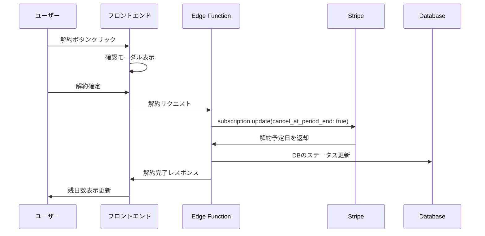

# ダウングレード・解約仕様書

## 概要
プレミアムプランから無料プランへのダウングレード（解約）および完全な退会機能の統合仕様書。
サブスクリプション管理システムの解約・退会プロセスを包括的に定義する。

作成日: 2025年8月14日  
バージョン: 2.0（統合版）  
推定総工数: 3時間

---

## 1. 機能区分

### 1.1 ダウングレード（プラン解約）
- **対象**: プレミアム会員 → 無料会員
- **データ保持**: すべてのデータを保持
- **アカウント**: 継続利用可能
- **実装**: 自動化済み（リアルタイム対応）

### 1.2 退会（アカウント削除）
- **対象**: 全会員 → サービス完全退会
- **データ削除**: 個人情報・投資データを削除
- **アカウント**: 削除（メールでのお問い合わせ対応のみ）
- **実装**: 手動対応（Phase 1）

---

## 2. ダウングレード機能詳細

### 2.1 基本要件
- プレミアム会員がいつでも解約できる
- 解約は請求期間終了時に適用（即座解約ではない）
- 解約予定の取り消しが可能
- 明確な解約プロセスと確認画面

### 2.2 法的要件
- 特定商取引法に基づく解約方法の明示
- 解約手続きの簡便性（2クリック以内）
- 解約理由の入力は任意

### 2.3 UI設計

#### アクセス経路
```
マイページ（Dashboard）
└── プラン管理セクション
    └── 「プランを解約」ボタン
```

#### 画面遷移
```
1. マイページ
   ↓
2. 解約確認画面（モーダル）
   ↓
3. 解約完了画面
```

#### 解約確認モーダル
```typescript
<Modal>
  <h2>プレミアムプランを解約しますか？</h2>
  
  <div className="warning-box">
    <p>⚠️ 解約にあたってのご注意</p>
    <ul>
      <li>2025年9月1日まではプレミアム機能をご利用いただけます</li>
      <li>残り30日間は無制限で利用可能です</li>
      <li>解約後は月5回の利用制限に戻ります</li>
      <li>作成済みのデータは引き続き閲覧可能です</li>
      <li>日割り返金はございません</li>
    </ul>
  </div>
  
  <div className="reason-section">
    <label>解約理由をお聞かせください（任意）</label>
    <select>
      <option>選択してください</option>
      <option>料金が高い</option>
      <option>機能を使いこなせない</option>
      <option>他のサービスを利用する</option>
      <option>一時的に利用を停止</option>
      <option>その他</option>
    </select>
  </div>
  
  <div className="buttons">
    <button className="cancel">キャンセル</button>
    <button className="confirm">解約する</button>
  </div>
</Modal>
```

### 2.4 技術実装

#### フロントエンド
- `/src/components/CancelSubscriptionModal.tsx`
- `/src/utils/subscriptionHelpers.ts`
- `/src/pages/PremiumPlan.tsx`への解約ボタン追加
- ヘッダーでの残日数リアルタイム表示

#### バックエンド
- Supabase Edge Function: `cancel-subscription`
- Stripe API連携（`cancel_at_period_end: true`）
- データベース更新（解約予定日設定）

#### API実装例
```typescript
const cancelSubscription = async () => {
  const { data, error } = await supabase.functions.invoke('cancel-subscription', {
    body: {
      reason: selectedReason, // 任意
      feedback: feedbackText  // 任意
    }
  });
  
  if (error) {
    // エラーハンドリング
  } else {
    // 成功処理：残日数表示更新
  }
};
```

### 2.5 データベース設計

#### subscriptionsテーブルの拡張
```sql
ALTER TABLE subscriptions 
ADD COLUMN cancel_at_period_end BOOLEAN DEFAULT FALSE,
ADD COLUMN cancel_at TIMESTAMP WITH TIME ZONE,
ADD COLUMN cancellation_reason TEXT,
ADD COLUMN cancellation_feedback TEXT,
ADD COLUMN cancelled_at TIMESTAMP;
```

### 2.6 処理フロー



### 2.7 残日数計算ロジック

```typescript
// フロントエンドでの計算（リアルタイム）
export const calculateRemainingDays = (cancelAt: string | null): number => {
  if (!cancelAt) return 0
  
  const cancelDate = new Date(cancelAt)
  const now = new Date()
  
  // UTCで計算して日本時間に調整
  const diffMs = cancelDate.getTime() - now.getTime()
  const diffDays = Math.ceil(diffMs / (1000 * 60 * 60 * 24))
  
  return diffDays > 0 ? diffDays : 0
}

// 表示フォーマット
export const formatRemainingTime = (days: number): string => {
  if (days > 30) return `あと${Math.ceil(days / 30)}ヶ月`
  return `あと${days}日`
}
```

---

## 3. 退会機能詳細

### 3.1 実装方針（Phase 1: お問い合わせ対応）

#### 退会案内の表示
```typescript
// Footer.tsx への追加
<div className="footer-links">
  <a href="mailto:support@ooya-dx.com?subject=退会のお申し込み">
    退会をご希望の方（メール申請）
  </a>
</div>
```

#### 退会申請メールテンプレート
```
件名: 退会のお申し込み

退会を希望される場合は、以下の情報をお送りください：
1. 登録メールアドレス
2. お名前
3. 退会理由（任意）

※ご注意：退会処理により、すべての個人データ・物件データ・投資シミュレーション結果が削除されます。
この操作は取り消すことができませんので、必要なデータは事前にエクスポートしてください。

3営業日以内に退会処理を完了し、ご連絡いたします。
```

### 3.2 運用フロー

1. **ユーザーからの退会申請**
   - メールで退会希望を受付
   - 本人確認（登録メールアドレスと照合）

2. **プレミアム会員の事前処理**
   - プレミアムプランの場合、先にダウングレード処理
   - Stripe サブスクリプションの解約

3. **データ削除処理**
   - 手動でデータ削除スクリプトを実行
   - 法的要件に基づく保持期間の確認

4. **完了通知**
   - 退会完了メールを送信

### 3.3 データ削除ポリシー

#### 削除タイミングとデータ分類

| データ種別 | 削除タイミング | 理由 | 保持期間 |
|-----------|--------------|------|----------|
| **個人情報** | 即時削除 | プライバシー保護 | なし |
| **物件データ** | 即時削除 | 個人資産情報 | なし |
| **シミュレーション結果** | 即時削除 | 個人の投資情報 | なし |
| **共有物件・コメント** | 即時削除 | 個人発言・評価 | なし |
| **利用ログ** | 30日後に匿名化 | サービス改善分析 | 30日 |
| **決済履歴** | 7年間保持後削除 | 法的要件（税法） | 7年 |

#### データ削除スクリプト

```sql
-- 退会処理スクリプト
-- ユーザーID: {USER_ID}

-- 1. 個人データの即時削除
DELETE FROM properties WHERE user_id = '{USER_ID}';
DELETE FROM simulations WHERE user_id = '{USER_ID}';
DELETE FROM market_analyses WHERE user_id = '{USER_ID}';
DELETE FROM property_shares WHERE owner_id = '{USER_ID}';
DELETE FROM share_comments WHERE user_id = '{USER_ID}';
DELETE FROM comment_reactions WHERE user_id = '{USER_ID}';

-- 2. サブスクリプション情報の匿名化
UPDATE subscriptions 
SET user_id = NULL, 
    customer_email = 'deleted_user@example.com',
    updated_at = NOW()
WHERE user_id = '{USER_ID}';

-- 3. ユーザーアカウント削除
DELETE FROM users WHERE id = '{USER_ID}';

-- 4. 利用履歴の匿名化（30日後に実行）
UPDATE usage_history 
SET user_id = 'deleted_user_' || gen_random_uuid()::text
WHERE user_id = '{USER_ID}' 
  AND created_at < NOW() - INTERVAL '30 days';
```

### 3.4 将来実装（Phase 2: セルフサービス退会）

#### UI設計
```typescript
// AccountSettings.tsx
<div className="danger-zone">
  <h3>アカウントの削除</h3>
  <p>⚠️ この操作により、すべてのデータが永続的に削除されます</p>
  <ul className="deletion-warning">
    <li>• すべての物件データ</li>
    <li>• 投資シミュレーション結果</li>
    <li>• 共有した物件とコメント</li>
    <li>• アカウント情報</li>
  </ul>
  <button className="btn-danger" onClick={handleDeleteAccount}>
    アカウントを削除
  </button>
</div>
```

#### 多段階確認フロー

1. **初回クリック - 警告表示**
```typescript
<Modal>
  <h2>本当にアカウントを削除しますか？</h2>
  <div className="warning">
    <p>この操作は取り消すことができません</p>
    <p>すべてのデータが永続的に削除されます</p>
  </div>
  <button>削除する</button>
  <button>キャンセル</button>
</Modal>
```

2. **最終確認 - メールアドレス入力**
```typescript
<Modal>
  <h2>最終確認</h2>
  <p>確認のため、登録メールアドレスを入力してください</p>
  <input type="email" placeholder="your@email.com" />
  <div className="final-warning">
    <input type="checkbox" id="understand" />
    <label>すべてのデータが削除されることを理解しました</label>
  </div>
  <button>アカウントを完全に削除</button>
</Modal>
```

---

## 4. 実装優先度とスケジュール

### Phase 1: 基本機能（3時間 - 実装済み）
- [x] ダウングレード機能のリアルタイム実装
- [x] Stripe連携での解約予定設定
- [x] 残日数のリアルタイム表示
- [x] 退会案内（メール対応）の追加

### Phase 2: 改善機能（8時間 - 今後実装）
- [ ] 解約理由の収集・分析
- [ ] 解約予定の取り消し機能
- [ ] セルフサービス退会システム
- [ ] 退会前の代替案提示

### Phase 3: 分析・改善機能（12時間）
- [ ] 解約率のダッシュボード
- [ ] リテンション施策の実装
- [ ] A/Bテストフレームワーク

---

## 5. セキュリティ・法的考慮事項

### 5.1 認証・認可
- JWT トークンによる本人確認
- プレミアム会員のみダウングレード可能
- CSRF対策の実装
- レート制限（1分間に3回まで）

### 5.2 個人情報保護法対応
- データ削除の権利を保証
- 削除要求から30日以内に対応
- 削除証明書の発行（要求があれば）
- バックアップからの削除（90日後）

### 5.3 GDPR対応（将来的）
- Right to be forgotten（忘れられる権利）
- データポータビリティの提供
- 削除要求から1ヶ月以内に対応

### 5.4 特定商取引法対応
- 解約方法の明示
- 解約手続きの簡便性（2クリック以内）
- 返金ポリシーの明記

---

## 6. エラーハンドリング

### 6.1 想定されるエラーケース

| エラーケース | 対処方法 | ユーザーメッセージ |
|-------------|----------|-------------------|
| ネットワークエラー | リトライボタン表示 | '通信エラーが発生しました。もう一度お試しください。' |
| 既に解約済み | 状態を同期して画面更新 | 'すでに解約手続きが完了しています。' |
| Stripe APIエラー | サポート連絡先を表示 | '決済処理でエラーが発生しました。サポートまでご連絡ください。' |
| 認証エラー | 再ログインを促す | 'セッションが切れました。再度ログインしてください。' |
| 権限エラー | プラン状態の確認 | '現在のプランでは実行できません。' |

### 6.2 エラーメッセージマップ
```typescript
const errorMessages = {
  no_active_subscription: 'アクティブなプランが見つかりません',
  already_canceled: 'すでに解約済みです',
  network_error: 'ネットワークエラーです。再度お試しください',
  auth_error: 'セッションが切れました。再ログインしてください',
  stripe_error: '決済処理エラーです。時間をおいて再試行してください',
  permission_error: '現在のプランでは実行できません',
  rate_limit: '操作が多すぎます。しばらく時間をおいてからお試しください',
  default: '予期しないエラーが発生しました。サポートまでご連絡ください'
};
```

---

## 7. テスト要件

### 7.1 ダウングレード機能テスト
- [ ] 解約ボタンの表示条件確認
- [ ] モーダルの開閉動作
- [ ] 残日数の正確な計算・表示
- [ ] Stripe API連携（テストモード）
- [ ] 解約後の画面状態更新
- [ ] エラーハンドリングの動作

### 7.2 退会機能テスト
- [ ] メール案内リンクの表示
- [ ] データ削除スクリプトの動作確認
- [ ] 法的要件の遵守確認
- [ ] バックアップからの削除確認

### 7.3 E2Eテスト
- [ ] ユーザー視点での全フロー確認
- [ ] 解約後の機能制限確認
- [ ] 再加入フローの確認
- [ ] 異常系パターンの確認

---

## 8. メトリクス・KPI

### 8.1 追跡すべき指標

#### ダウングレード関連
- 月次解約率
- 解約理由の分布
- 解約取り消し率
- 解約から再加入までの期間

#### 退会関連
- 月次退会数
- 退会理由の分析
- 退会から再登録までの期間
- カスタマーライフタイムバリュー

### 8.2 目標値
- **月次解約率**: 5%以下
- **解約撤回率**: 10%以上
- **再加入率**: 20%以上
- **月次退会率**: 1%以下

### 8.3 分析レポート
- 週次：解約・退会の数値サマリー
- 月次：詳細分析とトレンド
- 四半期：改善施策の効果測定

---

## 9. FAQ

### ダウングレードに関して
**Q: ダウングレード後すぐに機能制限されますか？**  
A: いいえ、請求期間終了まで（最大1ヶ月間）は全機能をご利用いただけます。

**Q: ダウングレードを取り消すことはできますか？**  
A: はい、請求期間終了前であれば取り消し可能です。マイページから手続きできます。

**Q: 作成したデータはどうなりますか？**  
A: すべてのデータは保持され、無料プランでも閲覧できます。新規作成のみ制限されます。

### 退会に関して
**Q: 退会後にデータを復元できますか？**  
A: 退会から30日以内であれば、サポートにご連絡いただければ復元可能です。

**Q: 退会理由を聞かれますか？**  
A: 任意でアンケートにご協力いただく場合がありますが、必須ではありません。

**Q: 決済情報はどうなりますか？**  
A: 法的要件により7年間保持されますが、個人を特定できない形で管理されます。

**Q: 再入会はできますか？**  
A: はい、いつでも再入会可能です。新規アカウントとして登録していただきます。

---

## 10. 関連ドキュメント

- [Stripe Subscription API](https://stripe.com/docs/api/subscriptions)
- [Supabase Edge Functions](https://supabase.com/docs/guides/functions)
- [特定商取引法ガイドライン](https://www.no-trouble.caa.go.jp/)
- [個人情報保護法ガイドライン](https://www.ppc.go.jp/)
- [料金プラン仕様書](./料金プラン仕様書.md)
- [Stripe連携仕様書](./Stripe連携仕様書.md)

---

## 11. 実装状況

### 現在のステータス: 🟢 Phase 1 完了

| 機能 | 実装状況 | 備考 |
|-----|---------|------|
| ダウングレード（解約） | 🟢 完了 | リアルタイム対応済み |
| 残日数表示 | 🟢 完了 | ヘッダー・詳細画面 |
| 退会案内 | 🟢 完了 | フッターにメール案内 |
| エラーハンドリング | 🟢 完了 | 網羅的な対応 |
| セルフ退会 | 🔴 未実装 | Phase 2で対応予定 |

### 次回実装予定
1. 解約理由の収集機能（1時間）
2. 解約取り消し機能（2時間）  
3. セルフサービス退会システム（8時間）

---

*このドキュメントはダウングレード・解約・退会機能の包括的な仕様書です。*  
*実装時は段階的に進め、ユーザビリティとセキュリティを最優先に考慮してください。*