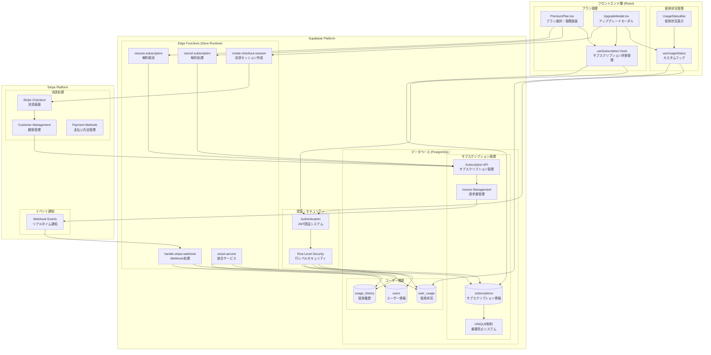
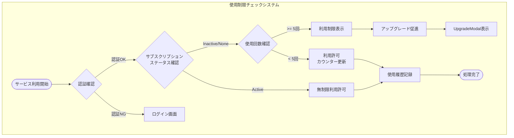
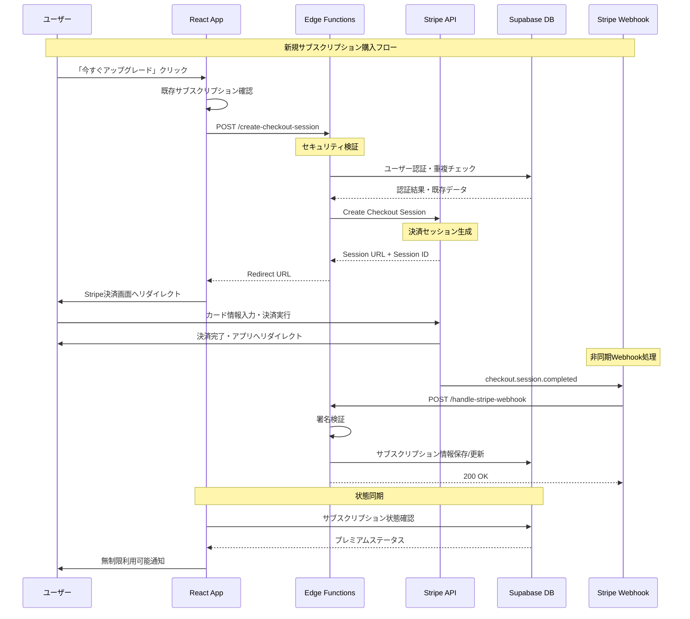
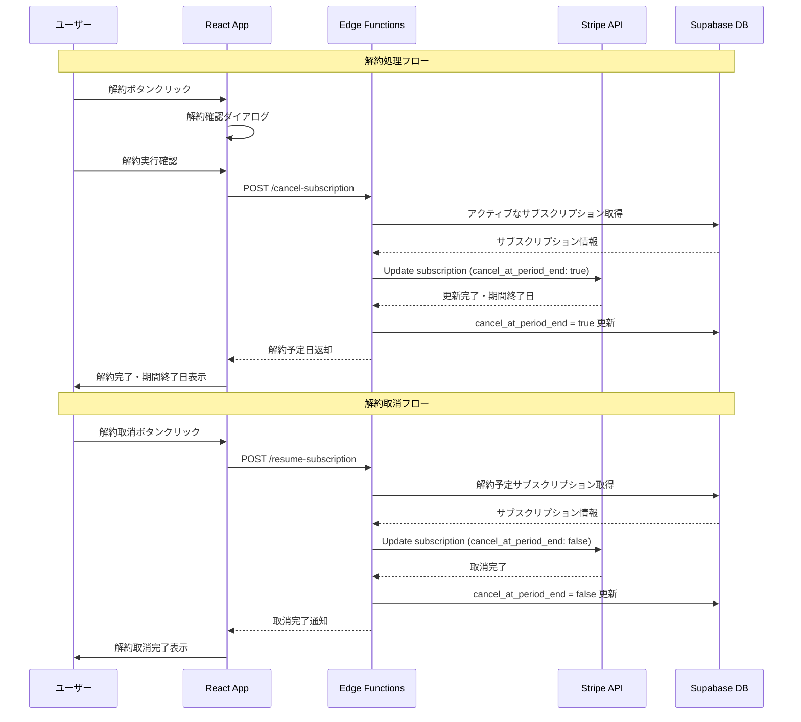
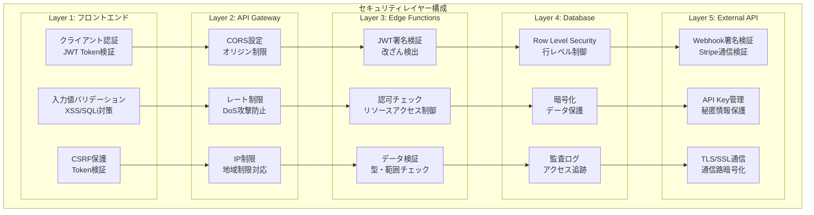
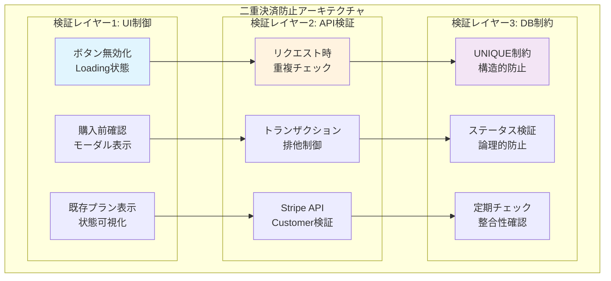
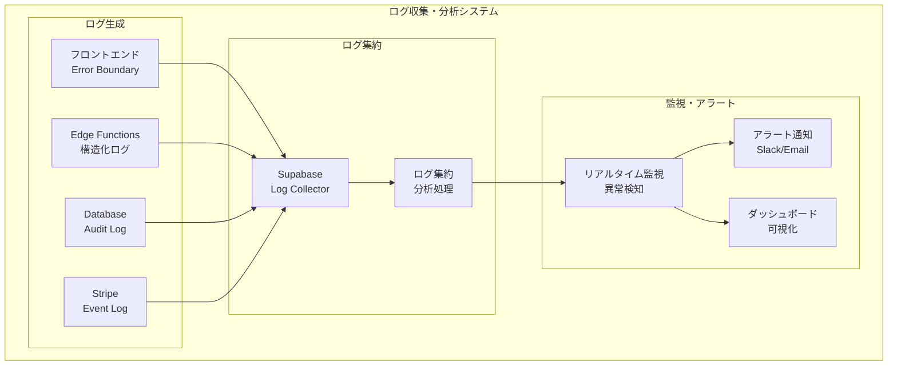
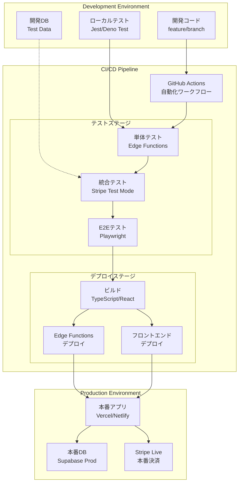
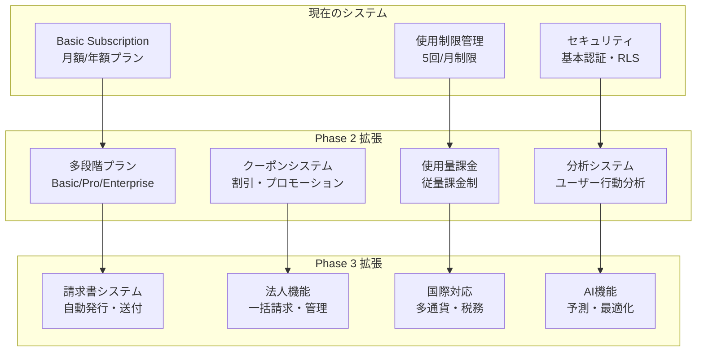

# サブスクリプション管理システム統合アーキテクチャ

## 概要
大家DXの有料課金システムは、Stripe決済とSupabase Edge Functionsを組み合わせた堅牢なサブスクリプション管理システムです。本システムは使用制限管理、決済処理、解約・退会処理を統合的に管理し、二重決済防止とセキュリティを重視した設計となっています。

## 統合システム構成図



## 詳細アーキテクチャ図

### 1. 使用制限管理フロー



### 2. 決済処理詳細フロー



### 3. 解約・退会処理フロー



## データベース設計詳細

### ER図（Entity Relationship Diagram）

```mermaid
erDiagram
    users ||--o{ user_usage : "has"
    users ||--o{ subscriptions : "has" 
    users ||--o{ usage_history : "has"
    
    users {
        uuid id PK "Primary Key"
        string email "ユーザーメールアドレス"
        string full_name "フルネーム"
        string avatar_url "アバター画像URL"
        timestamp created_at "作成日時"
        timestamp updated_at "更新日時"
    }
    
    user_usage {
        uuid id PK "Primary Key"
        uuid user_id FK "ユーザーID (外部キー)"
        int usage_count "月間使用回数"
        timestamp period_start_date "集計期間開始日"
        timestamp period_end_date "集計期間終了日"
        timestamp updated_at "最終更新日時"
        
        constraint "period_start < period_end"
        index "idx_user_period ON (user_id, period_start_date)"
    }
    
    subscriptions {
        uuid id PK "Primary Key"
        uuid user_id FK "ユーザーID (外部キー)"
        string status "サブスクリプション状態"
        string stripe_subscription_id "Stripe サブスクリプションID"
        string stripe_customer_id "Stripe 顧客ID"
        string stripe_price_id "Stripe 価格ID"
        timestamp current_period_start "現在の課金期間開始日"
        timestamp current_period_end "現在の課金期間終了日"
        boolean cancel_at_period_end "期間終了時解約フラグ"
        timestamp cancel_at "解約実行日時"
        timestamp canceled_at "解約完了日時"
        timestamp created_at "作成日時"
        timestamp updated_at "更新日時"
        
        constraint "UNIQUE INDEX idx_one_active_subscription_per_user ON (user_id) WHERE (status = 'active' AND cancel_at_period_end = false)"
    }
    
    usage_history {
        uuid id PK "Primary Key"
        uuid user_id FK "ユーザーID (外部キー)"
        string feature_type "使用機能タイプ"
        jsonb feature_data "機能利用データ (JSON)"
        string session_id "セッションID"
        timestamp created_at "利用日時"
        
        index "idx_user_feature_date ON (user_id, feature_type, created_at)"
        index "idx_created_at ON (created_at DESC)"
    }
```

### テーブル定義とセキュリティ

```sql
-- サブスクリプションテーブル作成
CREATE TABLE subscriptions (
    id UUID PRIMARY KEY DEFAULT uuid_generate_v4(),
    user_id UUID REFERENCES auth.users(id) ON DELETE CASCADE NOT NULL,
    stripe_customer_id TEXT NOT NULL,
    stripe_subscription_id TEXT UNIQUE NOT NULL,
    stripe_price_id TEXT NOT NULL,
    status TEXT NOT NULL CHECK (status IN ('active', 'canceled', 'past_due', 'unpaid', 'trialing')),
    current_period_start TIMESTAMPTZ,
    current_period_end TIMESTAMPTZ,
    cancel_at_period_end BOOLEAN DEFAULT false,
    cancel_at TIMESTAMPTZ,
    canceled_at TIMESTAMPTZ,
    created_at TIMESTAMPTZ DEFAULT NOW(),
    updated_at TIMESTAMPTZ DEFAULT NOW()
);

-- 重複防止のUNIQUE制約（アクティブなサブスクリプションは1ユーザー1つまで）
CREATE UNIQUE INDEX idx_one_active_subscription_per_user 
ON subscriptions(user_id) 
WHERE status = 'active' AND cancel_at_period_end = false;

-- Row Level Security (RLS) 設定
ALTER TABLE subscriptions ENABLE ROW LEVEL SECURITY;

-- ユーザーは自分のサブスクリプションのみアクセス可能
CREATE POLICY "Users can only access their own subscriptions" 
ON subscriptions FOR ALL 
USING (auth.uid() = user_id);

-- サービスロールは全アクセス可能（Edge Functions用）
CREATE POLICY "Service role can access all subscriptions" 
ON subscriptions FOR ALL 
USING (auth.role() = 'service_role');
```

## コンポーネント詳細仕様

### 1. フロントエンド層

#### UsageStatusBar.tsx
```typescript
interface UsageStatusBarProps {
  currentUsage: number;
  maxUsage: number;
  subscriptionStatus: 'active' | 'inactive' | null;
  onUpgradeClick: () => void;
}

// 主要機能:
// - リアルタイム使用状況表示
// - 使用制限アラート
// - プログレスバー表示
// - プレミアム状態表示
```

#### PremiumPlan.tsx
```typescript
interface PremiumPlanProps {
  subscription: Subscription | null;
  onPurchase: (priceId: string) => Promise<void>;
  onCancel: () => Promise<void>;
  onResume: () => Promise<void>;
}

// 主要機能:
// - 料金プラン表示（月額・年額）
// - サブスクリプション状態管理
// - 解約・解約取消操作
// - 残り日数・次回請求日表示
```

#### useSubscription Hook
```typescript
export interface UseSubscriptionReturn {
  subscription: Subscription | null;
  isLoading: boolean;
  error: Error | null;
  refetch: () => Promise<void>;
  hasActiveSubscription: boolean;
  cancelAtPeriodEnd: boolean;
  nextBillingDate: Date | null;
  daysRemaining: number | null;
}

// 機能:
// - リアルタイム状態監視
// - キャッシュ管理
// - エラーハンドリング
// - 自動再取得
```

### 2. Edge Functions層

#### create-checkout-session
```typescript
// 処理フロー:
// 1. JWT認証検証
// 2. 既存サブスクリプション重複チェック
// 3. Stripe顧客作成/取得
// 4. Checkout Session作成
// 5. メタデータ設定（user_id, price_id）
// 6. 成功/キャンセルURL設定

interface CreateCheckoutRequest {
  priceId: string;
  successUrl?: string;
  cancelUrl?: string;
}

interface CreateCheckoutResponse {
  url: string;
  sessionId: string;
}
```

#### handle-stripe-webhook
```typescript
// 処理イベント:
// - checkout.session.completed: 新規購入完了
// - customer.subscription.updated: サブスクリプション更新
// - customer.subscription.deleted: サブスクリプション削除  
// - invoice.payment_succeeded: 支払い成功
// - invoice.payment_failed: 支払い失敗

// セキュリティ:
// - Stripe署名検証必須
// - 重複処理防止（idempotency）
// - トランザクション処理
```

#### cancel-subscription
```typescript
// 処理フロー:
// 1. JWT認証検証
// 2. アクティブなサブスクリプション取得
// 3. Stripe API: 期間終了時解約設定
// 4. データベース更新
// 5. キャンセル日時・期間終了日返却

interface CancelSubscriptionResponse {
  success: boolean;
  cancelAtPeriodEnd: boolean;
  periodEndDate: string;
  message: string;
}
```

#### resume-subscription  
```typescript
// 処理フロー:
// 1. JWT認証検証
// 2. 解約予定サブスクリプション取得
// 3. Stripe API: 解約取消
// 4. データベース状態リセット
// 5. 継続確認返却

interface ResumeSubscriptionResponse {
  success: boolean;
  cancelAtPeriodEnd: boolean;
  nextBillingDate: string;
  message: string;
}
```

## セキュリティアーキテクチャ

### 多層防御システム



### セキュリティ実装詳細

#### 1. 認証・認可
```typescript
// JWT認証実装
const verifyAuth = async (request: Request): Promise<User> => {
  const token = request.headers.get('Authorization')?.replace('Bearer ', '');
  if (!token) throw new Error('Authentication required');
  
  const { data: user, error } = await supabase.auth.getUser(token);
  if (error) throw new Error('Invalid token');
  
  return user;
};

// Row Level Security ポリシー
CREATE POLICY "subscription_access_policy" ON subscriptions
FOR ALL USING (
  auth.uid() = user_id OR 
  auth.role() = 'service_role'
);
```

#### 2. Webhook セキュリティ
```typescript
// Stripe Webhook 署名検証
const verifyStripeSignature = (
  payload: string,
  signature: string,
  secret: string
): boolean => {
  const stripe = new Stripe(Deno.env.get('STRIPE_SECRET_KEY')!);
  try {
    stripe.webhooks.constructEvent(payload, signature, secret);
    return true;
  } catch (error) {
    console.error('Webhook signature verification failed:', error);
    return false;
  }
};
```

#### 3. 二重決済防止システム


## 監視・運用アーキテクチャ

### ログ管理システム



### パフォーマンス監視

```typescript
// Edge Functions パフォーマンス計測
const performanceMonitor = {
  startTime: performance.now(),
  
  logExecutionTime: (functionName: string) => {
    const endTime = performance.now();
    const executionTime = endTime - this.startTime;
    
    console.log(`[PERFORMANCE] ${functionName}: ${executionTime}ms`);
    
    // 閾値チェック（3秒）
    if (executionTime > 3000) {
      console.warn(`[SLOW_EXECUTION] ${functionName}: ${executionTime}ms`);
    }
  }
};
```

### メトリクス定義

| メトリクス名 | 説明 | 正常値 | アラート条件 |
|-------------|------|--------|-------------|
| 決済成功率 | 決済完了/決済試行 | >95% | <90% |
| チャーン率 | 月次解約率 | <5% | >10% |
| API応答時間 | Edge Functions実行時間 | <2秒 | >3秒 |
| エラー率 | エラー/総リクエスト | <1% | >5% |
| Webhook遅延 | イベント受信〜処理完了 | <10秒 | >30秒 |
| DB接続率 | DB接続成功率 | >99% | <95% |

## デプロイメント・CI/CDアーキテクチャ

### デプロイメントパイプライン



### GitHub Actions ワークフロー

```yaml
name: Deploy Subscription System
on:
  push:
    branches: [main, develop]
    paths:
      - 'src/**'
      - 'supabase/functions/**'
      - 'package.json'

jobs:
  test:
    runs-on: ubuntu-latest
    steps:
      - uses: actions/checkout@v4
      - uses: actions/setup-node@v4
        with:
          node-version: '18'
          
      # フロントエンドテスト
      - name: Run Frontend Tests
        run: |
          npm ci
          npm run test:coverage
          
      # Edge Functions テスト
      - name: Setup Deno
        uses: denoland/setup-deno@v1
        with:
          deno-version: v1.x
          
      - name: Run Edge Function Tests
        run: |
          cd supabase/functions
          deno test --allow-all
          
  deploy:
    needs: test
    if: github.ref == 'refs/heads/main'
    runs-on: ubuntu-latest
    steps:
      # Supabase Edge Functions デプロイ
      - uses: supabase/setup-cli@v1
        with:
          version: latest
          
      - name: Deploy Edge Functions
        env:
          SUPABASE_ACCESS_TOKEN: ${{ secrets.SUPABASE_ACCESS_TOKEN }}
          SUPABASE_PROJECT_ID: ${{ secrets.SUPABASE_PROJECT_ID }}
        run: |
          supabase functions deploy create-checkout-session --project-ref $SUPABASE_PROJECT_ID
          supabase functions deploy handle-stripe-webhook --project-ref $SUPABASE_PROJECT_ID
          supabase functions deploy cancel-subscription --project-ref $SUPABASE_PROJECT_ID
          supabase functions deploy resume-subscription --project-ref $SUPABASE_PROJECT_ID
          
      # フロントエンドデプロイ
      - name: Deploy Frontend
        env:
          VERCEL_TOKEN: ${{ secrets.VERCEL_TOKEN }}
        run: |
          npx vercel --prod --token $VERCEL_TOKEN
```

## 拡張可能性・将来計画

### Phase 1（実装完了）
- ✅ 基本サブスクリプション機能
- ✅ 解約・解約取消機能
- ✅ 二重決済防止システム
- ✅ 使用制限管理
- ✅ セキュリティ実装

### Phase 2（計画中）
- [ ] 多段階プラン対応
- [ ] クーポン・割引機能
- [ ] 使用量ベース課金
- [ ] アナリティクス強化

### Phase 3（将来）
- [ ] 請求書発行システム
- [ ] 法人向け一括請求
- [ ] 国際決済対応
- [ ] 税務計算自動化

### 拡張アーキテクチャ



## トラブルシューティング

### 一般的な問題と解決策

| 問題 | 症状 | 原因 | 解決策 |
|------|------|------|--------|
| 決済失敗 | Stripe Checkout エラー | APIキー無効・ネットワーク | 環境変数確認・キー再生成 |
| 重複購入エラー | 「既にサブスクリプション存在」 | UNIQUE制約違反 | 既存プラン確認・状態リセット |
| Webhook遅延 | サブスクリプション状態が更新されない | Edge Function処理時間超過 | 非同期処理最適化・タイムアウト調整 |
| 認証エラー | 401 Unauthorized | JWTトークン期限切れ・無効 | トークン再取得・認証フロー確認 |
| DB接続エラー | 503 Service Unavailable | Supabase接続制限・障害 | 接続プール設定・リトライ機構 |

### デバッグ手順

```typescript
// 1. ログ確認
console.log('Debug Info:', {
  userId: user?.id,
  subscriptionId: subscription?.stripe_subscription_id,
  timestamp: new Date().toISOString(),
  environment: Deno.env.get('ENVIRONMENT')
});

// 2. Stripe イベント確認
const stripeEvents = await stripe.events.list({
  limit: 10,
  types: ['customer.subscription.*']
});

// 3. データベース状態確認
const { data: dbSubscription } = await supabase
  .from('subscriptions')
  .select('*')
  .eq('user_id', userId)
  .single();
```

## 関連ドキュメント

### 技術仕様書
- [Stripe連携仕様書](/workspaces/real-estate-app/docs_md/11_サブスクリプション管理/01_仕様書/Stripe連携仕様書.md)
- [二重決済防止仕様書](/workspaces/real-estate-app/docs_md/11_サブスクリプション管理/01_仕様書/二重決済防止仕様書.md)
- [データベース設計](/workspaces/real-estate-app/docs_md/11_サブスクリプション管理/02_実装ガイド/データベース設計.md)

### 運用ガイド
- [デプロイ手順書](/workspaces/real-estate-app/docs_md/11_サブスクリプション管理/03_運用手順/デプロイ手順書.md)
- [トラブルシューティング](/workspaces/real-estate-app/docs_md/11_サブスクリプション管理/03_運用手順/トラブルシューティング.md)
- [テスト手順書](/workspaces/real-estate-app/docs_md/11_サブスクリプション管理/03_運用手順/テスト手順書.md)

### 外部リソース
- [Stripe API Documentation](https://stripe.com/docs/api)
- [Supabase Edge Functions Guide](https://supabase.com/docs/guides/functions)
- [PostgreSQL Row Level Security](https://www.postgresql.org/docs/current/ddl-rowsecurity.html)

---

**作成日**: 2025年8月14日  
**最終更新**: 2025年8月14日  
**バージョン**: 2.0.0  
**作成者**: システム統合チーム