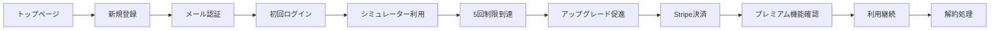

# テスト実行管理表

作成日: 2025-09-01  
バージョン: 1.0.0  
最終更新: 2025-09-01

## 📊 概要

本ドキュメントは、検証項目シート（01〜05）に定義された257項目のテスト項目に対する、Playwrightによる自動テストの実装・実行状況を管理するための統合管理表です。

### 目的
- 手動テストと自動テストの実施状況を一元管理
- テスト自動化率の可視化
- テスト実行結果の追跡
- CI/CDパイプラインとの連携状況の管理

---

## 🎯 テスト自動化カバレッジサマリー

| カテゴリ | 総項目数 | 自動化対象 | 自動化済 | 実装中 | 未着手 | カバレッジ | 目標 |
|---------|---------|-----------|----------|--------|--------|-----------|------|
| 認証機能 | 39 | 30 | 8 | 2 | 20 | 26.7% | 80% |
| シミュレーター機能 | 51 | 35 | 0 | 0 | 35 | 0% | 70% |
| サブスクリプション機能 | 56 | 40 | 0 | 0 | 40 | 0% | 75% |
| ダッシュボード機能 | 50 | 30 | 0 | 0 | 30 | 0% | 60% |
| セキュリティ・システム | 61 | 15 | 0 | 0 | 15 | 0% | 25% |
| **合計** | **257** | **150** | **8** | **2** | **140** | **5.3%** | **65%** |

> 注: 「自動化対象」は技術的に自動化可能かつコスト効率的な項目数

---

## 📁 Playwrightテストファイルマッピング

### 実装済みテストファイル

| ファイル名 | パス | カバー項目 | 最終更新 | 状態 |
|-----------|------|-----------|----------|------|
| 00_簡単テスト例.spec.ts | playwright_tests/ | 基本動作確認 | 2025-08-31 | ✅ Active |
| 00_簡単テスト例_screenshot.spec.ts | playwright_tests/ | スクリーンショット検証 | 2025-08-31 | ✅ Active |
| 01_認証機能テスト.spec.ts | playwright_tests/ | L001-L006, S004, P001 | 2025-08-31 | ✅ Active |
| 02_ログイン成功テスト.spec.ts | playwright_tests/ | L001詳細 | 2025-08-31 | ✅ Active |

### 実装予定テストファイル

| ファイル名 | カバー予定項目 | 優先度 | 予定日 |
|-----------|---------------|--------|--------|
| 03_サインアップフロー.spec.ts | S001-S010 | 高 | 2025-09-02 |
| 04_サブスクリプション購入.spec.ts | U001-U010, W001-W008 | 高 | 2025-09-03 |
| 05_E2E_新規ユーザージャーニー.spec.ts | 全体フロー | 高 | 2025-09-04 |
| 06_シミュレーター基本.spec.ts | F001-F010, C001-C010 | 中 | 2025-09-05 |

---

## 🔄 エンドツーエンド（E2E）ユーザージャーニーテスト

### メインシナリオ: 新規ユーザーの完全フロー



| ステップ | 検証項目ID | 実装状態 | テストファイル | 備考 |
|---------|-----------|---------|---------------|------|
| 1. トップページアクセス | - | ✅ 実装済 | 00_簡単テスト例.spec.ts | |
| 2. 新規会員登録 | S001-S006 | 🔄 実装中 | 03_サインアップフロー.spec.ts | |
| 3. メール認証 | S006 | ⏸️ 保留 | - | モック化検討中 |
| 4. 初回ログイン | L001 | ✅ 実装済 | 02_ログイン成功テスト.spec.ts | |
| 5. シミュレーター利用 | F001-F010 | ❌ 未実装 | - | |
| 6. 利用制限確認 | S001-S002 | ❌ 未実装 | - | |
| 7. アップグレード画面 | D001-D004 | ❌ 未実装 | - | |
| 8. Stripe決済 | U001-U008 | ❌ 未実装 | - | テストカード使用 |
| 9. プレミアム確認 | S008 | ❌ 未実装 | - | |
| 10. 解約処理 | C001-C009 | ❌ 未実装 | - | |

---

## 📈 個別検証項目の実装状況

### 認証機能（01_認証機能_検証項目シート.md）

#### ログイン機能

| ID | 検証項目 | 自動化 | テストケース名 | 最終実行 | 結果 | 備考 |
|----|---------|--------|---------------|----------|------|------|
| L001 | 正常ログイン | ✅ | test_login_success | 2025-08-31 | PASS | |
| L002 | 無効なメールアドレス | ✅ | test_invalid_email | 2025-08-31 | PASS | |
| L003 | 未登録メールアドレス | ✅ | test_unregistered_email | 2025-08-31 | PASS | |
| L004 | 誤ったパスワード | ✅ | test_wrong_password | 2025-08-31 | PASS | |
| L005 | 空欄での送信 | ✅ | test_empty_fields | 2025-08-31 | PASS | |
| L006 | パスワードマスキング | ✅ | test_password_masking | 2025-08-31 | FAIL | 要修正 |
| L007 | ログイン状態の保持 | ❌ | - | - | - | |
| L008 | 同時セッション制限 | ⏸️ | - | - | - | 手動テスト推奨 |
| L009 | Googleログイン | ❌ | - | - | - | OAuth実装待ち |
| L010 | SQLインジェクション | ⏸️ | - | - | - | セキュリティ専門テスト |

#### サインアップ機能

| ID | 検証項目 | 自動化 | テストケース名 | 最終実行 | 結果 | 備考 |
|----|---------|--------|---------------|----------|------|------|
| S001 | 正常サインアップ | 🔄 | test_signup_success | - | - | 実装中 |
| S002 | 重複メールアドレス | ❌ | - | - | - | |
| S003 | パスワード要件 | ❌ | - | - | - | |
| S004 | メール形式チェック | ✅ | test_email_format | 2025-08-31 | PASS | |
| S005 | 利用規約同意 | ❌ | - | - | - | |
| S006 | メール認証 | ❌ | - | - | - | モック化必要 |
| S007 | 確認メール再送信 | ❌ | - | - | - | |
| S008 | 特殊文字入力 | ❌ | - | - | - | |
| S009 | 長文入力 | ❌ | - | - | - | |
| S010 | XSS攻撃 | ⏸️ | - | - | - | セキュリティテスト |

#### パスワードリセット機能

| ID | 検証項目 | 自動化 | テストケース名 | 最終実行 | 結果 | 備考 |
|----|---------|--------|---------------|----------|------|------|
| P001 | リセットメール送信 | ✅ | test_reset_email | 2025-08-31 | SKIP | メール機能未実装 |
| P002 | 未登録メールアドレス | ❌ | - | - | - | |
| P003 | リセットリンク有効期限 | ❌ | - | - | - | |
| P004 | 新パスワード設定 | ❌ | - | - | - | |

---

## 🚀 テスト実行コマンド

### 全テスト実行
```bash
cd /workspaces/real-estate-app/docs_md/13_検証項目/playwright_tests
npm test
```

### 特定カテゴリのテスト実行
```bash
# 認証機能のみ
npm test -- 01_認証機能

# E2Eテストのみ
npm test -- E2E

# スクリーンショット付き
npm test -- --screenshot
```

### テストレポート生成
```bash
npm run test:report
```

---

## 📅 実行履歴

| 実行日時 | 実行環境 | 総テスト数 | 成功 | 失敗 | スキップ | 実行時間 | レポート |
|---------|---------|-----------|------|------|----------|----------|---------|
| 2025-08-31 18:45 | Local | 17 | 14 | 2 | 1 | 45s | [View](./playwright_tests/playwright-report/) |
| 2025-08-31 10:56 | Codespace | 17 | 14 | 2 | 1 | 52s | [View](./playwright_tests/playwright-report/) |

---

## 🔧 テスト環境設定

### 必要な環境変数（.env）
```env
TEST_EMAIL=test@example.com
TEST_PASSWORD=TestPassword123!
TEST_BASE_URL=http://localhost:5173
STRIPE_TEST_CARD=4242424242424242
```

### Playwrightコンフィグ
- **ブラウザ**: Chromium, Firefox, WebKit
- **並列実行**: 3ワーカー
- **リトライ**: 失敗時2回
- **タイムアウト**: 30秒/テスト
- **スクリーンショット**: 失敗時自動保存

---

## 📊 KPI・メトリクス

### 目標値
- **自動化率目標**: 65%（150/257項目）
- **テスト実行時間**: 5分以内（全自動テスト）
- **テスト成功率**: 95%以上
- **カバレッジ増加率**: 週10項目以上

### 現在の達成状況
- **自動化率**: 5.3%（8/150項目）
- **平均実行時間**: 45秒
- **成功率**: 82.4%（14/17）
- **週次増加**: +8項目（初週）

---

## 🐛 既知の問題・課題

| 優先度 | 課題 | 影響範囲 | 対応予定 | 担当 |
|--------|------|---------|---------|------|
| 高 | ログアウトセレクタ不一致 | L006, A002 | 2025-09-02 | - |
| 高 | メール認証のモック化未実装 | S006, P001 | 2025-09-03 | - |
| 中 | Stripe Webhookのローカルテスト | W001-W008 | 2025-09-05 | - |
| 低 | 並列実行時のDB競合 | 全体 | 2025-09-10 | - |

---

## 📝 改善提案・TODO

- [ ] GitHub Actions CI/CD統合
- [ ] テスト結果の自動更新スクリプト作成
- [ ] Allureレポートの導入
- [ ] Visual Regression Testing追加
- [ ] パフォーマンステストの組み込み
- [ ] テストデータ自動生成ツール
- [ ] Slack通知連携

---

## 🔗 関連ドキュメント

- [00_検証項目総合インデックス](./00_検証項目総合インデックス.md)
- [01_認証機能_検証項目シート](./01_認証機能_検証項目シート.md)
- [02_シミュレーター機能_検証項目シート](./02_シミュレーター機能_検証項目シート.md)
- [03_サブスクリプション機能_検証項目シート](./03_サブスクリプション機能_検証項目シート.md)
- [04_ダッシュボード機能_検証項目シート](./04_ダッシュボード機能_検証項目シート.md)
- [05_セキュリティ・システム全体_検証項目シート](./05_セキュリティ・システム全体_検証項目シート.md)
- [Playwright実行方法](./playwright_tests/README_Playwright実行方法.md)

---

## 更新履歴

| 日付 | バージョン | 更新内容 | 更新者 |
|------|-----------|---------|--------|
| 2025-09-01 | 1.0.0 | 初版作成、既存テストのマッピング | AI Assistant |

---

**次回更新予定**: 2025-09-02（サインアップフローテスト実装後）