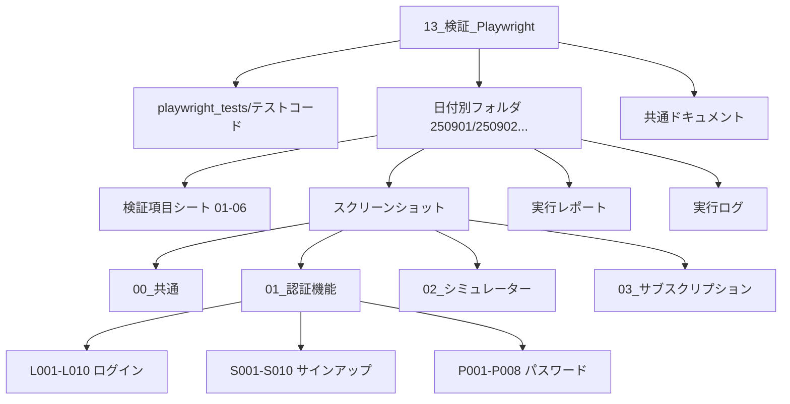
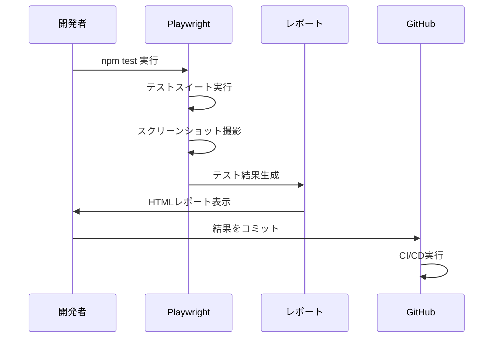
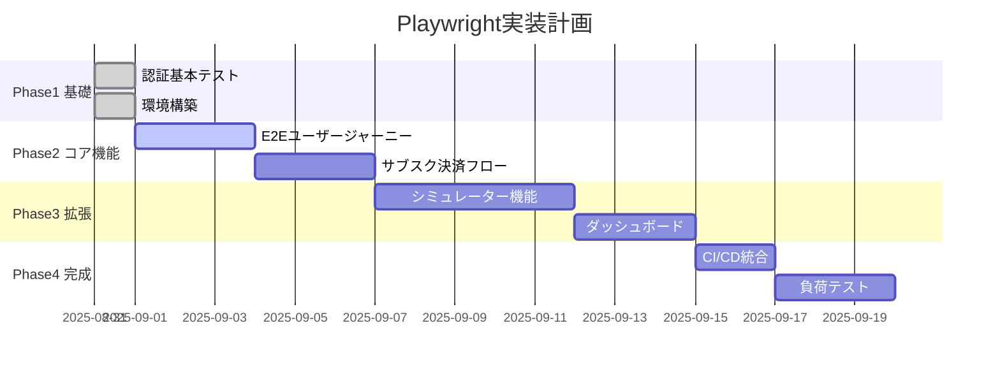

# 検証_Playwright全体マップ

作成日: 2025-09-01  
バージョン: 1.0.0

---

## 🗺️ 全体構造マップ



---

## 📁 ディレクトリ構造

```
13_検証_Playwright/
│
├── 📂 playwright_tests/               【テストコード格納】
│   ├── 00_簡単テスト例.spec.ts
│   ├── 01_認証機能テスト.spec.ts
│   ├── 02_ログイン成功テスト.spec.ts
│   ├── playwright.config.ts
│   ├── test-auth.config.ts
│   ├── .env.example
│   └── package.json
│
├── 📂 250901_テスト実行/              【2025年9月1日実行分】
│   ├── 📄 00_検証項目総合インデックス.md
│   ├── 📄 01_認証機能_検証項目シート.md
│   ├── 📄 02_シミュレーター機能_検証項目シート.md
│   ├── 📄 03_サブスクリプション機能_検証項目シート.md
│   ├── 📄 04_ダッシュボード機能_検証項目シート.md
│   ├── 📄 05_セキュリティ・システム全体_検証項目シート.md
│   ├── 📄 06_テスト実行管理表.md
│   ├── 📄 検証_Playwright仕様書.md      ⬅️ 本仕様書
│   ├── 📄 検証_Playwright全体マップ.md   ⬅️ このファイル
│   ├── 📄 実行ログ.md
│   ├── 📂 スクリーンショット/
│   │   ├── 01_認証機能/
│   │   ├── 02_シミュレーター機能/
│   │   └── ...
│   └── 📂 playwright-report/
│
├── 📂 250902_テスト実行/              【翌日分（予定）】
│   └── （250901と同様の構造）
│
└── 📄 共通ドキュメント
    ├── setup.sh
    └── ブラウザ自動起動防止ガイドライン.md
```

---

## 🔄 ワークフロー図



---

## 📊 検証項目マトリクス（257項目）

### カテゴリ別分布

| # | カテゴリ | 総項目 | 自動化対象 | 実装済 | 進捗 | ファイル |
|---|---------|--------|-----------|--------|------|----------|
| 1 | 認証機能 | 39 | 30 | 8 | 26.7% | 01_認証機能_検証項目シート.md |
| 2 | シミュレーター | 51 | 35 | 0 | 0% | 02_シミュレーター機能_検証項目シート.md |
| 3 | サブスク | 56 | 40 | 0 | 0% | 03_サブスクリプション機能_検証項目シート.md |
| 4 | ダッシュボード | 50 | 30 | 0 | 0% | 04_ダッシュボード機能_検証項目シート.md |
| 5 | セキュリティ | 61 | 15 | 0 | 0% | 05_セキュリティ・システム全体_検証項目シート.md |
| **計** | **全体** | **257** | **150** | **8** | **5.3%** | 06_テスト実行管理表.md |

---

## 🎯 テスト実装ロードマップ



---

## 🔍 検証項目ID体系

### 命名規則
```
[カテゴリ][機能][連番]
```

### カテゴリ別ID一覧

#### 認証機能
- **L001-L010**: Login（ログイン）
- **S001-S010**: Signup（サインアップ）  
- **P001-P008**: Password（パスワードリセット）
- **A001-A006**: Auth（認証状態管理）
- **SEC001-SEC005**: Security（セキュリティ）

#### シミュレーター機能
- **F001-F010**: Form（入力フォーム）
- **C001-C010**: Calculation（計算ロジック）
- **CF001-CF010**: CashFlow（キャッシュフロー）
- **V001-V010**: Validation（検証）
- **R001-R005**: Report（レポート生成）

#### サブスクリプション機能
- **D001-D006**: Display（プラン表示）
- **U001-U010**: Upgrade（アップグレード）
- **W001-W008**: Webhook（Webhook処理）
- **C001-C009**: Cancel（解約処理）
- **S001-S008**: Status（利用状況）
- **B001-B008**: Billing（請求管理）

#### ダッシュボード機能
- **D001-D007**: Dashboard（ダッシュボード表示）
- **H001-H008**: History（履歴管理）
- **P001-P007**: Profile（プロフィール）
- **S001-S008**: Statistics（統計）
- **N001-N006**: Navigation（ナビゲーション）
- **U001-U008**: UI/UX（ユーザビリティ）

#### セキュリティ・システム
- **AUTH001-006**: 認証・認可
- **INP001-007**: 入力値検証
- **COM001-006**: 通信セキュリティ
- **DAT001-006**: データ保護
- **PERF001-008**: パフォーマンス
- **ERR001-007**: エラーハンドリング

---

## 📈 メトリクス・ダッシュボード

### 現在の状況（2025-09-01）

```
┌──────────────────────────────────────┐
│         自動化カバレッジ               │
│  ■■□□□□□□□□ 5.3% (8/150)          │
└──────────────────────────────────────┘

┌──────────────────────────────────────┐
│         テスト成功率                   │
│  ■■■■■■■■□□ 82.4% (14/17)         │
└──────────────────────────────────────┘

┌──────────────────────────────────────┐
│         実行時間                      │
│  [========] 45秒 / 目標: 5分以内       │
└──────────────────────────────────────┘
```

---

## 🚀 クイックスタートガイド

### 1. 環境セットアップ
```bash
cd docs_md/13_検証_Playwright/playwright_tests
npm install
npx playwright install
```

### 2. テスト実行
```bash
# 全テスト
npm test

# 特定カテゴリ
npm test -- 01_認証機能

# デバッグモード
npm test -- --debug
```

### 3. レポート確認
```bash
npx playwright show-report
```

### 4. 新規テスト追加
```bash
# 新しい日付フォルダ作成
mkdir ../250902_テスト実行

# 前日からコピー
cp -r ../250901_テスト実行/* ../250902_テスト実行/

# テスト作成
touch 03_サインアップフロー.spec.ts
```

---

## 📝 運用ルール

### 日次タスク
1. ✅ 前日のテスト結果確認
2. ✅ 新規日付フォルダ作成
3. ✅ テスト実行（npm test）
4. ✅ スクリーンショット整理
5. ✅ 実行ログ記録
6. ✅ 管理表更新

### 週次タスク
1. 📊 カバレッジレポート作成
2. 🐛 失敗テストの分析
3. 🔧 テストメンテナンス
4. 📈 KPI測定・報告

### 月次タスク
1. 📋 全体進捗レビュー
2. 🎯 目標値の見直し
3. 📚 ドキュメント更新
4. 🚀 改善施策の実施

---

## 🔗 関連ファイルマップ

### テストコード → 検証項目
```
01_認証機能テスト.spec.ts
  └─→ 01_認証機能_検証項目シート.md
      └─→ L001-L006, S004, P001

02_ログイン成功テスト.spec.ts
  └─→ 01_認証機能_検証項目シート.md
      └─→ L001（詳細）
```

### スクリーンショット → 検証項目
```
スクリーンショット/01_認証機能/L001_正常ログイン/
  └─→ 検証項目: L001
      └─→ テスト: 02_ログイン成功テスト.spec.ts
```

### レポート → 管理表
```
playwright-report/index.html
  └─→ 06_テスト実行管理表.md
      └─→ 実行履歴セクション更新
```

---

## 🎯 次のアクション

### 即実行（Today）
- [ ] E2Eユーザージャーニーテスト実装
- [ ] サインアップフローテスト作成
- [ ] CI/CD設定ファイル準備

### 短期（This Week）
- [ ] サブスクリプション決済テスト
- [ ] エラーハンドリングテスト
- [ ] モバイルデバイステスト

### 中期（This Month）
- [ ] 全認証機能の自動化完了
- [ ] パフォーマンステスト導入
- [ ] ビジュアルリグレッション追加

---

## 📚 参考情報

### 内部ドキュメント
- [検証_Playwright仕様書](./検証_Playwright仕様書.md)
- [06_テスト実行管理表](./06_テスト実行管理表.md)
- [スクリーンショット命名規則](./スクリーンショット/スクリーンショット命名規則.md)

### 外部リソース
- [Playwright公式](https://playwright.dev)
- [Testing Best Practices](https://github.com/goldbergyoni/javascript-testing-best-practices)
- [E2E Testing Guide](https://www.cypress.io/blog/2019/01/03/stop-using-page-objects-and-start-using-app-actions/)

---

## 更新履歴

| 日付 | バージョン | 更新内容 | 更新者 |
|------|-----------|---------|--------|
| 2025-09-01 | 1.0.0 | 初版作成 | AI Assistant |

---

**このマップは検証作業の羅針盤として、日々の作業で参照・更新してください**