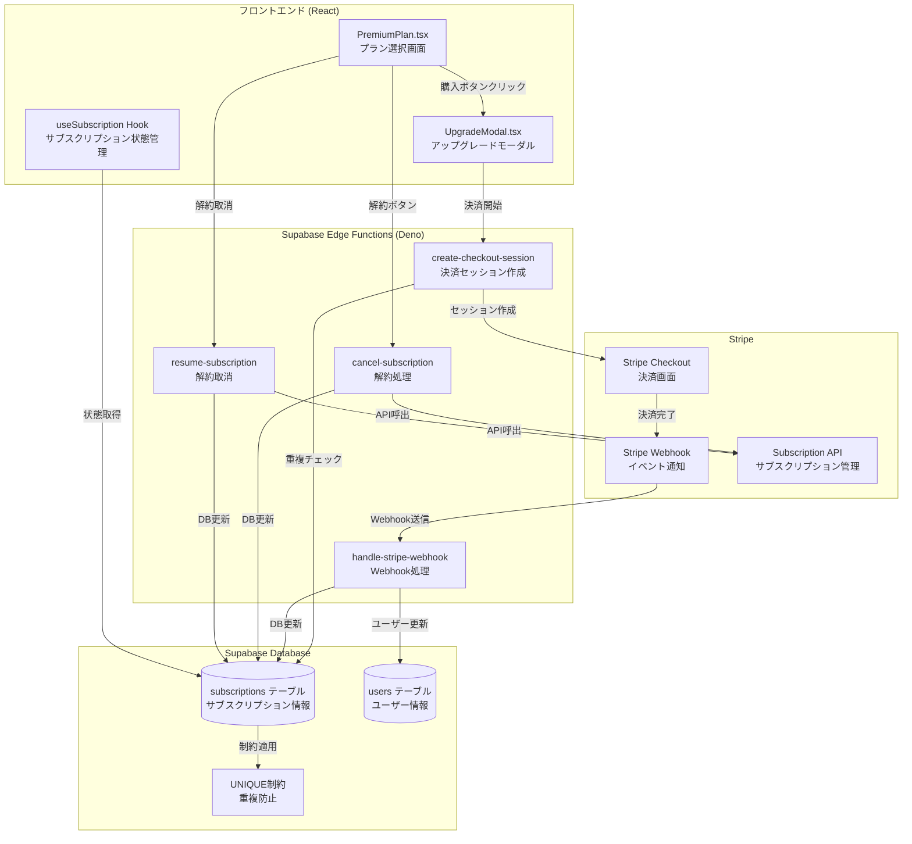
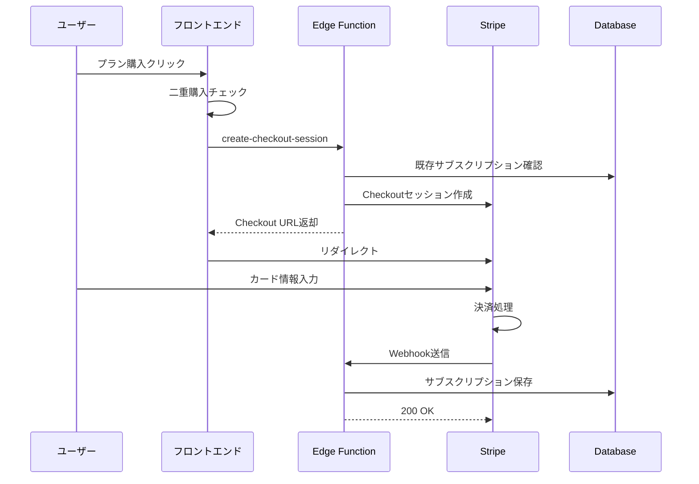
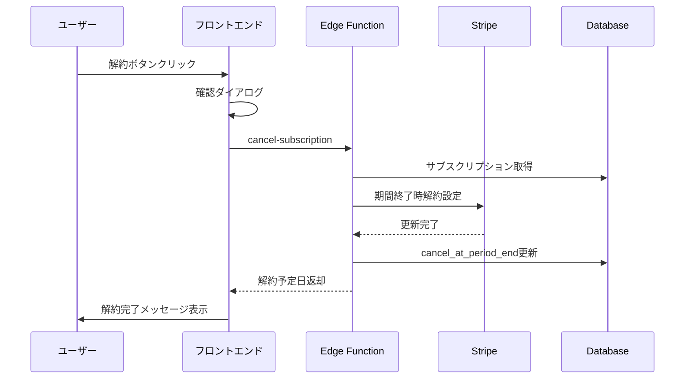

# 有料課金システムアーキテクチャ

## 概要
大家DXの有料課金システムは、Stripe決済とSupabase Edge Functionsを組み合わせた堅牢なサブスクリプション管理システムです。

## システム構成図



## コンポーネント詳細

### 1. フロントエンド層

#### PremiumPlan.tsx
- **役割**: プレミアムプラン画面の表示と操作
- **主要機能**:
  - 料金プランの表示（月額・年額）
  - 現在のサブスクリプション状態表示
  - 購入/解約/解約取消ボタンの制御
  - 解約予定日・残り日数の表示

#### UpgradeModal.tsx
- **役割**: アップグレード確認モーダル
- **主要機能**:
  - 二重購入防止チェック
  - Stripe Checkoutへのリダイレクト
  - エラーハンドリング

#### useSubscription Hook
- **役割**: サブスクリプション状態のリアルタイム管理
- **主要機能**:
  - サブスクリプション情報の取得
  - 状態変更の監視
  - キャッシュ管理

### 2. Edge Functions層（サーバーレス）

#### create-checkout-session
```typescript
// 主要処理フロー
1. ユーザー認証
2. 既存サブスクリプションチェック
3. Stripe Checkoutセッション作成
4. 成功/キャンセルURLの設定
5. セッションURLを返却
```

#### handle-stripe-webhook
```typescript
// Webhookイベント処理
- checkout.session.completed: 新規購入完了
- customer.subscription.updated: サブスクリプション更新
- customer.subscription.deleted: サブスクリプション削除
- invoice.payment_succeeded: 支払い成功
- invoice.payment_failed: 支払い失敗
```

#### cancel-subscription
```typescript
// 解約処理フロー
1. ユーザー認証
2. アクティブなサブスクリプション取得
3. Stripe APIで期間終了時解約設定
4. データベース更新（cancel_at_period_end = true）
```

#### resume-subscription
```typescript
// 解約取消処理フロー
1. ユーザー認証
2. 解約予定のサブスクリプション取得
3. Stripe APIで解約取消
4. データベース更新（cancel_at_period_end = false）
```

### 3. データベース設計

#### subscriptionsテーブル
```sql
CREATE TABLE subscriptions (
  id UUID PRIMARY KEY DEFAULT uuid_generate_v4(),
  user_id UUID REFERENCES users(id) NOT NULL,
  stripe_customer_id TEXT NOT NULL,
  stripe_subscription_id TEXT NOT NULL,
  stripe_price_id TEXT NOT NULL,
  status TEXT NOT NULL,
  current_period_start TIMESTAMPTZ,
  current_period_end TIMESTAMPTZ,
  cancel_at_period_end BOOLEAN DEFAULT false,
  cancel_at TIMESTAMPTZ,
  canceled_at TIMESTAMPTZ,
  created_at TIMESTAMPTZ DEFAULT NOW(),
  updated_at TIMESTAMPTZ DEFAULT NOW()
);

-- 重複防止のUNIQUE制約
CREATE UNIQUE INDEX idx_one_active_subscription_per_user 
ON subscriptions(user_id) 
WHERE status = 'active' AND cancel_at_period_end = false;
```

## セキュリティ対策

### 1. 認証・認可
- **JWT認証**: 全てのEdge FunctionでJWTトークン検証
- **RLS (Row Level Security)**: データベースレベルでのアクセス制御
- **Service Roleキー**: 管理操作用の特権キー使用

### 2. 決済セキュリティ
- **Webhook署名検証**: Stripeからの通信の真正性確認
- **HTTPS通信**: 全ての通信をSSL/TLS暗号化
- **PCI DSS準拠**: カード情報は直接扱わずStripeに委託

### 3. 二重決済防止

#### 多層防御アプローチ
```
レイヤー1: フロントエンド
├── UpgradeModal.tsx: 購入前チェック
└── PremiumPlan.tsx: ボタン状態管理

レイヤー2: バックエンド
├── create-checkout-session: API検証
└── handle-stripe-webhook: 重複処理防止

レイヤー3: データベース
└── UNIQUE制約: 構造的重複防止
```

## 処理フロー

### 新規購入フロー


### 解約フロー


## エラーハンドリング

### エラーパターンと対処

| エラー種別 | 発生箇所 | 対処方法 |
|-----------|---------|----------|
| 認証エラー | Edge Functions | 401エラー返却、再ログイン促す |
| 重複購入 | create-checkout-session | 400エラー、既存プラン案内 |
| Stripe API失敗 | 各Edge Function | リトライ機構、エラーログ記録 |
| Webhook検証失敗 | handle-stripe-webhook | 400エラー、セキュリティアラート |
| DB接続エラー | 全Edge Functions | 503エラー、自動リトライ |

## 監視・運用

### ログ管理
```typescript
// Edge Functionログ出力例
console.log('Processing subscription for user:', userId);
console.error('Stripe API error:', error);
```

### メトリクス監視項目
- 決済成功率
- 解約率（チャーンレート）
- Edge Function実行時間
- エラー発生率
- Webhook処理遅延

## デプロイメント

### GitHub Actions CI/CD
```yaml
name: Deploy Edge Functions
on:
  push:
    branches: [main, develop]
    paths:
      - 'supabase/functions/**'
      
jobs:
  deploy:
    runs-on: ubuntu-latest
    steps:
      - uses: actions/checkout@v3
      - uses: supabase/setup-cli@v1
      - name: Deploy Functions
        run: |
          supabase functions deploy create-checkout-session
          supabase functions deploy handle-stripe-webhook
          supabase functions deploy cancel-subscription
          supabase functions deploy resume-subscription
```

## テスト戦略

### 1. 単体テスト
- Edge Functions: Deno test
- フロントエンド: Jest + React Testing Library

### 2. 統合テスト
- Stripe Test Mode使用
- テスト用カード番号での決済フロー確認

### 3. E2Eテスト
- Cypress/Playwrightによる全体フロー確認
- 本番環境相当での動作確認

## 今後の拡張計画

### Phase 1（実装済み）
- ✅ 基本的なサブスクリプション機能
- ✅ 解約・解約取消機能
- ✅ 二重決済防止

### Phase 2（計画中）
- [ ] クーポン・割引機能
- [ ] 複数プラン対応
- [ ] 使用量ベース課金

### Phase 3（将来）
- [ ] 請求書発行機能
- [ ] 法人向け一括請求
- [ ] 国際決済対応

## トラブルシューティング

### よくある問題と解決方法

1. **「Failed to send a request to the Edge Function」エラー**
   - 原因: Edge Functionが未デプロイ
   - 解決: GitHub Actions再実行またはsupabase functions deploy

2. **重複購入エラー**
   - 原因: 既にアクティブなサブスクリプション存在
   - 解決: 管理画面から既存プラン確認

3. **Webhook処理遅延**
   - 原因: Edge Function処理時間超過
   - 解決: 非同期処理最適化、キュー導入検討

## 関連ドキュメント

- [Stripe API Documentation](https://stripe.com/docs/api)
- [Supabase Edge Functions Guide](https://supabase.com/docs/guides/functions)
- [二重決済防止システム仕様書](./二重決済防止システム仕様書.md)
- [Edge Functions デプロイ手順](./Edge_Functions_デプロイ手順_二重決済防止.md)