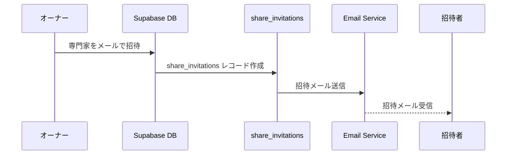
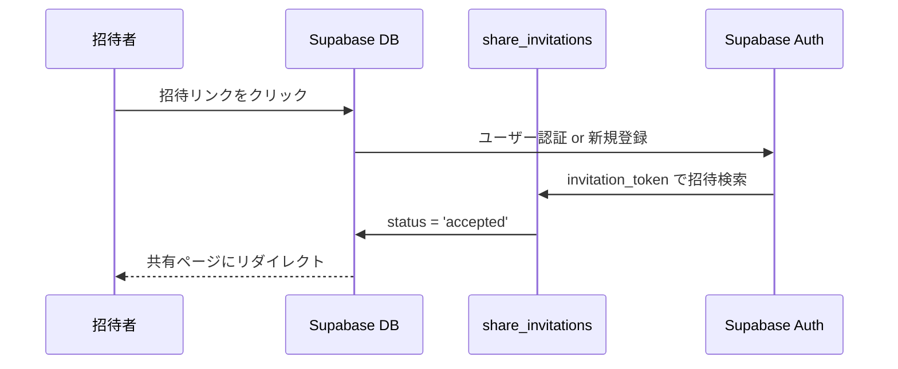

# コメント共有機能 統合仕様書

## 1. 概要

不動産投資シミュレーション結果に対してコメントを投稿・閲覧できる共有機能。シミュレーション結果を外部の人と共有し、コメントによる意見交換を可能にする。

### 1.1 機能目的
- **投資判断支援**: 専門家や家族からの意見収集
- **リスク軽減**: 多角的な視点での投資検討
- **意思決定強化**: エビデンスに基づく投資判断

### 1.2 対象ユーザー
#### 主要ユーザー（物件オーナー）
- 不動産投資を検討している個人投資家
- 家族で賃貸業を営んでいる方
- 複数の意見を参考にして投資判断をしたい方

#### 招待されるユーザー
- **家族メンバー**: 配偶者、親、子供など
- **専門家**: 税理士、不動産コンサルタント、ファイナンシャルプランナー
- **投資仲間**: 不動産投資経験者

## 2. 機能要件

### 2.1 基本機能
- **共有リンク生成**: シミュレーション結果の共有URLを生成
- **コメント投稿**: 共有ページでのコメント投稿
- **コメント表示**: シミュレーション結果ページでのコメント表示
- **リアルタイム更新**: コメントの自動更新機能

### 2.2 共有機能
- **7日間有効**: 共有リンクの有効期限
- **認証不要**: 共有リンクアクセス時のログイン不要
- **複数共有方法**: LINE、メール送信機能

### 2.3 データ永続化
- **編集モード対応**: 既存シミュレーション編集時の上書き更新
- **共有トークン維持**: 編集後も同じ共有トークンを保持
- **認証タイミング対応**: ページリロード時のコメント表示継続

### 2.4 権限管理
- **viewer**: 閲覧のみ
- **commenter**: 閲覧・コメント投稿
- **editor**: 閲覧・コメント・編集
- **owner**: 全権限

## 3. システム構成

### 3.1 データベーステーブル

#### property_shares テーブル（共有管理）
```sql
CREATE TABLE property_shares (
  id UUID PRIMARY KEY DEFAULT gen_random_uuid(),
  property_id TEXT NOT NULL,
  owner_id UUID REFERENCES auth.users(id),
  share_token TEXT UNIQUE NOT NULL DEFAULT encode(gen_random_bytes(16), 'hex'),
  title TEXT,
  description TEXT,
  settings JSONB DEFAULT '{"allow_comments": true}',
  expires_at TIMESTAMP WITH TIME ZONE DEFAULT (now() + interval '7 days'),
  created_at TIMESTAMP WITH TIME ZONE DEFAULT now(),
  updated_at TIMESTAMP WITH TIME ZONE DEFAULT now()
);
```

#### share_comments テーブル（コメント管理）
```sql
CREATE TABLE share_comments (
  id UUID PRIMARY KEY DEFAULT gen_random_uuid(),
  share_id UUID REFERENCES property_shares(id) ON DELETE CASCADE,
  user_id UUID,
  content TEXT NOT NULL,
  tags TEXT[] DEFAULT '{}',
  parent_id UUID REFERENCES share_comments(id),
  user_email TEXT,
  user_name TEXT,
  created_at TIMESTAMP WITH TIME ZONE DEFAULT now(),
  updated_at TIMESTAMP WITH TIME ZONE DEFAULT now()
);
```

#### share_invitations テーブル（招待管理）
```sql
CREATE TABLE share_invitations (
  id UUID PRIMARY KEY DEFAULT gen_random_uuid(),
  share_id UUID NOT NULL REFERENCES property_shares(id) ON DELETE CASCADE,
  email VARCHAR(255) NOT NULL,
  role VARCHAR(50) NOT NULL CHECK (role IN ('viewer', 'commenter', 'editor')),
  user_type VARCHAR(50) DEFAULT 'general',
  invited_by UUID NOT NULL REFERENCES auth.users(id),
  accepted_by UUID REFERENCES auth.users(id),
  invitation_token VARCHAR(255) UNIQUE NOT NULL,
  status VARCHAR(50) DEFAULT 'pending',
  message TEXT,
  accepted_at TIMESTAMP WITH TIME ZONE,
  expires_at TIMESTAMP WITH TIME ZONE,
  created_at TIMESTAMP WITH TIME ZONE DEFAULT CURRENT_TIMESTAMP
);
```

#### comment_reactions テーブル（リアクション管理）
```sql
CREATE TABLE comment_reactions (
  id UUID PRIMARY KEY DEFAULT gen_random_uuid(),
  comment_id UUID NOT NULL REFERENCES share_comments(id) ON DELETE CASCADE,
  user_id UUID NOT NULL REFERENCES auth.users(id),
  reaction VARCHAR(10) NOT NULL,
  created_at TIMESTAMP WITH TIME ZONE DEFAULT CURRENT_TIMESTAMP,
  UNIQUE(comment_id, user_id, reaction)
);
```

#### simulations テーブル（共有トークン永続化）
```sql
ALTER TABLE simulations ADD COLUMN share_token TEXT;
```

### 3.2 主要コンポーネント

#### フロントエンド
- **ShareButton**: 共有リンク生成・表示
- **ShareCommentDisplay**: コメント表示・投稿フォーム
- **SimpleCommentSection**: シンプルなコメント投稿UI
- **SimulationResult**: 結果表示ページ（コメント統合）
- **InviteModal**: 招待・共有リンク生成モーダル
- **CollaborationView**: 招待者用の共有ビューページ

#### バックエンド/API
- **usePropertyShare**: 共有・コメント管理フック
- **useShareComments**: コメント取得・表示フック
- **useSupabaseData**: データ永続化管理

## 4. 主要機能の詳細仕様

### 4.1 共有リンク生成

#### 処理フロー
1. **共有ボタンクリック**
2. **property_shares作成/取得**
   - 既存共有確認（property_id + owner_id）
   - なければ新規作成
3. **共有URL生成**
   - `${baseUrl}/simple-collaboration/${share_token}`
4. **モーダル表示**
   - URL表示・コピー機能
   - LINE・メール送信リンク

#### 実装例
```typescript
const handleShare = async () => {
  const share = await fetchOrCreateShareByPropertyId(propertyId, propertyName);
  const shareUrl = `${window.location.origin}/simple-collaboration/${share.share_token}`;
  setShowModal(true);
};
```

### 4.2 コメント投稿・表示

#### 投稿処理
1. **認証チェック** (任意)
2. **share_comments挿入**
   - share_id（共有ID）
   - user_id / user_email（投稿者情報）
   - content（コメント内容）
3. **リアルタイム更新**

#### 表示処理
1. **共有トークン取得**
   - currentShare.share_token
   - または、simulation.share_token（フォールバック）
2. **コメント一覧取得**
   - share_id での絞り込み
   - 作成日時順ソート
3. **リアルタイム更新**
   - Supabaseリアルタイム機能使用

### 4.3 データ永続化機能

#### 新規作成フロー
```typescript
// 1. 共有情報先行作成
const share = await fetchOrCreateShareByPropertyId(tempId, propertyName);
const shareToken = share.share_token;

// 2. シミュレーション保存（共有トークン含む）
const { data } = await saveSimulation(simulationData, shareToken);

// 3. property_id更新
await updatePropertyShareId(share.id, data.id);
```

#### 編集モード（上書き更新）フロー
```typescript
// 1. 編集モード判定
const isEditMode = Boolean(editingId);

// 2. 既存共有トークン取得
const shareToken = currentShare?.share_token || 
                  await fetchShareTokenFromSimulation(editingId);

// 3. 上書き更新
const { data } = await saveSimulation(simulationData, shareToken, editingId);
```

### 4.4 招待機能

#### 招待フロー


#### 招待承認フロー


## 5. UI/UX 仕様

### 5.1 共有モーダル
- **共有URL表示**: 読み取り専用入力フィールド
- **ワンクリックコピー**: クリップボード機能
- **外部共有**: LINE・メール送信リンク
- **有効期限表示**: 7日間の期限案内

### 5.2 招待モーダル
```tsx
<InviteModal>
  <h2>シミュレーション結果を共有</h2>
  
  <TabGroup>
    <Tab>メールで招待</Tab>
    <Tab>リンク共有</Tab>
    <Tab>既存メンバー</Tab>
  </TabGroup>
  
  <EmailInviteForm>
    <Input placeholder="メールアドレス" />
    <Select label="役割">
      <Option>家族</Option>
      <Option>税理士</Option>
      <Option>不動産専門家</Option>
    </Select>
    <Select label="権限">
      <Option>閲覧のみ</Option>
      <Option>コメント可能</Option>
      <Option>編集可能</Option>
    </Select>
  </EmailInviteForm>
</InviteModal>
```

### 5.3 コメント表示
- **投稿者表示**: ユーザー名またはゲスト表示
- **投稿日時**: 日本時間での表示
- **自動更新**: 手動更新ボタン + リアルタイム
- **タグ別色分け**: リスク=赤、承認=緑、質問=青、要検討=黄、提案=紫
- **専門家バッジ**: 税理士、不動産専門家、家族の識別表示
- **デバッグ情報**: 開発環境での詳細表示

### 5.4 レスポンシブ対応
- **モバイル最適化**: スマートフォン表示対応
- **タッチ操作**: タップ・スワイプ対応
- **アクセシビリティ**: WAI-ARIA準拠

## 6. 認証・セキュリティ

### 6.1 認証なしアクセス対応
- **共有ページ**: ログイン不要
- **コメント投稿**: ゲストユーザー対応
- **フォールバック機能**: 認証状態に関係なく共有トークン取得

### 6.2 Row Level Security (RLS)
```sql
-- property_shares読み取りポリシー
CREATE POLICY "property_shares_select" ON property_shares 
FOR SELECT USING (true);

-- share_comments読み取りポリシー  
CREATE POLICY "share_comments_select" ON share_comments 
FOR SELECT USING (true);

-- コメント投稿ポリシー
CREATE POLICY "share_comments_insert" ON share_comments 
FOR INSERT WITH CHECK (true);
```

### 6.3 権限管理システム
| 権限 | 閲覧 | コメント | 編集 | 削除 |
|------|------|----------|------|------|
| **viewer** | ✅ | ❌ | ❌ | ❌ |
| **commenter** | ✅ | ✅ | ❌ | ❌ |
| **editor** | ✅ | ✅ | ✅ | ✅ |
| **owner** | ✅ | ✅ | ✅ | ✅ |

### 6.4 ユーザータイプ
| タイプ | 説明 | バッジ表示 | デフォルト権限 |
|--------|------|------------|----------------|
| **family** | 家族・親戚 | 👨‍👩‍👧‍👦 家族 | commenter |
| **tax_accountant** | 税理士 | 👨‍💼 税理士 | commenter |
| **consultant** | 不動産専門家 | 🏠 専門家 | commenter |
| **general** | その他 | 🔵 ゲスト | viewer |

## 7. エラーハンドリング

### 7.1 認証タイミング問題の解決
```typescript
// ユーザー認証が利用できない場合のフォールバック
if (!user?.id) {
  const shareToken = await fetchShareTokenFromSimulation(propertyId);
  if (shareToken) {
    const shareData = await fetchShare(shareToken);
    return shareData;
  }
}
```

### 7.2 データベース制約エラー対応
- **外部キー制約**: 警告レベルで処理継続
- **UUID検証**: 無効形式の自動修正
- **重複防止**: upsert処理での競合回避

## 8. パフォーマンス最適化

### 8.1 データ取得最適化
- **並列処理**: 複数API呼び出しの同時実行
- **キャッシュ機能**: 15分間の自動キャッシュ
- **遅延読み込み**: 必要時のみコメント取得

### 8.2 リアルタイム機能
- **Supabaseリアルタイム**: WebSocket接続
- **自動再接続**: 接続断絶時の復旧機能
- **効率的な更新**: 差分更新での帯域最適化

### 8.3 インデックス戦略
```sql
-- 複合インデックス
CREATE INDEX idx_invitations_status_share ON share_invitations(status, share_id);
CREATE INDEX idx_comments_share_created ON share_comments(share_id, created_at DESC);

-- 部分インデックス
CREATE INDEX idx_active_invitations ON share_invitations(share_id)
  WHERE status = 'accepted';

-- GINインデックス（タグ検索用）
CREATE INDEX idx_comments_tags ON share_comments USING GIN(tags);
```

## 9. 実装状況

### 9.1 完了機能
- ✅ **基本コメント表示システム**: SimulationResult・Simulatorページ両対応
- ✅ **UI/UX設計**: レスポンシブ対応、タグ別色分け、専門家バッジ
- ✅ **データベース設計**: 全テーブル作成完了
- ✅ **共有リンク生成**: 基本的な共有機能
- ✅ **編集モード対応**: 上書き更新による共有トークン維持
- ✅ **認証フォールバック**: ページリロード時のコメント表示継続

### 9.2 開発中・改善項目
- 🔄 **メール招待機能**: Resend API使用の招待メール送信
- 🔄 **権限管理強化**: より詳細な権限制御
- 🔄 **リアルタイム通知**: 新規コメント時の通知機能
- 🔄 **パフォーマンス最適化**: RLS性能改善

## 10. 今後の拡張予定

### 10.1 追加機能候補
- **コメント返信**: ネストしたコメント機能
- **リアクション**: いいね・絵文字リアクション
- **通知機能**: 新規コメント時のメール通知
- **画像添付**: コメントへの画像・ファイル添付
- **@メンション**: 特定ユーザーへのメンション機能

### 10.2 AI・自動化機能
- **リスク自動検出**: AIによるリスク要因の自動抽出
- **推奨専門家**: 物件特性に応じた専門家推薦
- **自動タグ付け**: コメント内容の自動タグ分類
- **AI要約**: 複数コメントの自動要約機能

### 10.3 高度なコラボレーション
- **投票機能**: 投資可否の多数決投票
- **会議室機能**: リアルタイムチャット・ビデオ通話
- **文書共有**: 関連資料・契約書等の共有
- **タスク管理**: 検討事項・TODO管理

## 11. テスト仕様

### 11.1 単体テスト
- **共有トークン生成**: 一意性・形式検証
- **コメント投稿**: バリデーション・保存確認
- **認証フォールバック**: 各種認証状態での動作確認

### 11.2 統合テスト
- **エンドツーエンド**: 共有〜コメント投稿〜表示の完全フロー
- **クロスブラウザ**: Chrome・Safari・Firefoxでの動作確認
- **モバイル**: iOS・Androidでの操作確認

### 11.3 負荷テスト
- **同時アクセス**: 複数ユーザーでの共有ページアクセス
- **大量コメント**: 100件以上のコメント表示性能
- **リアルタイム**: 同時コメント投稿時の更新性能

## 12. 成功指標（KPI）

### 12.1 利用指標
- 月間アクティブユーザー数: 1,000人
- 共有機能の利用率: 40%以上
- 平均コメント数/シミュレーション: 3件以上
- 招待承認率: 70%以上

### 12.2 品質指標
- コメント投稿成功率: 99%以上
- ページ表示速度: 2秒以内
- エラー発生率: 1%以下
- ユーザー満足度: 4.0/5.0以上

## 13. 運用・保守

### 13.1 監視項目
- エラー監視・アラート設定
- パフォーマンス監視ダッシュボード
- ユーザーフィードバック収集システム
- A/Bテスト基盤構築

### 13.2 セキュリティ運用
- 定期的なセキュリティテスト
- アクセスログの監査
- 不正利用の検知・対応
- データバックアップ・復旧手順

---

**最終更新**: 2025年7月2日  
**バージョン**: 2.0  
**作成者**: AI開発チーム

---

## 関連ドキュメント履歴

この統合仕様書は以下のドキュメントをマージして作成されました：

1. `コメント機能要件・残課題整理_250701_1.md` - 要件定義・課題整理
2. `共有機能UI設計.md` - UI/UX設計詳細
3. `共有機能データベース設計.md` - データベース設計
4. `招待機能データベース設計詳細.md` - 招待機能詳細設計
5. `コメント共有機能仕様書.md` - 基本仕様書

**統合により削除対象となったファイル**:
- コメント機能要件・残課題整理_250701_1.md
- 共有機能UI設計.md  
- 共有機能データベース設計.md
- 招待機能データベース設計詳細.md
- コメント共有機能仕様書.md