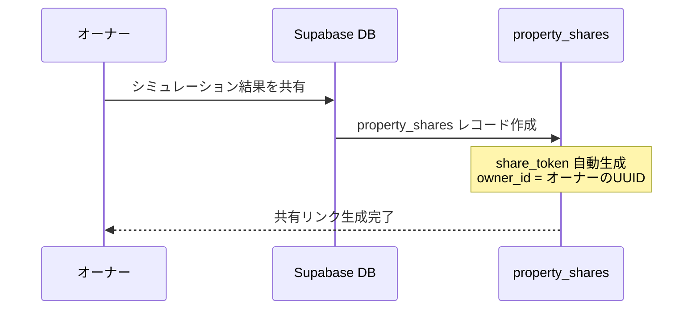
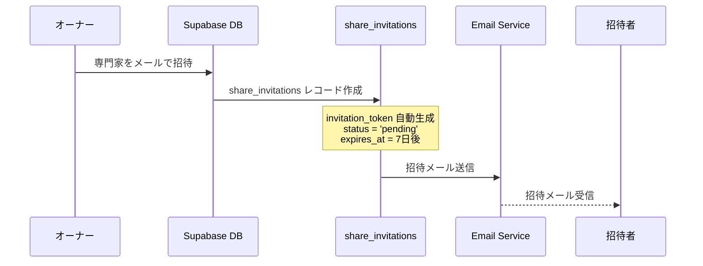
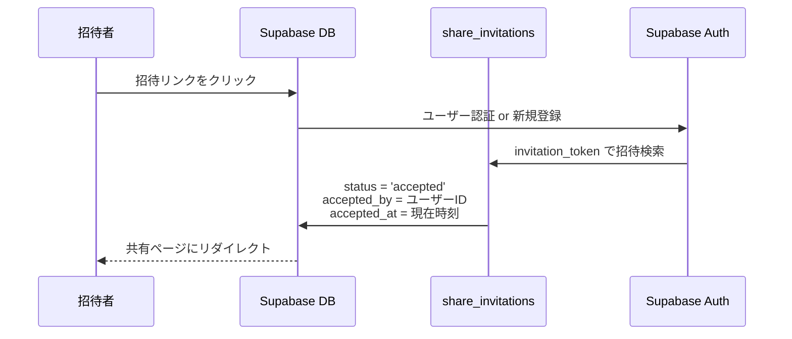
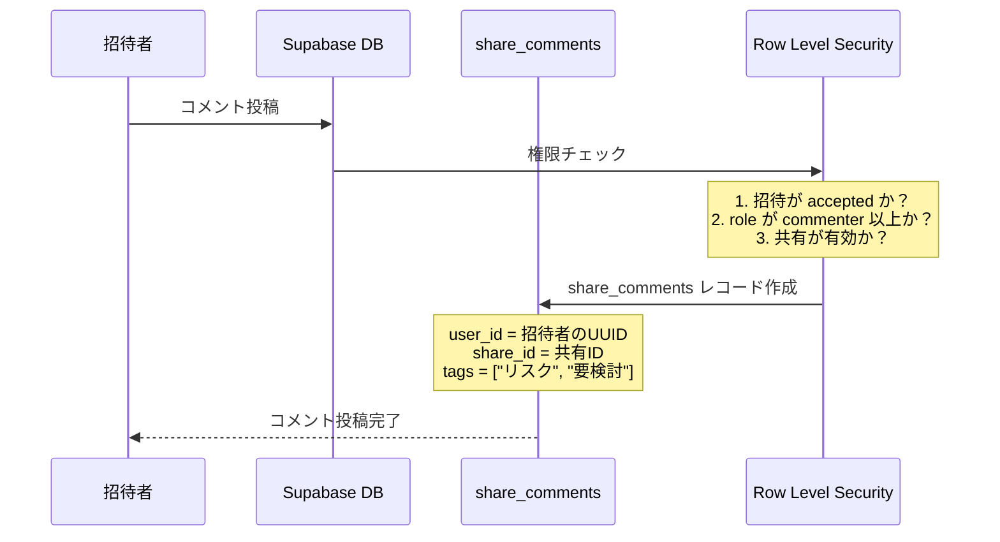

# 招待機能データベース設計詳細

## 📊 データベース構造概要

### 🏗️ テーブル関係図

```
┌─────────────────┐    ┌──────────────────┐    ┌─────────────────┐
│   auth.users    │    │   properties     │    │ property_shares │
│ (Supabase認証)  │    │   (物件情報)     │    │   (共有管理)    │
├─────────────────┤    ├──────────────────┤    ├─────────────────┤
│ id (UUID)       │◄──┐│ id (UUID)        │◄──┐│ id (UUID)       │
│ email           │   ││ user_id (UUID)   │   ││ property_id     │
│ created_at      │   │├──────────────────┤   │├─────────────────┤
└─────────────────┘   │└──────────────────┘   ││ owner_id        │
                      │                       ││ share_token     │
                      │                       ││ title           │
                      │                       ││ settings        │
                      │                       ││ expires_at      │
                      │                       │└─────────────────┘
                      │                       │
                      │┌─────────────────────┐│
                      ││ share_invitations   ││
                      ││   (招待管理)        ││
                      │├─────────────────────┤│
                      ││ id (UUID)           ││
                      ││ share_id (UUID)     ││ ◄─┘
                      ││ email (VARCHAR)     ││
                      ││ role (ENUM)         ││
                      ││ user_type (ENUM)    ││
                      ││ invited_by (UUID)   ││ ◄─┘
                      ││ accepted_by (UUID)  ││ ◄─┘
                      ││ invitation_token    ││
                      ││ status (ENUM)       ││
                      ││ message (TEXT)      ││
                      │└─────────────────────┘│
                      │                       │
                      │┌─────────────────────┐│
                      ││ share_comments      ││
                      ││   (コメント管理)    ││
                      │├─────────────────────┤│
                      ││ id (UUID)           ││
                      ││ share_id (UUID)     ││ ◄─┘
                      ││ user_id (UUID)      ││ ◄─┘
                      ││ parent_id (UUID)    ││ (返信用)
                      ││ content (TEXT)      ││
                      ││ tags (TEXT[])       ││
                      ││ attachments (JSONB) ││
                      │└─────────────────────┘│
                      │                       │
                      │┌─────────────────────┐│
                      ││ comment_reactions   ││
                      ││  (リアクション管理) ││
                      │├─────────────────────┤│
                      ││ id (UUID)           ││
                      ││ comment_id (UUID)   ││ ◄─┘
                      ││ user_id (UUID)      ││ ◄─┘
                      ││ reaction (VARCHAR)  ││
                      │└─────────────────────┘│
                      │                       │
                      │┌─────────────────────┐│
                      ││ share_access_logs   ││
                      ││  (アクセスログ)     ││
                      │├─────────────────────┤│
                      ││ id (UUID)           ││
                      ││ share_id (UUID)     ││ ◄─┘
                      ││ user_id (UUID)      ││ ◄─┘
                      ││ action (VARCHAR)    ││
                      ││ ip_address (INET)   ││
                      │└─────────────────────┘│
                      └───────────────────────┘
```

---

## 🔄 招待・コメント機能のワークフロー

### Phase 1: 共有作成


### Phase 2: 招待送信


### Phase 3: 招待承認


### Phase 4: コメント投稿


---

## 🔐 セキュリティ設計（RLS）

### 1. property_shares テーブル
```sql
-- SELECT: オーナーのみが自分の共有を閲覧可能
CREATE POLICY "Users can view their own shares" ON property_shares
  FOR SELECT USING (auth.uid() = owner_id);

-- INSERT: 認証されたユーザーが共有作成可能
CREATE POLICY "Authenticated users can create shares" ON property_shares
  FOR INSERT WITH CHECK (auth.uid() = owner_id);
```

### 2. share_invitations テーブル
```sql
-- SELECT: 関連するユーザーのみ招待情報を閲覧可能
CREATE POLICY "Users can view relevant invitations" ON share_invitations
  FOR SELECT USING (
    auth.uid() = invited_by OR          -- 招待者
    auth.uid() = accepted_by OR         -- 被招待者（承認後）
    email = auth.jwt()->>'email'        -- メールアドレス一致
  );
```

### 3. share_comments テーブル
```sql
-- SELECT: 共有オーナー or 承認済み招待者のみコメント閲覧可能
CREATE POLICY "Users can view comments" ON share_comments
  FOR SELECT USING (
    EXISTS (
      SELECT 1 FROM property_shares 
      WHERE id = share_comments.share_id 
      AND owner_id = auth.uid()
    )
  );

-- INSERT: commenter or editor 権限が必要
CREATE POLICY "Users can create comments" ON share_comments
  FOR INSERT WITH CHECK (
    EXISTS (
      SELECT 1 FROM share_invitations si
      JOIN property_shares ps ON si.share_id = ps.id
      WHERE ps.id = share_comments.share_id
      AND si.accepted_by = auth.uid()
      AND si.status = 'accepted'
      AND si.role IN ('commenter', 'editor')
    )
  );
```

---

## 🎯 権限管理システム

### 権限レベル
| 権限 | 閲覧 | コメント | 編集 | 削除 |
|------|------|----------|------|------|
| **viewer** | ✅ | ❌ | ❌ | ❌ |
| **commenter** | ✅ | ✅ | ❌ | ❌ |
| **editor** | ✅ | ✅ | ✅ | ✅ |
| **owner** | ✅ | ✅ | ✅ | ✅ |

### ユーザータイプ
| タイプ | 説明 | バッジ表示 | デフォルト権限 |
|--------|------|------------|----------------|
| **family** | 家族・親戚 | 👨‍👩‍👧‍👦 家族 | commenter |
| **tax_accountant** | 税理士 | 👨‍💼 税理士 | commenter |
| **consultant** | 不動産専門家 | 🏠 専門家 | commenter |
| **general** | その他 | 🔵 ゲスト | viewer |

---

## 🔄 実際のデータフロー

### 1. オーナーが共有作成
```sql
-- 1. property_shares テーブルに挿入
INSERT INTO property_shares (property_id, owner_id, title, description)
VALUES (
    'property-uuid',
    'owner-uuid', 
    '新宿区マンション投資検討',
    '利回り8.5%の物件です。ご意見をお聞かせください。'
);

-- 自動生成される値:
-- id: gen_random_uuid()
-- share_token: トリガーで自動生成
-- created_at: CURRENT_TIMESTAMP
```

### 2. 招待送信
```sql
-- 2. share_invitations テーブルに挿入
INSERT INTO share_invitations (share_id, email, role, user_type, invited_by, message)
VALUES (
    'share-uuid',
    'yamada@example.com',
    'commenter',
    'tax_accountant',
    'owner-uuid',
    '税務面でのアドバイスをお願いします。'
);

-- 自動生成される値:
-- id: gen_random_uuid()
-- invitation_token: トリガーで自動生成
-- status: 'pending'
-- expires_at: CURRENT_TIMESTAMP + 7 days
```

### 3. 招待承認
```sql
-- 3. 招待承認時の更新
UPDATE share_invitations 
SET 
    status = 'accepted',
    accepted_by = 'invitee-uuid',
    accepted_at = CURRENT_TIMESTAMP
WHERE invitation_token = 'invitation-token-from-email';
```

### 4. コメント投稿
```sql
-- 4. share_comments テーブルに挿入
INSERT INTO share_comments (share_id, user_id, content, tags)
VALUES (
    'share-uuid',
    'invitee-uuid',
    'この物件の利回りは良好ですが、築年数を考慮すると修繕費の積み立てを多めに見積もった方が良いかもしれません。',
    ARRAY['要検討', 'リスク']
);
```

---

## ⚠️ 現在の実装上の問題点

### 1. データベース接続問題
```typescript
// 問題: usePropertyShare.ts の fetchComments が空を返す
const { data, error } = await supabase
  .from('share_comments')
  .select('*')
  .eq('share_id', shareId);
// → RLSポリシーまたは認証状態に問題がある可能性
```

### 2. 共有状態管理問題
```typescript
// 問題: currentShare が常に null
const [currentShare, setCurrentShare] = useState<PropertyShare | null>(null);
// → fetchShareByPropertyId が正常に動作していない
```

### 3. 認証状態の不整合
```typescript
// 問題: user?.id の値とデータベースの認証状態が一致しない
const { user } = useSupabaseAuth();
// → Supabase の auth.uid() と user?.id が異なる可能性
```

---

## 🔧 修正が必要な箇所

### 1. RLSポリシーの見直し
現在のポリシーはオーナーのみアクセス可能だが、招待者もアクセスできるようにする必要

### 2. 認証状態の統一
フロントエンドの認証状態とSupabaseの認証状態を統一

### 3. エラーハンドリングの強化
データベース操作のエラーを適切にキャッチ・表示

### 4. デバッグ機能の追加
現在の認証状態・権限状態を可視化する機能

---

## 🎯 次回実装予定

### Phase 0: 基本機能修復（1週間）
1. **Day 1**: 認証状態の統一・デバッグ
2. **Day 2**: RLSポリシーの修正
3. **Day 3**: 実コメント保存・取得機能
4. **Day 4**: 共有状態管理の修正
5. **Day 5**: エラーハンドリング・テスト

この設計により、スケーラブルで安全な招待・コメント機能が実現できます。

---

*作成日: 2025年07月01日*  
*責任者: 開発チーム*