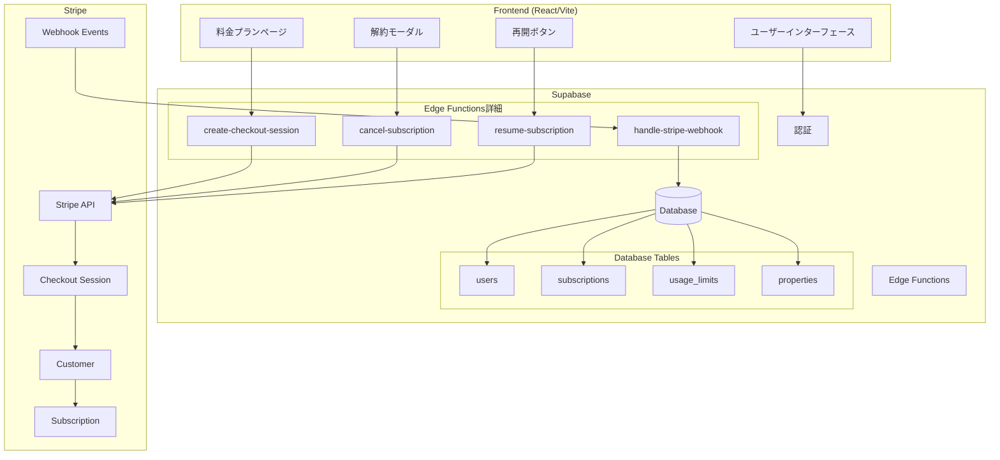
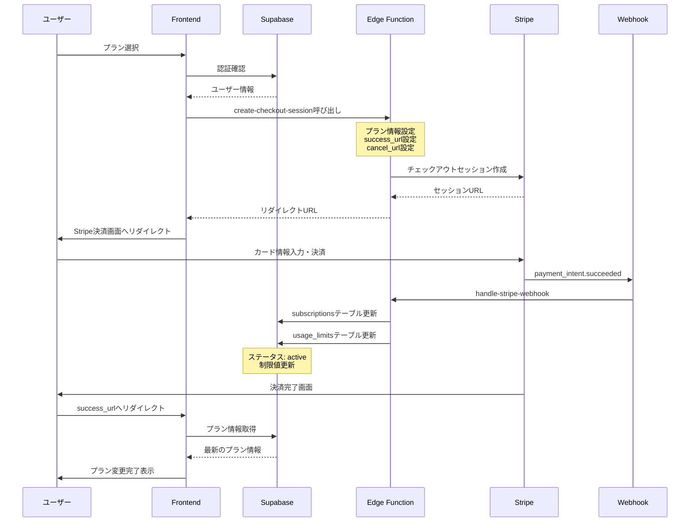
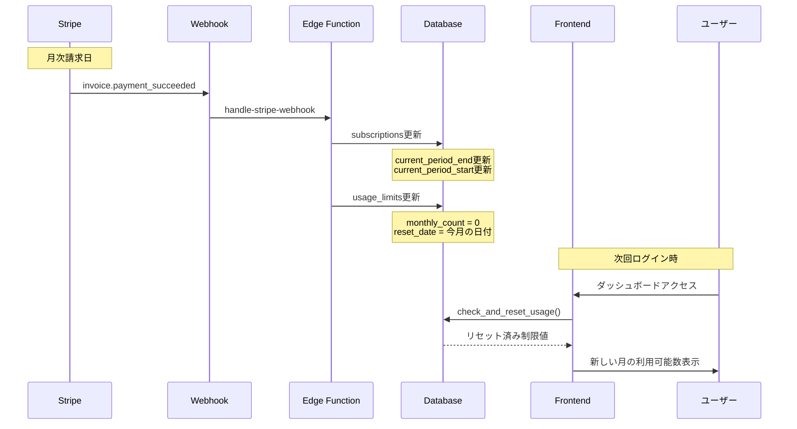
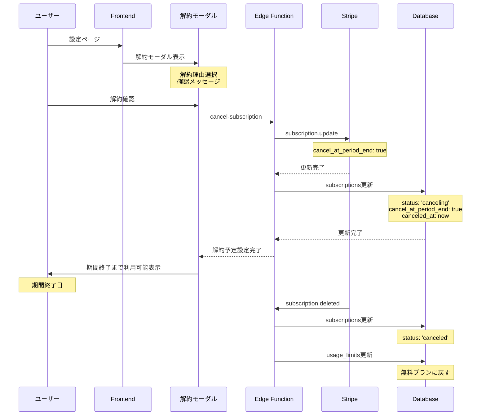
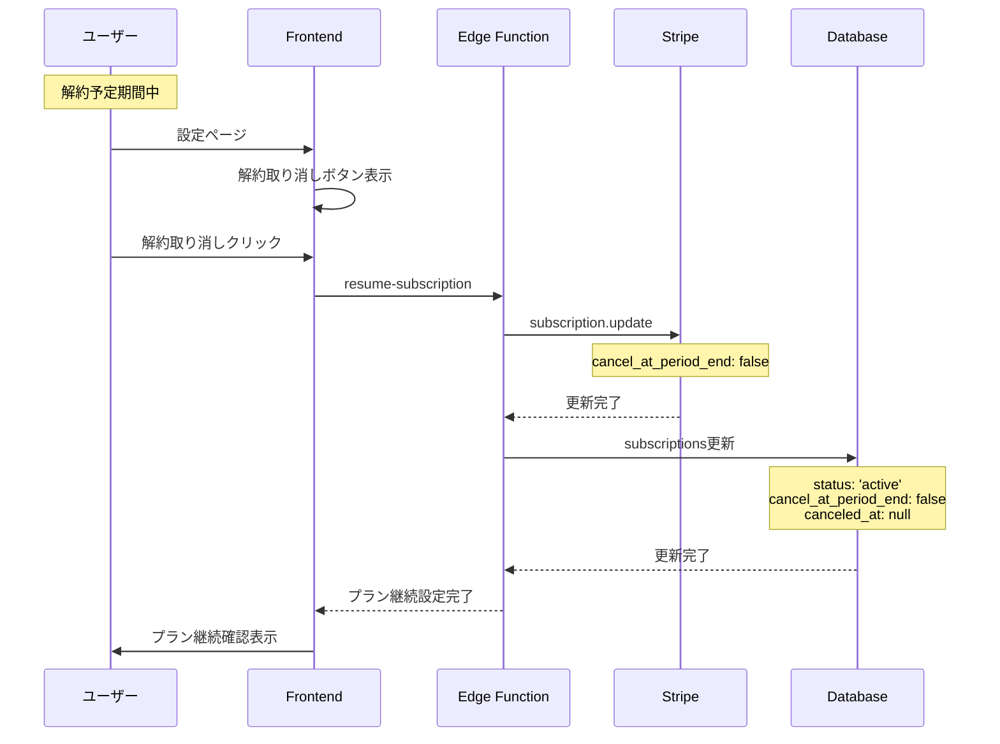
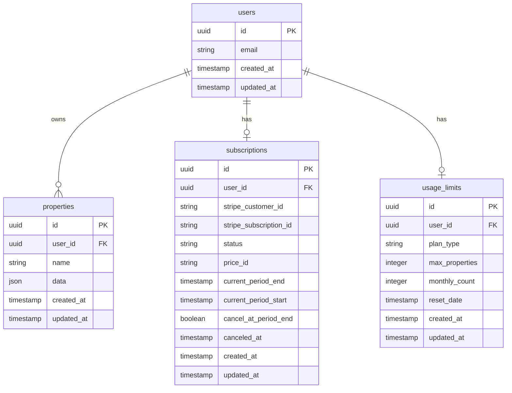
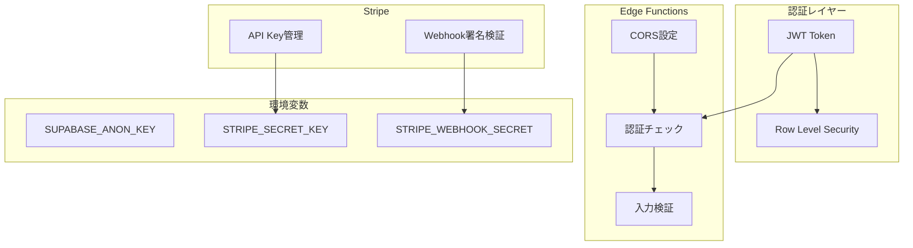
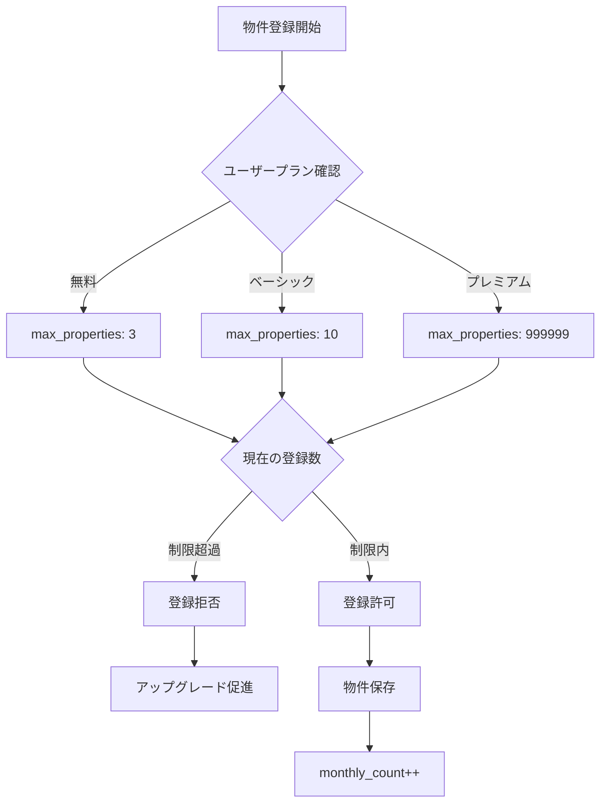
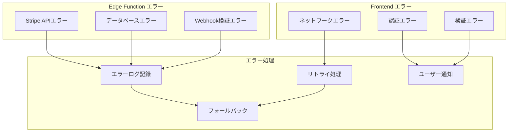

# 📊 Supabase/Stripe 月額課金システムアーキテクチャ

作成日: 2025-08-15  
最終更新: 2025-08-15

## 🏗️ システム全体アーキテクチャ

## 💳 新規プラン購入フロー

## 🔄 月次更新フロー

## ❌ 解約フロー

## 🔄 解約取り消しフロー

## 📊 データベース構造

## 🔐 セキュリティ構成

## 🎯 プラン別制限管理

| プラン | 月額料金 | 物件登録数 | シミュレーション | リセット |
|-------|---------|-----------|---------------|---------|
| **無料プラン** | ¥0 | 3件まで | 制限なし | 月初 |
| **ベーシック** | ¥500 | 10件まで | 制限なし | 月初 |
| **プレミアム** | ¥1,500 | 無制限 | 制限なし | - |

### 制限チェックフロー

## 🚨 エラーハンドリング

## 📝 重要な実装ポイント

### 1. Webhook処理の冪等性
- 同じイベントが複数回送信されても結果が同じになるよう実装
- イベントIDを記録して重複処理を防ぐ

### 2. 月次リセット処理
- `check_and_reset_usage`関数で自動リセット
- タイムゾーン考慮（JST）

### 3. プラン変更時の日割り計算
- Stripeが自動で日割り計算
- 即座にプラン切り替え

### 4. 解約時の挙動
- 期間終了まで利用可能
- 解約取り消し可能期間の設定

### 5. エラー時のフォールバック
- Stripeエラー時は既存のプラン維持
- ユーザーへの適切なフィードバック

## 🔧 開発・テスト環境

| 環境 | Stripe | Supabase | URL |
|-----|--------|----------|-----|
| **開発** | テストモード | 開発プロジェクト | localhost:5173 |
| **ステージング** | テストモード | 開発プロジェクト | dev.ooya.tech |
| **本番** | 本番モード | 本番プロジェクト | ooya.tech |

## 📚 関連ファイル

### Frontend
- `/src/pages/PricingPlans.tsx` - 料金プランページ
- `/src/components/CancelSubscriptionModal.tsx` - 解約モーダル
- `/src/utils/subscriptionManager.ts` - プラン管理ユーティリティ

### Edge Functions
- `/supabase/functions/create-checkout-session/` - 決済セッション作成
- `/supabase/functions/handle-stripe-webhook/` - Webhook処理
- `/supabase/functions/cancel-subscription/` - 解約処理
- `/supabase/functions/resume-subscription/` - 再開処理

### Database
- `/supabase/migrations/20240812_stripe_tables.sql` - Stripeテーブル定義
- `/supabase/migrations/20250813_fix_monthly_reset.sql` - 月次リセット関数

---

作成者: Claude Code  
レビュー: 未実施