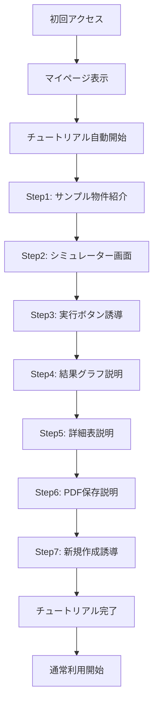

# 初回ユーザー向けチュートリアル機能仕様書

## 📅 作成情報
- **作成日**: 2025年9月11日
- **バージョン**: 1.0
- **作成者**: AI Assistant

## 🎯 機能概要
初回ユーザーがサービスの価値を即座に理解できるよう、インタラクティブなガイドツアーを提供する機能。サンプル物件を使用して、シミュレーション機能の一連の流れを体験してもらう。

## 📊 ユーザーフロー



## 📝 チュートリアルシナリオ詳細

### ステップ1: マイページ到着時
**場所**: マイページ（/my-page）
**ハイライト対象**: サンプル物件カード
**説明文**: 
```
まずはサンプル物件でシミュレーション機能を
体験してみましょう！
「シミュレーション結果を見る」をクリックしてください。
```
**待機アクション**: 「シミュレーション結果を見る」ボタンクリック
**スキップ可否**: 可能

### ステップ2: シミュレーター画面到着
**場所**: シミュレーター（/simulator）
**ハイライト対象**: 入力フォームエリア全体
**説明文**:
```
サンプル物件のデータが自動入力されています。
実際の物件では、こちらに物件情報を入力します。
下にスクロールして確認してみましょう。
```
**待機アクション**: 下へのスクロール（または「次へ」クリック）
**スキップ可否**: 可能

### ステップ3: シミュレーション実行誘導
**場所**: シミュレーター下部
**ハイライト対象**: 「シミュレーションを実行する」ボタン
**説明文**:
```
入力が完了したら、このボタンでシミュレーションを
実行します。クリックしてみましょう！
```
**待機アクション**: ボタンクリック
**スキップ可否**: 不可（重要ステップ）

### ステップ4: 年次キャッシュフロー説明
**場所**: シミュレーション結果画面
**ハイライト対象**: 年次キャッシュフローグラフセクション
**説明文**:
```
📊 年次キャッシュフロー
35年間の収支推移をグラフで確認できます。
累積キャッシュフローで投資回収時期も分かります。
```
**待機アクション**: 「次へ」クリック
**スキップ可否**: 可能

### ステップ5: 詳細キャッシュフロー表説明
**場所**: シミュレーション結果画面
**ハイライト対象**: 詳細キャッシュフロー表セクション
**説明文**:
```
📋 詳細キャッシュフロー表
年ごとの詳細な収支内訳を確認できます。
賃料収入、経費、ローン返済額などが一目で分かります。
```
**待機アクション**: 「次へ」クリック
**スキップ可否**: 可能

### ステップ6: PDF保存機能説明
**場所**: シミュレーション結果画面
**ハイライト対象**: 「PDF保存」ボタン
**説明文**:
```
💾 分析結果の保存
シミュレーション結果はPDFとして
保存・印刷することができます。
```
**待機アクション**: 「次へ」クリック
**スキップ可否**: 可能

### ステップ7: 新規作成への誘導
**場所**: シミュレーション結果画面
**ハイライト対象**: ヘッダーの「シミュレーションを開始する」ボタン
**説明文**:
```
🎉 チュートリアル完了！
実際の物件でシミュレーションする場合は、
こちらから新規作成できます。
```
**待機アクション**: 「完了」クリック
**スキップ可否**: 不可

## 🛠️ 技術仕様

### 推奨ライブラリ
**react-joyride** (推奨)
- 理由：
  - React専用設計で統合が容易
  - 豊富なカスタマイズオプション
  - アクセシビリティ対応
  - TypeScript対応
  - アニメーション機能内蔵

### 実装コンポーネント構成

```typescript
// /bolt_front/src/components/Tutorial/TutorialProvider.tsx
interface TutorialStep {
  target: string;        // CSSセレクター
  content: string;       // 説明文
  placement: 'top' | 'bottom' | 'left' | 'right';
  disableBeacon: boolean;
  spotlightClicks: boolean;
  styles: {
    options: {
      primaryColor: string;
      zIndex: number;
    }
  }
}

// /bolt_front/src/hooks/useTutorial.ts
const useTutorial = () => {
  const [run, setRun] = useState(false);
  const [stepIndex, setStepIndex] = useState(0);
  
  useEffect(() => {
    const hasCompleted = localStorage.getItem('hasCompletedTutorial');
    if (!hasCompleted && isFirstTimeUser) {
      setRun(true);
    }
  }, []);
  
  return { run, stepIndex, setRun, setStepIndex };
};
```

### データ管理

```typescript
// LocalStorage キー
const TUTORIAL_KEYS = {
  COMPLETED: 'hasCompletedTutorial',      // 完了フラグ
  SKIP_COUNT: 'tutorialSkipCount',        // スキップ回数
  LAST_STEP: 'tutorialLastStep',          // 中断時のステップ
  COMPLETION_DATE: 'tutorialCompletionDate' // 完了日時
};

// 完了状態の管理
const markTutorialComplete = () => {
  localStorage.setItem(TUTORIAL_KEYS.COMPLETED, 'true');
  localStorage.setItem(TUTORIAL_KEYS.COMPLETION_DATE, new Date().toISOString());
};
```

## 🎨 UI/UXデザイン仕様

### オーバーレイ
- **背景色**: rgba(0, 0, 0, 0.5)
- **z-index**: 10000
- **トランジション**: 0.3s ease-in-out

### スポットライト
- **ハイライト部分**: 元のz-indexを維持
- **パディング**: 10px
- **ボーダー**: 2px solid #3B82F6（ブルー）

### 吹き出し（Tooltip）
- **背景色**: #FFFFFF
- **文字色**: #1F2937
- **影**: 0 10px 40px rgba(0, 0, 0, 0.2)
- **最大幅**: 400px（PC）、90vw（SP）
- **フォントサイズ**: 16px（PC）、14px（SP）

### ボタン
- **次へボタン**: 
  - 背景: #3B82F6
  - 文字: #FFFFFF
  - ホバー: #2563EB
- **スキップボタン**:
  - 背景: transparent
  - 文字: #6B7280
  - ホバー: #374151

### プログレスバー
- **位置**: 吹き出し上部
- **高さ**: 4px
- **背景色**: #E5E7EB
- **進行色**: #3B82F6
- **表示形式**: ステップ 3/7

## 📱 レスポンシブ対応

### PC版（768px以上）
- 吹き出し位置: 自動調整（上下左右）
- 最大幅: 400px
- フォントサイズ: 16px

### SP版（768px未満）
- 吹き出し位置: 常に下部固定
- 最大幅: 90vw
- フォントサイズ: 14px
- スクロール自動調整あり

## ⚙️ 設定オプション

### ユーザー設定
```typescript
interface TutorialSettings {
  autoStart: boolean;        // 自動開始（デフォルト: true）
  showProgress: boolean;     // 進捗表示（デフォルト: true）
  allowSkip: boolean;        // スキップ許可（デフォルト: true）
  resumeOnReturn: boolean;   // 中断後の再開（デフォルト: false）
}
```

### トリガー条件
1. **自動開始条件**:
   - 初回ユーザー（登録物件0件）
   - チュートリアル未完了
   - サンプル物件が表示されている

2. **手動開始**:
   - ヘルプメニューから「チュートリアルを見る」
   - 設定画面から「チュートリアルを再生」

## 📊 計測項目

### 基本メトリクス
- チュートリアル開始率
- 完了率
- 各ステップの離脱率
- 平均所要時間
- スキップ使用率

### 詳細分析
```typescript
interface TutorialAnalytics {
  userId: string;
  startTime: Date;
  endTime?: Date;
  completedSteps: number[];
  skippedSteps: number[];
  totalDuration: number;
  deviceType: 'PC' | 'SP';
  completionStatus: 'completed' | 'skipped' | 'abandoned';
}
```

## 🚀 実装優先順位

### Phase 1（MVP）
1. 基本的なステップ進行
2. サンプル物件との連携
3. 完了状態の保存

### Phase 2（改善）
1. アニメーション追加
2. 中断・再開機能
3. プログレスバー表示

### Phase 3（拡張）
1. 複数チュートリアルパターン
2. インタラクティブな操作練習
3. 動画チュートリアルオプション

## ⚠️ 注意事項

### 実装上の注意
1. **ページ遷移対応**: React Routerと連携して、ページ遷移時もチュートリアルを継続
2. **エラーハンドリング**: 要素が見つからない場合は次のステップへ自動進行
3. **パフォーマンス**: オーバーレイのレンダリングを最適化

### UX上の注意
1. **強制しない**: いつでもスキップ可能に
2. **邪魔にならない**: 重要な操作を妨げない
3. **繰り返し可能**: 後から見返せるように

## 🔄 今後の改善案

### 短期
1. チュートリアル完了後のフィードバック収集
2. よくある質問への誘導
3. 次のアクション提案

### 中長期
1. AIによる個別最適化されたチュートリアル
2. ゲーミフィケーション要素の追加
3. 動画とインタラクティブ要素の組み合わせ

---

**レビュー**: 未実施  
**承認**: 未実施