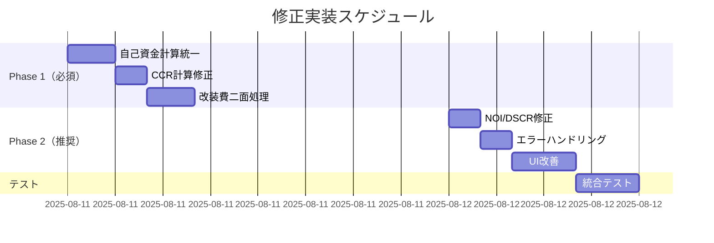

# 物件シミュレーター 計算バグ課題管理表

**作成日**: 2025-08-10  
**最終更新**: 2025-08-10  
**バージョン**: 2.0.0（統合・整理版）  
**対象システム**: 物件シミュレーター  
**緊急度**: 🔴 **最優先（有料版リリース前に必須）**

---

## 📊 エグゼクティブサマリー

### 現状
- **7つのシナリオテスト**で同一の致命的バグを確認
- **投資効率（CCR）が最大88倍も誤表示**される深刻な状況
- **有料版リリース不可**：現状のままでは投資判断を大きく誤らせる

### 影響範囲
- 全ユーザーの投資判断
- システムの信頼性
- 法的リスク（誤った投資判断による損害賠償の可能性）

### 必要工数
- **Phase 1（必須）**: 1日（8時間）
- **Phase 2（推奨）**: 1日（8時間）
- **合計**: 2日で有料版リリース可能レベルへ

---

## 🐛 統合バグ一覧（重複排除済み）

### 1. 自己資金・CCR計算バグ群
| バグID | 内容 | 現在の値 | 正しい値 | 影響度 |
|--------|------|----------|----------|---------|
| BUG_001 | **自己資金計算式の誤り** | 改装費のみ or 一部のみ | 購入-借入+諸経費+改装費 | 🔴致命的 |
| BUG_002 | **CCR（初年度）の誤計算** | -78.7%～-122.9% | -1.4%～-13.1% | 🔴致命的 |
| BUG_003 | **CCR（全期間）の計算ロジック** | IRRと混同？ | 累計CF÷自己資金÷保有年数 | 🔴致命的 |
| BUG_004 | **自己資金≤0時の処理** | 0.00%表示 | N/A表示すべき | 🟡重大 |

### 2. 改装費処理バグ群
| バグID | 内容 | 現在の状態 | 正しい処理 | 影響度 |
|--------|------|------------|------------|---------|
| BUG_005 | **改装費のCF無視** | 年次CFに計上なし | 初年度に全額マイナス | 🔴致命的 |
| BUG_006 | **改装費の減価償却無視** | 建物分のみ | 建物+改装費の合計 | 🔴致命的 |

### 3. NOI・DSCR計算バグ群
| バグID | 内容 | 現在の計算 | 正しい計算 | 影響度 |
|--------|------|------------|------------|---------|
| BUG_007 | **NOI計算の不統一** | 固定資産税を含まない場合あり | 家賃-管理費-その他-固定資産税 | 🟡重大 |
| BUG_008 | **DSCRの連鎖誤り** | NOI誤りの影響 | 正しいNOI÷ローン返済額 | 🟡重大 |

### 4. ROI・その他指標バグ群
| バグID | 内容 | 現在の状態 | 正しい定義 | 影響度 |
|--------|------|------------|------------|---------|
| BUG_009 | **ROI定義の不明確** | 分母が不統一 | CF÷総投資額 | 🟢中 |
| BUG_010 | **自己資金推移の誤り** | 初期値が誤り | -自己資金+年次CF | 🟢中 |

### 5. UI・表示系バグ群
| バグID | 内容 | 現在の状態 | 改善案 | 影響度 |
|--------|------|------------|---------|---------|
| BUG_011 | **管理費入力の曖昧さ** | 「12500円 or 5%」 | 明確な選択UI | 🟢低 |
| BUG_012 | **RC耐用年数の誤表記** | 法定27年 | 法定47年 | 🟢低 |
| BUG_013 | **計算式の非表示** | ツールチップなし | 全指標に計算式表示 | 🟢低 |

---

## 🎯 修正実装計画

### Phase 1: 致命的バグ修正（1日以内・必須）

#### 1-1. 自己資金計算の統一実装
```typescript
// 単一ソース化して全画面で参照
const calculateSelfFunding = (data: SimulationData): number => {
  return data.purchasePrice 
    - data.loanAmount 
    + data.acquisitionCost 
    + data.renovationCost;
};

// State管理
const [selfFunding, setSelfFunding] = useState<number>(0);
```

#### 1-2. CCR計算の修正
```typescript
// CCR（初年度）
const ccrFirst = selfFunding > 0 
  ? (yearCF[0] / selfFunding) * 100 
  : null; // N/A

// CCR（全期間）
const ccrTotal = selfFunding > 0
  ? (cumulativeCF[holdingYears - 1] / selfFunding / holdingYears) * 100
  : null; // N/A
```

#### 1-3. 改装費の二面処理
```typescript
// キャッシュフロー処理
yearCF[0] = income - expenses - loanPayment - renovationCost;

// 減価償却処理
const totalDepreciation = 
  (buildingPrice / depreciationYears) + 
  (renovationCost / depreciationYears);
```

### Phase 2: 品質向上（1日以内・推奨）

#### 2-1. NOI定義の統一
```typescript
const calculateNOI = (data: SimulationData): number => {
  return data.annualRent 
    - data.managementFee 
    - (data.otherExpenses * 12)
    - data.propertyTax;
};
```

#### 2-2. エラーハンドリング
```typescript
// N/A表示の統一
const formatMetric = (value: number | null): string => {
  if (value === null || isNaN(value) || !isFinite(value)) {
    return "N/A";
  }
  return `${value.toFixed(2)}%`;
};
```

#### 2-3. ツールチップ追加
```typescript
const tooltips = {
  CCR: "年間キャッシュフロー ÷ 自己資金",
  ROI: "年間キャッシュフロー ÷ 総投資額",
  DSCR: "NOI ÷ 年間ローン返済額",
  NOI: "家賃収入 - 管理費 - その他経費 - 固定資産税"
};
```

---

## ✅ テスト検証項目

### 必須検証シナリオ
| シナリオ | 自己資金 | CCR初年度 | CCR全期間 | 検証状態 |
|----------|----------|-----------|-----------|----------|
| 木崎 | 600万円 | -13.1% | 15.4% | ⬜ 未検証 |
| クレメント川越 | 410万円 | -6.4% | 計算要 | ⬜ 未検証 |
| 北越谷 | 880万円 | -1.4% | 計算要 | ⬜ 未検証 |
| 天沼町（負の自己資金） | -50万円 | N/A | N/A | ⬜ 未検証 |

---

## 📅 実装スケジュール



---

## 🚀 Go-Liveチェックリスト

### 最低限必要な確認（Phase 1完了後）
- [ ] 自己資金計算が全シナリオで正しい
- [ ] CCR（初年度）の誤差が1%以内
- [ ] CCR（全期間）が保有年数ベースで計算
- [ ] 自己資金≤0でN/A表示
- [ ] 改装費がCFと減価償却の両方に反映

### 推奨確認項目（Phase 2完了後）
- [ ] NOIに固定資産税が含まれる
- [ ] 全指標にツールチップ表示
- [ ] ROI定義が統一されている
- [ ] エッジケースでエラーが出ない

---

## 📊 リスク評価

| リスク項目 | 発生確率 | 影響度 | 対策 |
|-----------|---------|--------|------|
| 既存データとの非互換 | 高 | 中 | 移行スクリプト作成 |
| 計算精度の低下 | 低 | 高 | 十分なテスト実施 |
| 新規バグの混入 | 中 | 高 | 段階的リリース |
| ユーザー混乱 | 中 | 中 | 変更内容の事前告知 |

---

## 📝 補足情報

### ChatGPTによる分析まとめ
- 7シナリオ全てで同一のバグパターンを確認
- 最も深刻なのは自己資金計算の不統一
- 改装費の処理が最も複雑で要注意

### 優先度の根拠
1. **法的リスク回避**: 誤った投資判断による訴訟リスク
2. **信頼性確保**: 有料版として最低限の品質
3. **競合優位性**: 正確な計算による差別化

---

**次のアクション**: Phase 1の実装を即座に開始し、1日以内に完了させる