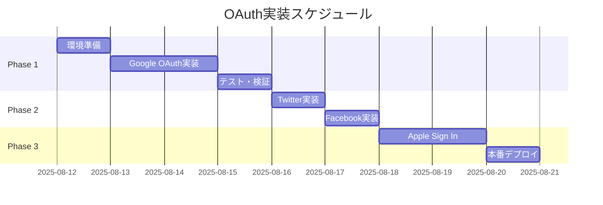

# OAuth実装ガイド

作成日: 2025年8月12日  
バージョン: 2.0.0（統合版）

---

## 第1部：実装スケジュールと手順

### 1.1 全体スケジュール



---

## 第2部：Google OAuth実装（Phase 1）

### 2.1 Google Cloud Console設定（30分）

```bash
# 1. プロジェクト作成
https://console.cloud.google.com/
→ 新規プロジェクト: ooya-dx-production

# 2. OAuth同意画面設定
APIs & Services → OAuth consent screen
- User Type: External
- アプリ名: 大家DX
- サポートメール: support@ooya-dx.com
- スコープ: email, profile, openid

# 3. 認証情報作成
Credentials → Create Credentials → OAuth client ID
- Type: Web application
- Name: 大家DX Web Client
- Authorized JavaScript origins:
  - http://localhost:5173
  - https://ooya-dx.com
- Authorized redirect URIs:
  - http://localhost:5173/auth/callback
  - https://[project-id].supabase.co/auth/v1/callback
```

### 2.2 Supabase設定（15分）

```bash
# Supabaseダッシュボード
Authentication → Providers → Google
- Enable: ON
- Client ID: [Googleから取得]
- Client Secret: [Googleから取得]
```

### 2.3 コード実装

#### useSupabaseAuth.ts拡張
```typescript
const signInWithOAuth = async (
  provider: 'google' | 'twitter' | 'facebook' | 'apple'
) => {
  const { data, error } = await supabase.auth.signInWithOAuth({
    provider,
    options: {
      redirectTo: `${window.location.origin}/auth/callback`,
      scopes: provider === 'facebook' ? 'email,public_profile' : undefined
    }
  })
  return { data, error }
}
```

#### Login.tsx UI追加
```tsx
import { FcGoogle } from 'react-icons/fc'
import { BsTwitter, BsFacebook, BsApple } from 'react-icons/bs'

// OAuthボタンコンポーネント
const OAuthButtons = () => {
  const [loading, setLoading] = useState<string | null>(null)
  
  const handleOAuth = async (provider: string) => {
    setLoading(provider)
    const { error } = await signInWithOAuth(provider)
    if (error) console.error(error)
  }
  
  return (
    <>
      <button onClick={() => handleOAuth('google')}
              className="w-full flex items-center justify-center gap-3 
                       px-4 py-3 bg-white border rounded-lg">
        <FcGoogle className="h-5 w-5" />
        <span>Googleでログイン</span>
      </button>
      {/* 他のプロバイダーボタン... */}
    </>
  )
}
```

#### AuthCallback.tsx作成
```tsx
// pages/AuthCallback.tsx
const AuthCallback: React.FC = () => {
  const navigate = useNavigate()
  
  useEffect(() => {
    const handleCallback = async () => {
      const params = new URLSearchParams(window.location.search)
      const error = params.get('error')
      
      if (error) {
        navigate(`/login?error=${error}`)
        return
      }
      
      navigate('/')
    }
    
    handleCallback()
  }, [])
  
  return <LoadingSpinner />
}
```

---

## 第3部：SNS OAuth実装（Phase 2）

### 3.1 Twitter設定

```bash
# Developer Portal
https://developer.twitter.com/
→ Create App
- App name: 大家DX
- Callback URI:
  - https://[project-id].supabase.co/auth/v1/callback
- API Key/Secret取得
```

### 3.2 Facebook設定

```bash
# Facebook Developers
https://developers.facebook.com/
→ Create App → Consumer
- App Name: 大家DX
- Facebook Login → Settings
- Valid OAuth Redirect URIs:
  - https://[project-id].supabase.co/auth/v1/callback
```

### 3.3 Apple Sign In設定

```bash
# Apple Developer ($99/年)
https://developer.apple.com/
→ Certificates, Identifiers & Profiles
- App ID作成
- Service ID作成
- Sign In with Apple有効化
- Key作成
```

---

## 第4部：環境別設定とデプロイ

### 4.1 環境変数

```env
# 開発環境（.env.local）
VITE_ENABLE_OAUTH=true
VITE_GOOGLE_CLIENT_ID=xxx.apps.googleusercontent.com

# 本番環境（Vercel/Render）
同じ変数をダッシュボードで設定
```

### 4.2 Feature Flag実装

```typescript
// config/features.ts
export const FEATURES = {
  OAUTH_GOOGLE: process.env.VITE_ENABLE_GOOGLE_OAUTH === 'true',
  OAUTH_TWITTER: process.env.VITE_ENABLE_TWITTER_OAUTH === 'true',
  OAUTH_FACEBOOK: process.env.VITE_ENABLE_FACEBOOK_OAUTH === 'true',
  OAUTH_APPLE: process.env.VITE_ENABLE_APPLE_OAUTH === 'true',
}

// 使用例
{FEATURES.OAUTH_GOOGLE && <GoogleLoginButton />}
```

### 4.3 段階的リリース

```typescript
// A/Bテスト実装
const isInTestGroup = (userId: string): boolean => {
  const hash = userId.split('').reduce((a, b) => {
    a = ((a << 5) - a) + b.charCodeAt(0)
    return a & a
  }, 0)
  return Math.abs(hash) % 100 < 50 // 50%でテスト
}
```

---

## 第5部：トラブルシューティング

### 5.1 よくあるエラー

| エラー | 原因 | 解決法 |
|--------|------|--------|
| redirect_uri_mismatch | URI設定ミス | Console確認 |
| invalid_client | ID/Secret誤り | 環境変数確認 |
| rate_limit_exceeded | API制限 | 時間を置く |
| access_denied | 権限不足 | スコープ確認 |

### 5.2 デバッグ方法

```bash
# Supabaseログ確認
supabase logs auth

# ブラウザコンソール
localStorage.getItem('supabase.auth.token')

# ネットワーク確認
curl https://[project-id].supabase.co/auth/v1/health
```

### 5.3 ロールバック手順

```bash
# 即時ロールバック（5分以内）
VITE_ENABLE_OAUTH=false
git push origin main

# 完全ロールバック（30分以内）
git revert HEAD
git push origin main
```

---

## 付録：コマンドリファレンス

### パッケージインストール
```bash
npm install react-icons@^5.3.0
```

### Git操作
```bash
# ブランチ作成
git checkout -b feature/oauth-google

# コミット
git add -A
git commit -m "feat: Google OAuth認証を実装"

# プッシュ
git push origin feature/oauth-google
```

### テスト実行
```bash
# ローカルテスト
npm run dev

# E2Eテスト
npm run test:e2e
```

---

以上