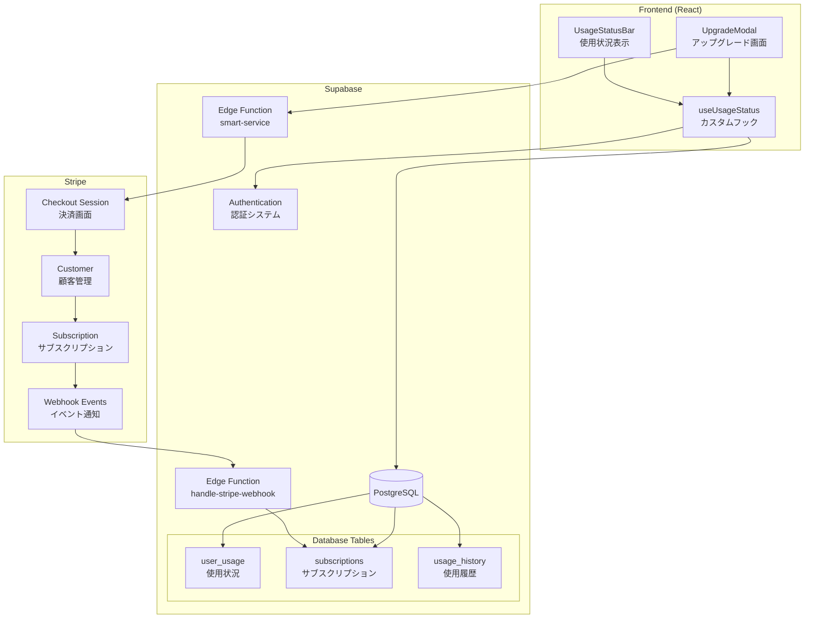
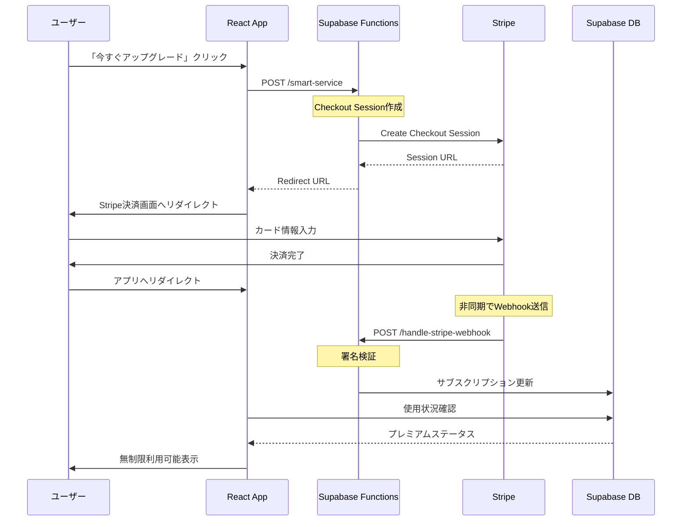
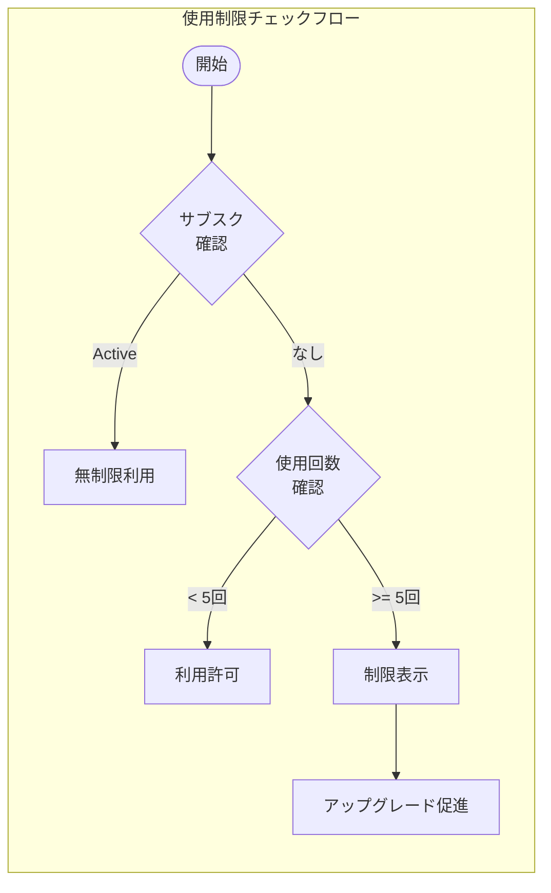
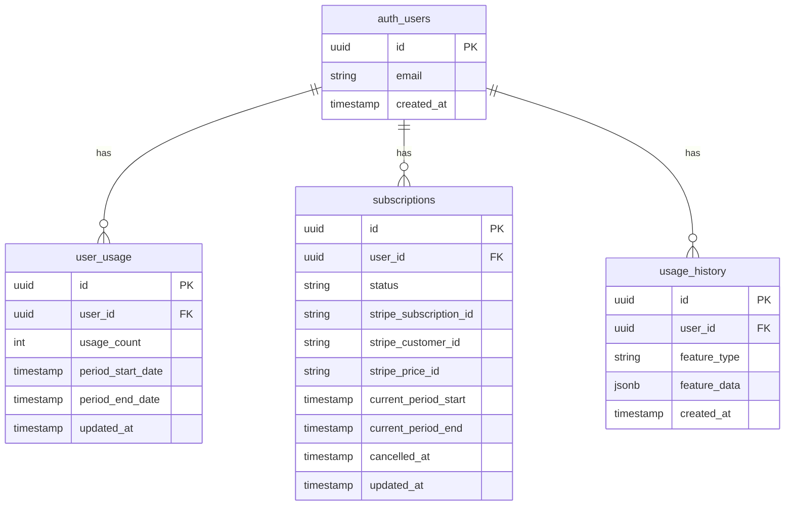
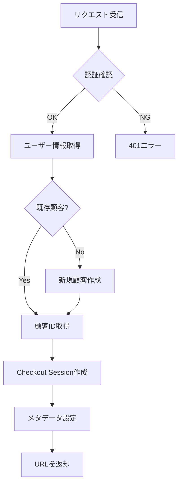
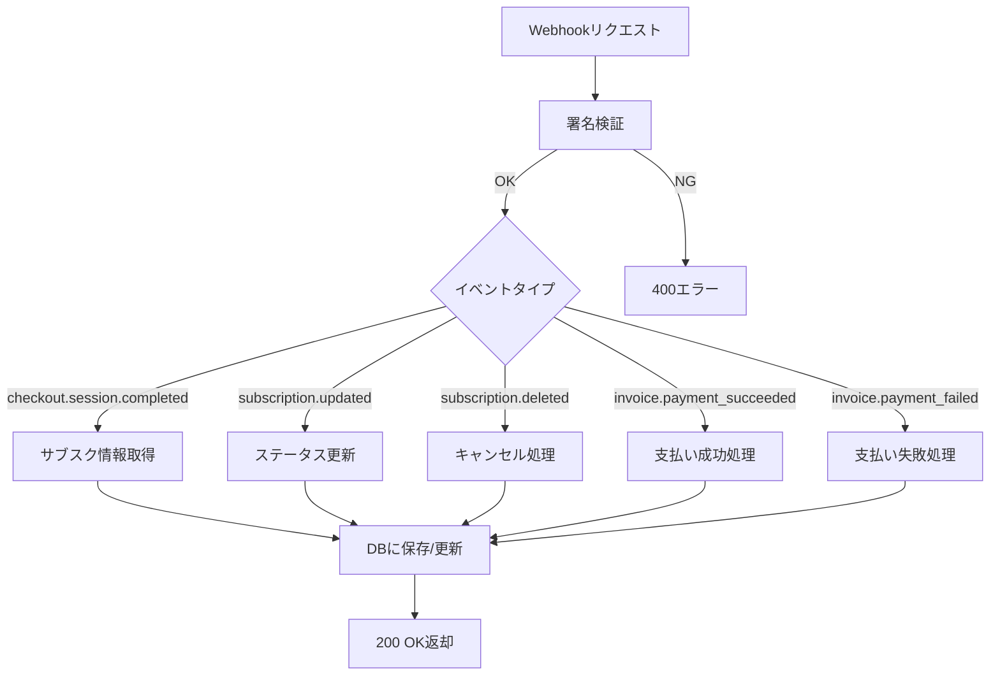
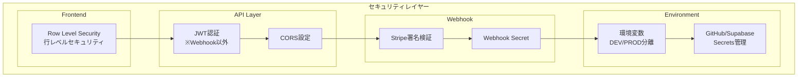
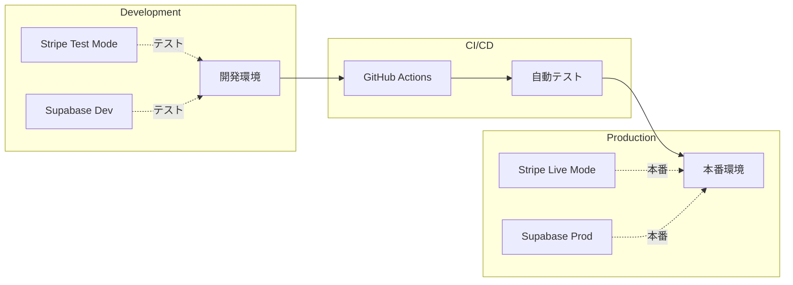

# Stripe決済システム アーキテクチャ図

## システム全体図

## 決済フロー詳細

## データフロー図

## データベース関係図

## Edge Functions 処理フロー

### create-checkout-session (smart-service)

### handle-stripe-webhook

## セキュリティアーキテクチャ

## デプロイメントアーキテクチャ

---
作成日: 2025年8月12日
バージョン: 1.0.0