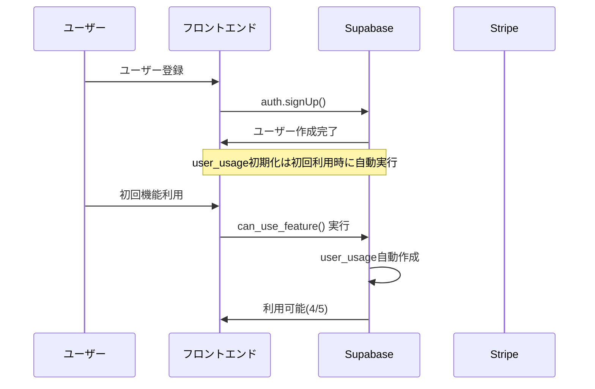
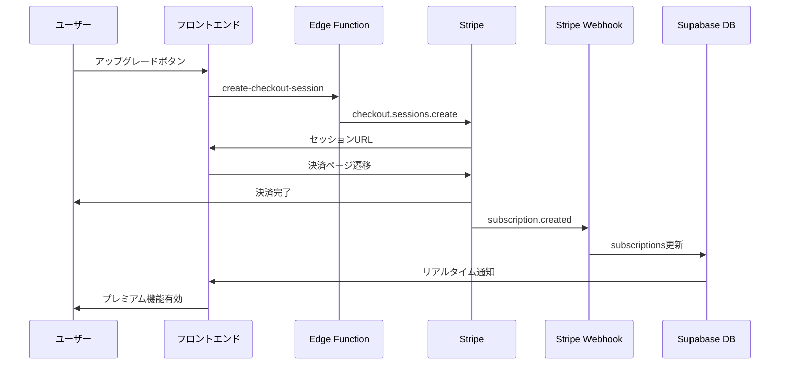
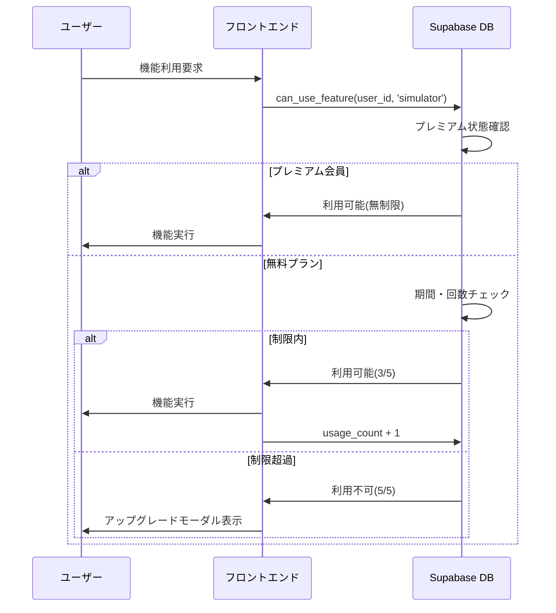
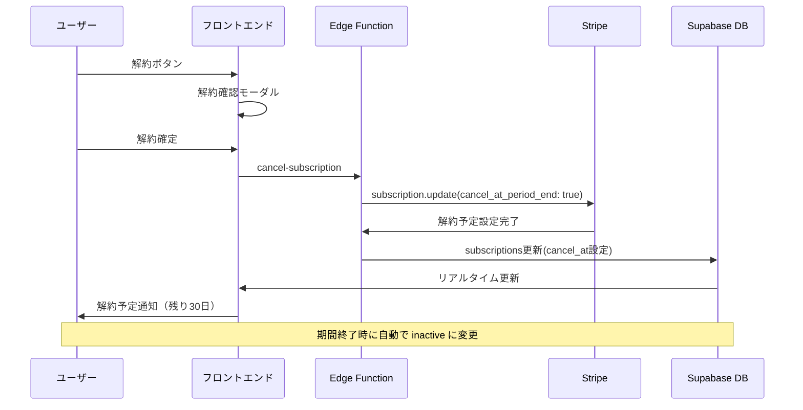

# サブスクリプション管理システム データベース設計書

**作成日**: 2025年8月14日  
**バージョン**: 2.0.0  
**データベース**: Supabase PostgreSQL  
**対象システム**: 大家DX プレミアムプラン課金システム

---

## 📋 概要

本ドキュメントは、大家DXアプリケーションのサブスクリプション管理システムにおけるデータベース設計の包括的なガイドです。Stripe決済システムとの連携、使用制限管理、RLS（Row Level Security）による厳格なセキュリティ実装について詳述します。

### システム要件
- 月額課金システム（2,980円/月）
- 使用制限管理（無料：5回/30日、有料：無制限）
- サブスクリプション解約・再開機能
- 二重決済防止システム
- 利用履歴・分析機能

---

## 🏗️ データベース全体構成

### アーキテクチャ概要

```
┌─────────────────────────────────────┐
│           Supabase Auth             │
│        (ユーザー認証システム)        │
└─────────────────────────────────────┘
               │
               ▼
┌─────────────────────────────────────┐
│      サブスクリプション管理         │
│    ┌─────────────┬─────────────┐    │
│    │Subscriptions│ User Usage  │    │
│    │  決済情報   │  利用制限   │    │
│    └─────────────┴─────────────┘    │
└─────────────────────────────────────┘
               │
               ▼
┌─────────────────────────────────────┐
│        利用履歴・分析システム       │
│    ┌─────────────┬─────────────┐    │
│    │Usage History│  Analytics  │    │
│    │  履歴管理   │   分析機能   │    │
│    └─────────────┴─────────────┘    │
└─────────────────────────────────────┘
```

---

## 📊 テーブル構成一覧

### 1. サブスクリプション管理テーブル

| テーブル名 | 用途 | 主要機能 |
|-----------|------|----------|
| `subscriptions` | Stripe連携・課金管理 | 決済状態、期間管理、解約処理 |
| `user_usage` | 利用制限管理 | 無料枠制限、期間リセット |
| `usage_history` | 利用履歴記録 | 機能別利用統計、分析データ |

### 2. 既存システム連携テーブル

| テーブル名 | 用途 | 連携内容 |
|-----------|------|----------|
| `auth.users` | ユーザー認証 | Supabase Auth連携 |
| `properties` | 物件管理 | シミュレーション対象 |
| `simulations` | 計算結果保存 | 利用カウント対象 |
| `market_analyses` | 市場分析 | 利用カウント対象 |

---

## 📝 テーブル詳細設計

### 1. subscriptions テーブル

**目的**: Stripeサブスクリプションとの同期・課金状態管理

```sql
CREATE TABLE subscriptions (
  id UUID DEFAULT gen_random_uuid() PRIMARY KEY,
  user_id UUID REFERENCES auth.users(id) ON DELETE CASCADE UNIQUE NOT NULL,
  stripe_customer_id TEXT UNIQUE,
  stripe_subscription_id TEXT UNIQUE,
  status TEXT DEFAULT 'inactive' NOT NULL,
  current_period_start TIMESTAMP WITH TIME ZONE,
  current_period_end TIMESTAMP WITH TIME ZONE,
  cancel_at_period_end BOOLEAN DEFAULT FALSE,
  cancel_at TIMESTAMP WITH TIME ZONE,
  cancellation_reason TEXT,
  cancellation_feedback TEXT,
  cancelled_at TIMESTAMP WITH TIME ZONE,
  created_at TIMESTAMP WITH TIME ZONE DEFAULT NOW() NOT NULL,
  updated_at TIMESTAMP WITH TIME ZONE DEFAULT NOW() NOT NULL
);
```

#### カラム詳細

| カラム名 | 型 | 制約 | 説明 |
|---------|-----|------|------|
| `id` | UUID | PRIMARY KEY | サブスクリプションの一意識別子 |
| `user_id` | UUID | UNIQUE, NOT NULL, FK | ユーザーID（auth.users.id） |
| `stripe_customer_id` | TEXT | UNIQUE | Stripe顧客ID |
| `stripe_subscription_id` | TEXT | UNIQUE | StripeサブスクリプションID |
| `status` | TEXT | NOT NULL | ステータス（active/canceled/past_due/inactive） |
| `current_period_start` | TIMESTAMPTZ | | 現在の課金期間開始日 |
| `current_period_end` | TIMESTAMPTZ | | 現在の課金期間終了日 |
| `cancel_at_period_end` | BOOLEAN | DEFAULT FALSE | 期間終了時解約フラグ |
| `cancel_at` | TIMESTAMPTZ | | 解約予定日時 |
| `cancellation_reason` | TEXT | | 解約理由 |
| `cancellation_feedback` | TEXT | | 解約時フィードバック |
| `cancelled_at` | TIMESTAMPTZ | | 実際の解約日時 |

#### ステータス値定義

| status値 | 説明 | 利用権限 |
|----------|------|----------|
| `active` | 有効なプレミアム会員 | 無制限利用可能 |
| `canceled` | 解約済み | 無料枠のみ |
| `past_due` | 支払い遅延 | 制限付き利用 |
| `inactive` | 未加入 | 無料枠のみ |

#### インデックス設計

```sql
-- パフォーマンス最適化用インデックス
CREATE INDEX idx_subscriptions_user_id ON subscriptions(user_id);
CREATE INDEX idx_subscriptions_stripe_customer_id ON subscriptions(stripe_customer_id);
CREATE INDEX idx_subscriptions_status ON subscriptions(status);
CREATE INDEX idx_subscriptions_period_end ON subscriptions(current_period_end);
CREATE INDEX idx_subscriptions_cancel_at ON subscriptions(cancel_at);
```

---

### 2. user_usage テーブル

**目的**: 無料プランユーザーの利用制限管理・期間リセット

```sql
CREATE TABLE user_usage (
  id UUID DEFAULT gen_random_uuid() PRIMARY KEY,
  user_id UUID REFERENCES auth.users(id) ON DELETE CASCADE UNIQUE NOT NULL,
  usage_count INTEGER DEFAULT 0 NOT NULL,
  period_start_date TIMESTAMP WITH TIME ZONE DEFAULT NOW() NOT NULL,
  period_end_date TIMESTAMP WITH TIME ZONE DEFAULT (NOW() + INTERVAL '30 days') NOT NULL,
  created_at TIMESTAMP WITH TIME ZONE DEFAULT NOW() NOT NULL,
  updated_at TIMESTAMP WITH TIME ZONE DEFAULT NOW() NOT NULL
);
```

#### カラム詳細

| カラム名 | 型 | 制約 | 説明 |
|---------|-----|------|------|
| `id` | UUID | PRIMARY KEY | 利用記録の一意識別子 |
| `user_id` | UUID | UNIQUE, NOT NULL, FK | ユーザーID（auth.users.id） |
| `usage_count` | INTEGER | DEFAULT 0 | 現在の期間内利用回数 |
| `period_start_date` | TIMESTAMPTZ | NOT NULL | 現在の利用期間開始日 |
| `period_end_date` | TIMESTAMPTZ | NOT NULL | 期間終了日（30日後） |

#### 利用制限仕様

```typescript
// 利用制限定数
const USAGE_LIMITS = {
  FREE_PLAN: 5,        // 無料プラン：月5回
  PREMIUM_PLAN: -1,    // プレミアム：無制限（-1で表現）
  PERIOD_DAYS: 30      // リセット期間：30日
};
```

#### インデックス設計

```sql
-- 高速検索用インデックス
CREATE INDEX idx_user_usage_user_id ON user_usage(user_id);
CREATE INDEX idx_user_usage_period_end ON user_usage(period_end_date);
CREATE INDEX idx_user_usage_updated_at ON user_usage(updated_at);
```

---

### 3. usage_history テーブル

**目的**: 機能利用履歴の詳細記録・分析データ収集

```sql
CREATE TABLE usage_history (
  id UUID DEFAULT gen_random_uuid() PRIMARY KEY,
  user_id UUID REFERENCES auth.users(id) ON DELETE CASCADE NOT NULL,
  feature_type TEXT NOT NULL,
  feature_data JSONB DEFAULT '{}',
  session_id TEXT,
  ip_address INET,
  user_agent TEXT,
  created_at TIMESTAMP WITH TIME ZONE DEFAULT NOW() NOT NULL
);
```

#### カラム詳細

| カラム名 | 型 | 制約 | 説明 |
|---------|-----|------|------|
| `id` | UUID | PRIMARY KEY |履歴レコードの一意識別子 |
| `user_id` | UUID | NOT NULL, FK | ユーザーID（auth.users.id） |
| `feature_type` | TEXT | NOT NULL | 機能種別（simulator/market_analysis等） |
| `feature_data` | JSONB | DEFAULT '{}' | 利用詳細データ（JSON形式） |
| `session_id` | TEXT | | セッションID（トラッキング用） |
| `ip_address` | INET | | アクセス元IPアドレス |
| `user_agent` | TEXT | | ブラウザ・デバイス情報 |

#### 機能種別定義

| feature_type | 説明 | カウント対象 |
|--------------|------|--------------|
| `simulator` | 投資シミュレーション | ✅ |
| `market_analysis` | 市場分析 | ✅ |
| `property_share` | 物件共有 | ❌ |
| `comment` | コメント投稿 | ❌ |
| `profile_update` | プロフィール更新 | ❌ |

#### feature_data構造例

```json
{
  "simulation_id": "uuid",
  "property_id": "uuid", 
  "calculation_type": "roi",
  "input_values": {
    "purchase_price": 50000000,
    "monthly_rent": 200000
  },
  "execution_time_ms": 1250
}
```

#### インデックス設計

```sql
-- 分析・レポート用インデックス
CREATE INDEX idx_usage_history_user_id ON usage_history(user_id);
CREATE INDEX idx_usage_history_feature_type ON usage_history(feature_type);
CREATE INDEX idx_usage_history_created_at ON usage_history(created_at DESC);
CREATE INDEX idx_usage_history_session_id ON usage_history(session_id);

-- 複合インデックス（高速集計用）
CREATE INDEX idx_usage_history_user_feature_date 
  ON usage_history(user_id, feature_type, created_at DESC);
```

---

## 🔐 セキュリティ設計（RLS）

### Row Level Security 全体設計

すべてのサブスクリプション関連テーブルでRLSを有効化し、ユーザーは自分のデータのみアクセス可能です。

```sql
-- RLS有効化
ALTER TABLE subscriptions ENABLE ROW LEVEL SECURITY;
ALTER TABLE user_usage ENABLE ROW LEVEL SECURITY;
ALTER TABLE usage_history ENABLE ROW LEVEL SECURITY;
```

### 1. subscriptions テーブル RLSポリシー

```sql
-- ユーザーは自分のサブスクリプション情報のみ閲覧・更新可能
CREATE POLICY "Users can view own subscription" ON subscriptions
  FOR SELECT USING (auth.uid() = user_id);

CREATE POLICY "Users can update own subscription" ON subscriptions
  FOR UPDATE USING (auth.uid() = user_id);

-- 新規サブスクリプション作成（サービスロール・Webhook専用）
CREATE POLICY "Service role can insert subscriptions" ON subscriptions
  FOR INSERT WITH CHECK (auth.role() = 'service_role');

-- Webhook・サービスロール専用更新
CREATE POLICY "Service role can update subscriptions" ON subscriptions
  FOR UPDATE USING (auth.role() = 'service_role');
```

### 2. user_usage テーブル RLSポリシー

```sql
-- ユーザーは自分の利用状況のみ参照・更新可能
CREATE POLICY "Users can view own usage" ON user_usage
  FOR SELECT USING (auth.uid() = user_id);

CREATE POLICY "Users can update own usage" ON user_usage
  FOR UPDATE USING (auth.uid() = user_id);

-- 自動作成（初回利用時）
CREATE POLICY "Users can insert own usage" ON user_usage
  FOR INSERT WITH CHECK (auth.uid() = user_id);
```

### 3. usage_history テーブル RLSポリシー

```sql
-- ユーザーは自分の履歴のみ閲覧可能
CREATE POLICY "Users can view own history" ON usage_history
  FOR SELECT USING (auth.uid() = user_id);

-- 履歴記録（システム側での自動記録）
CREATE POLICY "Authenticated users can insert history" ON usage_history
  FOR INSERT WITH CHECK (auth.uid() = user_id);

-- 管理者・分析用（サービスロール）
CREATE POLICY "Service role can view all history" ON usage_history
  FOR SELECT USING (auth.role() = 'service_role');
```

---

## 🔧 データベース関数・トリガー

### 1. 利用期間チェック・リセット関数

```sql
CREATE OR REPLACE FUNCTION check_and_reset_usage(p_user_id UUID)
RETURNS TABLE(current_count INTEGER, period_end TIMESTAMP WITH TIME ZONE) AS $$
DECLARE
  v_usage RECORD;
BEGIN
  -- 現在の使用状況を取得
  SELECT * INTO v_usage FROM user_usage WHERE user_id = p_user_id;
  
  -- レコードが存在しない場合は作成
  IF NOT FOUND THEN
    INSERT INTO user_usage (user_id, usage_count, period_start_date, period_end_date)
    VALUES (p_user_id, 0, NOW(), NOW() + INTERVAL '30 days')
    RETURNING usage_count, period_end_date INTO current_count, period_end;
    RETURN NEXT;
    RETURN;
  END IF;
  
  -- 期間が過ぎていたらリセット
  IF v_usage.period_end_date < NOW() THEN
    UPDATE user_usage 
    SET usage_count = 0,
        period_start_date = NOW(),
        period_end_date = NOW() + INTERVAL '30 days',
        updated_at = NOW()
    WHERE user_id = p_user_id
    RETURNING usage_count, period_end_date INTO current_count, period_end;
  ELSE
    current_count := v_usage.usage_count;
    period_end := v_usage.period_end_date;
  END IF;
  
  RETURN NEXT;
END;
$$ LANGUAGE plpgsql SECURITY DEFINER;
```

### 2. プレミアム会員チェック関数

```sql
CREATE OR REPLACE FUNCTION is_premium_user(p_user_id UUID)
RETURNS BOOLEAN AS $$
DECLARE
  v_status TEXT;
BEGIN
  SELECT status INTO v_status 
  FROM subscriptions 
  WHERE user_id = p_user_id;
  
  RETURN COALESCE(v_status = 'active', FALSE);
END;
$$ LANGUAGE plpgsql SECURITY DEFINER;
```

### 3. 利用制限チェック関数

```sql
CREATE OR REPLACE FUNCTION can_use_feature(p_user_id UUID, p_feature_type TEXT)
RETURNS TABLE(
  can_use BOOLEAN, 
  current_count INTEGER, 
  limit_count INTEGER,
  is_premium BOOLEAN,
  period_end TIMESTAMP WITH TIME ZONE
) AS $$
DECLARE
  v_is_premium BOOLEAN;
  v_usage_result RECORD;
BEGIN
  -- プレミアム会員チェック
  SELECT is_premium_user(p_user_id) INTO v_is_premium;
  
  -- プレミアム会員は無制限
  IF v_is_premium THEN
    SELECT TRUE, 0, -1, TRUE, NULL 
    INTO can_use, current_count, limit_count, is_premium, period_end;
    RETURN NEXT;
    RETURN;
  END IF;
  
  -- 無料プランの制限チェック
  SELECT * INTO v_usage_result FROM check_and_reset_usage(p_user_id);
  
  SELECT 
    (v_usage_result.current_count < 5), 
    v_usage_result.current_count,
    5,
    FALSE,
    v_usage_result.period_end
  INTO can_use, current_count, limit_count, is_premium, period_end;
  
  RETURN NEXT;
END;
$$ LANGUAGE plpgsql SECURITY DEFINER;
```

### 4. 自動更新トリガー

```sql
-- updated_at自動更新関数
CREATE OR REPLACE FUNCTION update_updated_at_column()
RETURNS TRIGGER AS $$
BEGIN
  NEW.updated_at = NOW();
  RETURN NEW;
END;
$$ LANGUAGE plpgsql;

-- subscriptionsテーブル用トリガー
CREATE TRIGGER update_subscriptions_updated_at 
  BEFORE UPDATE ON subscriptions
  FOR EACH ROW 
  EXECUTE FUNCTION update_updated_at_column();

-- user_usageテーブル用トリガー
CREATE TRIGGER update_user_usage_updated_at 
  BEFORE UPDATE ON user_usage
  FOR EACH ROW 
  EXECUTE FUNCTION update_updated_at_column();
```

---

## 🔄 データフロー・ワークフロー

### 1. 新規ユーザー登録フロー



### 2. プレミアムアップグレードフロー



### 3. 利用制限チェックフロー



### 4. サブスクリプション解約フロー



---

## 📊 データ分析・レポート設計

### 1. 利用統計ビュー

```sql
-- 月間利用統計ビュー
CREATE VIEW monthly_usage_stats AS
SELECT 
  DATE_TRUNC('month', created_at) as month,
  feature_type,
  COUNT(*) as usage_count,
  COUNT(DISTINCT user_id) as unique_users
FROM usage_history 
GROUP BY DATE_TRUNC('month', created_at), feature_type
ORDER BY month DESC, usage_count DESC;

-- ユーザー別利用サマリービュー  
CREATE VIEW user_usage_summary AS
SELECT 
  u.user_id,
  u.usage_count as current_period_count,
  u.period_end_date,
  s.status as subscription_status,
  CASE WHEN s.status = 'active' THEN 'unlimited' 
       ELSE (5 - u.usage_count)::TEXT END as remaining_uses
FROM user_usage u
LEFT JOIN subscriptions s ON u.user_id = s.user_id;
```

### 2. 収益分析クエリ

```sql
-- 月間収益レポート
SELECT 
  DATE_TRUNC('month', current_period_start) as month,
  COUNT(*) as active_subscriptions,
  COUNT(*) * 2980 as monthly_revenue,
  COUNT(CASE WHEN cancel_at_period_end THEN 1 END) as canceling_users
FROM subscriptions 
WHERE status = 'active'
GROUP BY DATE_TRUNC('month', current_period_start)
ORDER BY month DESC;

-- 解約理由分析
SELECT 
  cancellation_reason,
  COUNT(*) as count,
  ROUND(COUNT(*) * 100.0 / (SELECT COUNT(*) FROM subscriptions WHERE cancelled_at IS NOT NULL), 2) as percentage
FROM subscriptions 
WHERE cancelled_at IS NOT NULL 
  AND cancellation_reason IS NOT NULL
GROUP BY cancellation_reason
ORDER BY count DESC;
```

---

## 📈 パフォーマンス最適化

### 1. インデックス戦略

#### 高頻度クエリ対応
```sql
-- ユーザー認証・権限チェック用
CREATE INDEX CONCURRENTLY idx_subscriptions_user_status 
  ON subscriptions(user_id, status);

-- 期限管理用
CREATE INDEX CONCURRENTLY idx_subscriptions_period_management
  ON subscriptions(current_period_end, cancel_at_period_end) 
  WHERE status = 'active';

-- 利用制限チェック用
CREATE INDEX CONCURRENTLY idx_user_usage_period_check
  ON user_usage(user_id, period_end_date, usage_count);

-- 履歴分析用
CREATE INDEX CONCURRENTLY idx_usage_history_analytics
  ON usage_history(created_at, feature_type, user_id);
```

#### パーティショニング設計

```sql
-- usage_historyテーブルの月次パーティション
CREATE TABLE usage_history_y2025m08 PARTITION OF usage_history
  FOR VALUES FROM ('2025-08-01') TO ('2025-09-01');

CREATE TABLE usage_history_y2025m09 PARTITION OF usage_history  
  FOR VALUES FROM ('2025-09-01') TO ('2025-10-01');

-- 自動パーティション作成（pg_partman使用推奨）
```

### 2. クエリ最適化

#### 利用制限チェック最適化
```sql
-- 単一クエリで利用可否判定
WITH user_status AS (
  SELECT 
    u.user_id,
    u.usage_count,
    u.period_end_date,
    s.status as subscription_status,
    CASE 
      WHEN s.status = 'active' THEN true
      WHEN u.period_end_date < NOW() THEN true  -- リセット対象
      WHEN u.usage_count < 5 THEN true
      ELSE false 
    END as can_use
  FROM user_usage u
  LEFT JOIN subscriptions s ON u.user_id = s.user_id
  WHERE u.user_id = $1
)
SELECT * FROM user_status;
```

---

## 🚨 制約・制限事項

### 1. データ制約

```sql
-- subscriptionsテーブル制約
ALTER TABLE subscriptions 
ADD CONSTRAINT check_status_valid 
CHECK (status IN ('active', 'canceled', 'past_due', 'inactive'));

ALTER TABLE subscriptions
ADD CONSTRAINT check_period_logic
CHECK (current_period_end > current_period_start);

-- user_usageテーブル制約  
ALTER TABLE user_usage
ADD CONSTRAINT check_usage_count_positive
CHECK (usage_count >= 0);

ALTER TABLE user_usage  
ADD CONSTRAINT check_period_logic
CHECK (period_end_date > period_start_date);

-- usage_historyテーブル制約
ALTER TABLE usage_history
ADD CONSTRAINT check_feature_type_valid
CHECK (feature_type IN ('simulator', 'market_analysis', 'property_share', 'comment', 'profile_update'));
```

### 2. ビジネスルール制約

| 制約項目 | ルール | 実装方法 |
|----------|--------|----------|
| 1ユーザー1サブスク | ユーザーは1つのサブスクリプションのみ | UNIQUE制約 |
| 利用回数上限 | 無料プラン5回/30日 | アプリケーションロジック |
| 期間リセット | 30日ごとに自動リセット | データベース関数 |
| 二重決済防止 | 同時決済処理の防止 | トランザクション制御 |

### 3. セキュリティ制約

```sql
-- 機密情報の暗号化（将来実装）
CREATE EXTENSION IF NOT EXISTS pgcrypto;

-- 監査ログ（将来実装）
CREATE TABLE audit_log (
  id UUID PRIMARY KEY DEFAULT gen_random_uuid(),
  table_name TEXT NOT NULL,
  operation TEXT NOT NULL,
  user_id UUID,
  old_values JSONB,
  new_values JSONB,
  created_at TIMESTAMP WITH TIME ZONE DEFAULT NOW()
);
```

---

## 📱 マイグレーション手順

### 1. 初期セットアップ

```sql
-- 1. 拡張機能の有効化
CREATE EXTENSION IF NOT EXISTS "uuid-ossp";
CREATE EXTENSION IF NOT EXISTS "pgcrypto";

-- 2. テーブル作成順序（依存関係考慮）
-- Step 1: subscriptions
-- Step 2: user_usage  
-- Step 3: usage_history

-- 3. インデックス作成
-- 4. RLS有効化・ポリシー設定
-- 5. 関数・トリガー作成
```

### 2. 本番環境マイグレーション

```bash
#!/bin/bash
# migration_script.sh

echo "Starting database migration..."

# バックアップ作成
pg_dump $DATABASE_URL > backup_$(date +%Y%m%d_%H%M%S).sql

# マイグレーション実行
psql $DATABASE_URL -f migrations/001_create_subscriptions.sql
psql $DATABASE_URL -f migrations/002_create_user_usage.sql  
psql $DATABASE_URL -f migrations/003_create_usage_history.sql
psql $DATABASE_URL -f migrations/004_create_indexes.sql
psql $DATABASE_URL -f migrations/005_setup_rls.sql
psql $DATABASE_URL -f migrations/006_create_functions.sql

echo "Migration completed successfully!"
```

### 3. ロールバック手順

```sql
-- 緊急時のロールバック用
DROP TABLE IF EXISTS usage_history CASCADE;
DROP TABLE IF EXISTS user_usage CASCADE;  
DROP TABLE IF EXISTS subscriptions CASCADE;

-- 関数・トリガーも削除
DROP FUNCTION IF EXISTS check_and_reset_usage(UUID);
DROP FUNCTION IF EXISTS is_premium_user(UUID);
DROP FUNCTION IF EXISTS can_use_feature(UUID, TEXT);
```

---

## 🔮 将来拡張計画

### Phase 2 機能拡張（1-3ヶ月）

#### 1. 複数プラン対応
```sql
-- プラン管理テーブル追加
CREATE TABLE subscription_plans (
  id UUID PRIMARY KEY DEFAULT gen_random_uuid(),
  plan_code TEXT UNIQUE NOT NULL,
  name TEXT NOT NULL,
  price INTEGER NOT NULL,
  features JSONB DEFAULT '{}',
  usage_limit INTEGER DEFAULT 5,
  created_at TIMESTAMP WITH TIME ZONE DEFAULT NOW()
);

-- サブスクリプションテーブル拡張
ALTER TABLE subscriptions ADD COLUMN plan_id UUID REFERENCES subscription_plans(id);
```

#### 2. 使用量課金対応
```sql
-- 使用量課金テーブル
CREATE TABLE usage_billing (
  id UUID PRIMARY KEY DEFAULT gen_random_uuid(),
  user_id UUID REFERENCES auth.users(id),
  billing_period_start TIMESTAMP WITH TIME ZONE,
  billing_period_end TIMESTAMP WITH TIME ZONE,
  base_fee INTEGER DEFAULT 2980,
  usage_fee INTEGER DEFAULT 0,
  total_fee INTEGER,
  usage_details JSONB DEFAULT '{}',
  created_at TIMESTAMP WITH TIME ZONE DEFAULT NOW()
);
```

### Phase 3 高度な分析機能（3-6ヶ月）

#### 1. リアルタイム分析
```sql
-- 分析用マテリアライズドビュー
CREATE MATERIALIZED VIEW real_time_metrics AS
SELECT 
  COUNT(DISTINCT CASE WHEN s.status = 'active' THEN s.user_id END) as active_subscribers,
  COUNT(DISTINCT uh.user_id) as active_users_today,
  SUM(CASE WHEN s.status = 'active' THEN 2980 ELSE 0 END) as mrr
FROM subscriptions s
CROSS JOIN usage_history uh 
WHERE uh.created_at >= CURRENT_DATE;

-- 自動更新スケジュール
SELECT cron.schedule('refresh-metrics', '*/5 * * * *', 'REFRESH MATERIALIZED VIEW real_time_metrics;');
```

#### 2. 機械学習データパイプライン
```sql  
-- ML特徴量テーブル
CREATE TABLE ml_features (
  user_id UUID PRIMARY KEY,
  signup_date DATE,
  days_to_first_use INTEGER,
  avg_weekly_usage DECIMAL,
  feature_diversity_score DECIMAL,
  churn_probability DECIMAL,
  updated_at TIMESTAMP WITH TIME ZONE DEFAULT NOW()
);
```

---

## 📊 監視・メンテナンス

### 1. パフォーマンス監視

```sql
-- スロークエリ監視
SELECT 
  query,
  mean_exec_time,
  calls,
  total_exec_time
FROM pg_stat_statements 
WHERE query LIKE '%subscriptions%' 
   OR query LIKE '%user_usage%'
ORDER BY mean_exec_time DESC
LIMIT 10;

-- インデックス使用状況
SELECT 
  schemaname,
  tablename, 
  indexname,
  idx_scan,
  idx_tup_read,
  idx_tup_fetch
FROM pg_stat_user_indexes 
WHERE schemaname = 'public'
ORDER BY idx_scan DESC;
```

### 2. 定期メンテナンス

```bash
#!/bin/bash
# maintenance_script.sh

# 古い履歴データのアーカイブ（6ヶ月以上）
psql $DATABASE_URL -c "
  INSERT INTO usage_history_archive 
  SELECT * FROM usage_history 
  WHERE created_at < NOW() - INTERVAL '6 months';
  
  DELETE FROM usage_history 
  WHERE created_at < NOW() - INTERVAL '6 months';
"

# VACUUM・ANALYZE実行
psql $DATABASE_URL -c "VACUUM ANALYZE subscriptions;"
psql $DATABASE_URL -c "VACUUM ANALYZE user_usage;" 
psql $DATABASE_URL -c "VACUUM ANALYZE usage_history;"

# インデックス再構築（必要に応じて）
# psql $DATABASE_URL -c "REINDEX TABLE subscriptions;"
```

### 3. アラート設定

```sql
-- 異常検知用クエリ
WITH subscription_metrics AS (
  SELECT 
    COUNT(*) as total_subscriptions,
    COUNT(CASE WHEN status = 'active' THEN 1 END) as active_count,
    COUNT(CASE WHEN cancel_at_period_end THEN 1 END) as canceling_count
  FROM subscriptions
)
SELECT 
  *,
  CASE 
    WHEN canceling_count::DECIMAL / active_count > 0.1 
    THEN 'HIGH_CHURN_ALERT' 
    ELSE 'OK' 
  END as alert_status
FROM subscription_metrics;
```

---

## 📚 参考資料・関連ドキュメント

### 内部ドキュメント
- [Stripe連携仕様書](/docs_md/11_サブスクリプション管理/01_仕様書/Stripe連携仕様書.md)
- [プラン解約機能仕様書](/docs_md/12_退会処理/統合実装仕様書_プラン解約機能.md)  
- [データベース全体設計書](/supabase/table.md)

### 外部リファレンス
- [Supabase Row Level Security](https://supabase.com/docs/guides/auth/row-level-security)
- [PostgreSQL インデックス設計](https://www.postgresql.org/docs/current/indexes.html)
- [Stripe Subscriptions API](https://stripe.com/docs/api/subscriptions)

---

**本ドキュメントは実装チームによる継続的な更新対象です**

*最終更新: 2025年8月14日*  
*次回レビュー予定: 2025年9月14日*  
*作成者: データベース設計チーム*