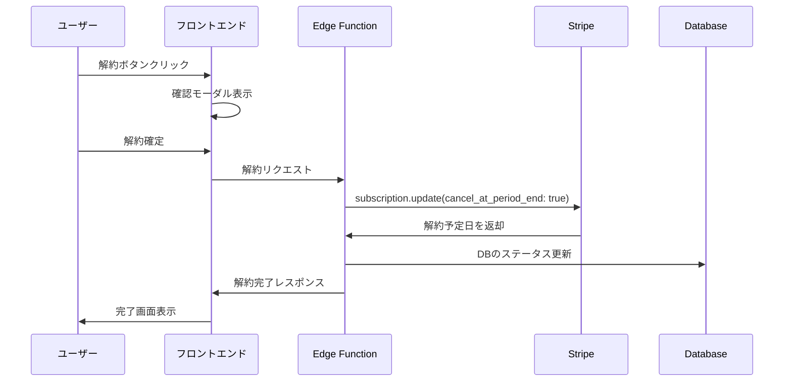

# ダウングレード機能仕様書

## 概要
プレミアムプランから無料プランへのダウングレード（解約）機能の詳細仕様を定義する。

作成日: 2025年8月13日  
バージョン: 1.0

---

## 1. 機能要件

### 1.1 基本要件
- プレミアム会員がいつでも解約できる
- 解約は請求期間終了時に適用（即座解約ではない）
- 解約予定の取り消しが可能
- 明確な解約プロセスと確認画面

### 1.2 法的要件
- 特定商取引法に基づく解約方法の明示
- 解約手続きの簡便性（2クリック以内）
- 解約理由の入力は任意

---

## 2. UI/UX設計

### 2.1 アクセス経路
```
マイページ（Dashboard）
└── プラン管理セクション
    └── 「プランを解約」ボタン
```

### 2.2 画面遷移
```
1. マイページ
   ↓
2. 解約確認画面
   ↓
3. 解約完了画面
```

### 2.3 UIコンポーネント

#### マイページでの表示
```typescript
// プレミアム会員の場合
<div className="subscription-section">
  <h3>現在のプラン</h3>
  <div className="plan-info">
    <span>プレミアムプラン</span>
    <span>月額 ¥2,980</span>
    <span>次回請求日: 2025年9月1日</span>
  </div>
  <button className="cancel-button">プランを解約</button>
</div>
```

#### 解約確認画面
```typescript
<Modal>
  <h2>プレミアムプランを解約しますか？</h2>
  
  <div className="warning-box">
    <p>⚠️ 解約にあたってのご注意</p>
    <ul>
      <li>2025年9月1日まではプレミアム機能をご利用いただけます</li>
      <li>解約後は月5回の利用制限に戻ります</li>
      <li>作成済みのデータは引き続き閲覧可能です</li>
    </ul>
  </div>
  
  <div className="reason-section">
    <label>解約理由をお聞かせください（任意）</label>
    <select>
      <option>選択してください</option>
      <option>料金が高い</option>
      <option>機能を使いこなせない</option>
      <option>他のサービスを利用する</option>
      <option>一時的に利用を停止</option>
      <option>その他</option>
    </select>
  </div>
  
  <div className="buttons">
    <button className="cancel">キャンセル</button>
    <button className="confirm">解約する</button>
  </div>
</Modal>
```

---

## 3. 技術仕様

### 3.1 フロントエンド実装

#### 新規作成ファイル
- `/src/pages/SubscriptionSettings.tsx`
- `/src/components/CancelSubscriptionModal.tsx`

#### API呼び出し
```typescript
// 解約処理
const cancelSubscription = async () => {
  const { data, error } = await supabase.functions.invoke('cancel-subscription', {
    body: {
      reason: selectedReason, // 任意
      feedback: feedbackText  // 任意
    }
  });
  
  if (error) {
    // エラーハンドリング
  } else {
    // 成功処理
  }
};
```

### 3.2 バックエンド実装

#### Supabase Edge Function: cancel-subscription
```typescript
import { serve } from 'https://deno.land/std@0.168.0/http/server.ts'
import Stripe from 'https://esm.sh/stripe@11.1.0?target=deno'

serve(async (req) => {
  const { reason, feedback } = await req.json()
  const authHeader = req.headers.get('Authorization')
  
  // 1. ユーザー認証
  const user = await authenticateUser(authHeader)
  
  // 2. サブスクリプション取得
  const subscription = await getActiveSubscription(user.id)
  
  // 3. Stripeで解約予定を設定
  const stripe = new Stripe(Deno.env.get('STRIPE_SECRET_KEY'))
  const updatedSubscription = await stripe.subscriptions.update(
    subscription.stripe_subscription_id,
    {
      cancel_at_period_end: true
    }
  )
  
  // 4. DBを更新
  await updateSubscriptionStatus(user.id, {
    cancel_at_period_end: true,
    cancel_at: updatedSubscription.current_period_end,
    cancellation_reason: reason,
    cancellation_feedback: feedback
  })
  
  return new Response(
    JSON.stringify({
      success: true,
      cancel_at: updatedSubscription.current_period_end
    }),
    { headers: { 'Content-Type': 'application/json' } }
  )
})
```

### 3.3 データベース変更

#### subscriptionsテーブルに追加するカラム
```sql
ALTER TABLE subscriptions ADD COLUMN cancel_at_period_end BOOLEAN DEFAULT FALSE;
ALTER TABLE subscriptions ADD COLUMN cancel_at TIMESTAMP;
ALTER TABLE subscriptions ADD COLUMN cancellation_reason TEXT;
ALTER TABLE subscriptions ADD COLUMN cancellation_feedback TEXT;
ALTER TABLE subscriptions ADD COLUMN cancelled_at TIMESTAMP;
```

---

## 4. 処理フロー

### 4.1 解約処理


### 4.2 解約取り消し処理
```typescript
// 解約予定の取り消し
const reactivateSubscription = async () => {
  const { data, error } = await supabase.functions.invoke('reactivate-subscription')
  // Stripeのcancel_at_period_endをfalseに戻す
};
```

---

## 5. エラーハンドリング

### 5.1 想定されるエラー
| エラーケース | 対処方法 |
|-------------|----------|
| ネットワークエラー | リトライボタン表示 |
| 既に解約済み | 状態を同期して画面更新 |
| Stripe APIエラー | サポート連絡先を表示 |
| 認証エラー | 再ログインを促す |

### 5.2 エラーメッセージ
```typescript
const errorMessages = {
  network: '通信エラーが発生しました。もう一度お試しください。',
  already_cancelled: 'すでに解約手続きが完了しています。',
  stripe_error: '決済処理でエラーが発生しました。サポートまでご連絡ください。',
  auth_error: 'セッションが切れました。再度ログインしてください。'
};
```

---

## 6. テスト要件

### 6.1 単体テスト
- [ ] 解約ボタンの表示条件
- [ ] モーダルの開閉
- [ ] API呼び出しのモック
- [ ] エラー表示

### 6.2 統合テスト
- [ ] 解約フロー全体（Stripeテストモード）
- [ ] 解約後の画面表示
- [ ] 解約予定の表示
- [ ] 解約取り消し

### 6.3 E2Eテスト
- [ ] ユーザー視点での解約フロー
- [ ] 解約後の機能制限確認
- [ ] 再加入フロー

---

## 7. セキュリティ考慮事項

### 7.1 認証・認可
- JWT トークンによる本人確認
- プレミアム会員のみ解約可能
- CSRF対策

### 7.2 データ保護
- 解約理由の匿名化
- 個人情報の適切な処理

---

## 8. 実装優先度

1. **Phase 1（MVP）**: 基本的な解約機能
   - 解約ボタン
   - 確認画面
   - Stripe連携
   
2. **Phase 2**: 改善機能
   - 解約理由の収集
   - 解約予定の取り消し
   - 解約前の代替案提示

3. **Phase 3**: 分析機能
   - 解約率のダッシュボード
   - 解約理由の分析
   - リテンション施策

---

## 9. 関連ドキュメント

- [Stripe Subscription API](https://stripe.com/docs/api/subscriptions)
- [特定商取引法ガイドライン](https://www.no-trouble.caa.go.jp/)
- [退会機能仕様書](./02_退会機能仕様書.md)

---

*このドキュメントは随時更新されます。*