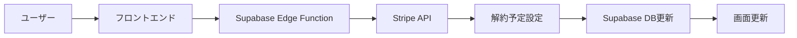

# 統合実装仕様書：プラン解約機能

作成日: 2025年8月13日  
バージョン: 2.1（課題管理版）  
推定総工数: 3時間

---

## 📋 実装課題管理シート

### 🔴 現在のステータス: 未着手

### 実装タスク一覧

| No | タスク名 | カテゴリ | 工数 | 担当 | ステータス | 開始日 | 完了日 | 備考 |
|----|----------|---------|------|------|------------|--------|--------|------|
| 01 | Supabase Edge Function作成 | Backend | 45分 | - | 🔴未着手 | - | - | cancel-subscription/index.ts |
| 02 | CORS設定追加 | Backend | 5分 | - | 🔴未着手 | - | - | Edge Functionに追加 |
| 03 | Stripe API連携実装 | Backend | 15分 | - | 🔴未着手 | - | - | cancel_at_period_end設定 |
| 04 | データベースマイグレーション | Backend | 15分 | - | 🔴未着手 | - | - | cancel_at, cancel_at_period_end追加 |
| 05 | RLSポリシー設定 | Backend | 10分 | - | 🔴未着手 | - | - | subscriptionsテーブル |
| 06 | Edge Functionデプロイ | Backend | 10分 | - | 🔴未着手 | - | - | supabase functions deploy |
| 07 | 環境変数設定（Stripeキー） | Backend | 5分 | - | 🔴未着手 | - | - | STRIPE_SECRET_KEY設定 |
| 08 | subscriptionHelpers.ts作成 | Frontend | 15分 | - | 🔴未着手 | - | - | 残日数計算関数 |
| 09 | CancelSubscriptionModal作成 | Frontend | 30分 | - | 🔴未着手 | - | - | 解約確認モーダル |
| 10 | PremiumPlan.tsx更新 | Frontend | 30分 | - | 🔴未着手 | - | - | 解約ボタン追加 |
| 11 | Layout.tsx更新 | Frontend | 15分 | - | 🔴未着手 | - | - | ヘッダーに残日数表示 |
| 12 | エラーハンドリング実装 | Frontend | 15分 | - | 🔴未着手 | - | - | エラーメッセージ処理 |
| 13 | Stripeテストモード確認 | Test | 5分 | - | 🔴未着手 | - | - | ダッシュボード確認 |
| 14 | 解約フロー動作テスト | Test | 15分 | - | 🔴未着手 | - | - | E2Eテスト |
| 15 | 残日数表示テスト | Test | 10分 | - | 🔴未着手 | - | - | 計算ロジック確認 |
| 16 | エラーケーステスト | Test | 10分 | - | 🔴未着手 | - | - | 異常系テスト |

### ステータス凡例
- 🔴未着手: タスク未開始
- 🟡作業中: 現在作業中
- 🟢完了: タスク完了
- ⏸️保留: 何らかの理由で保留中
- ❌ブロック: 他タスク待ちなどでブロック

---

## 📊 進捗サマリー

| カテゴリ | 総タスク | 完了 | 作業中 | 未着手 | 進捗率 |
|---------|----------|------|--------|--------|--------|
| Backend | 7 | 0 | 0 | 7 | 0% |
| Frontend | 5 | 0 | 0 | 5 | 0% |
| Test | 4 | 0 | 0 | 4 | 0% |
| **合計** | **16** | **0** | **0** | **16** | **0%** |

---

## 📝 タスク詳細仕様

### Phase 1: バックエンド基盤（1時間30分）

#### No.01: Supabase Edge Function作成
**詳細内容:**
- ファイル: `supabase/functions/cancel-subscription/index.ts`
- JWT認証処理の実装
- Stripeサブスクリプション更新ロジック
- データベース更新処理
- エラーハンドリング

**受入条件:**
- [ ] 認証が正しく動作する
- [ ] Stripe APIが呼び出せる
- [ ] DBが更新される
- [ ] エラーレスポンスが適切

#### No.02: CORS設定追加
**詳細内容:**
- CORSヘッダーの追加
- OPTIONS メソッドの処理
- Access-Control-Allow-Origin設定

**受入条件:**
- [ ] ブラウザからアクセス可能
- [ ] CORS エラーが発生しない

#### No.03: Stripe API連携実装
**詳細内容:**
- `stripe.subscriptions.update()`実装
- `cancel_at_period_end: true`設定
- メタデータ追加（キャンセル日時、ユーザー情報）

**受入条件:**
- [ ] Stripeで解約予定が設定される
- [ ] 解約日が正しく返される

#### No.04: データベースマイグレーション
**詳細内容:**
```sql
ALTER TABLE subscriptions 
ADD COLUMN cancel_at_period_end BOOLEAN DEFAULT FALSE,
ADD COLUMN cancel_at TIMESTAMP WITH TIME ZONE;
```

**受入条件:**
- [ ] カラムが追加される
- [ ] 既存データに影響なし

#### No.05: RLSポリシー設定
**詳細内容:**
- subscriptionsテーブルのRLS有効化
- ユーザーが自分のデータのみ参照可能

**受入条件:**
- [ ] RLSが有効
- [ ] 他ユーザーのデータが見えない

#### No.06: Edge Functionデプロイ
**詳細内容:**
```bash
supabase functions deploy cancel-subscription
```

**受入条件:**
- [ ] デプロイ成功
- [ ] エンドポイントが有効

#### No.07: 環境変数設定
**詳細内容:**
- STRIPE_SECRET_KEY設定
- SUPABASE_SERVICE_ROLE_KEY確認

**受入条件:**
- [ ] 環境変数が設定される
- [ ] APIキーが有効

### Phase 2: フロントエンド実装（1時間15分）

#### No.08: subscriptionHelpers.ts作成
**詳細内容:**
```typescript
// 残日数計算関数
export const calculateRemainingDays = (cancelAt: string | null): number
// フォーマット関数
export const formatRemainingTime = (days: number): string
export const formatCancelDate = (cancelAt: string): string
```

**受入条件:**
- [ ] 計算が正確
- [ ] タイムゾーン考慮
- [ ] エッジケース処理

#### No.09: CancelSubscriptionModal作成
**詳細内容:**
- モーダルコンポーネント
- 警告メッセージ表示
- キャンセル/確認ボタン
- ローディング状態

**受入条件:**
- [ ] モーダルが開閉する
- [ ] ESCキーで閉じる
- [ ] ローディング表示

#### No.10: PremiumPlan.tsx更新
**詳細内容:**
- 解約ボタン追加
- 解約予定の表示
- API呼び出し処理
- 成功/エラー処理

**受入条件:**
- [ ] ボタンが表示される
- [ ] 解約処理が動作
- [ ] 状態が更新される

#### No.11: Layout.tsx更新
**詳細内容:**
- ヘッダーに残日数表示
- 「プレミアム会員（あと30日）」形式
- リアルタイム計算

**受入条件:**
- [ ] 残日数が表示される
- [ ] 表示が正確

#### No.12: エラーハンドリング実装
**詳細内容:**
- エラーメッセージマップ
- ユーザーフレンドリーな表示
- リトライ機能

**受入条件:**
- [ ] エラーが適切に表示
- [ ] リトライが可能

### Phase 3: テスト（15分）

#### No.13-16: 各種テスト
**詳細内容:**
- Stripeテストモード確認
- E2Eフローテスト
- 残日数計算テスト
- エラーケーステスト

**受入条件:**
- [ ] すべてのテストがパス
- [ ] 本番相当の動作確認

---

## 🎯 実装目標

- **ユーザーがリアルタイムで解約手続きが可能**
- **解約予定日まで機能利用可能**
- **残り日数をフロントエンドで動的計算**
- **実装工数：3時間**

---

## 📊 システム設計

### データフロー



### データベース設計

```sql
-- subscriptionsテーブル
CREATE TABLE subscriptions (
  id UUID PRIMARY KEY DEFAULT gen_random_uuid(),
  user_id UUID REFERENCES auth.users(id) ON DELETE CASCADE,
  stripe_customer_id TEXT NOT NULL,
  stripe_subscription_id TEXT UNIQUE NOT NULL,
  status TEXT NOT NULL, -- 'active', 'canceled', 'past_due'
  current_period_start TIMESTAMP WITH TIME ZONE,
  current_period_end TIMESTAMP WITH TIME ZONE,
  cancel_at_period_end BOOLEAN DEFAULT FALSE,
  cancel_at TIMESTAMP WITH TIME ZONE, -- 解約予定日時
  created_at TIMESTAMP WITH TIME ZONE DEFAULT NOW(),
  updated_at TIMESTAMP WITH TIME ZONE DEFAULT NOW()
);
```

### 残日数計算ロジック

```typescript
// フロントエンドでの計算（キャッシュなし、都度計算）
export const calculateRemainingDays = (cancelAt: string | null): number => {
  if (!cancelAt) return 0
  
  const cancelDate = new Date(cancelAt)
  const now = new Date()
  
  // UTCで計算して日本時間に調整
  const diffMs = cancelDate.getTime() - now.getTime()
  const diffDays = Math.ceil(diffMs / (1000 * 60 * 60 * 24))
  
  return diffDays > 0 ? diffDays : 0
}
```

---

## 🛠 実装手順

### Step 1: バックエンド実装（1.5時間）

#### 1-1. Supabase Edge Function作成（45分）

```typescript
// supabase/functions/cancel-subscription/index.ts
import { serve } from 'https://deno.land/std@0.168.0/http/server.ts'
import { createClient } from 'https://esm.sh/@supabase/supabase-js@2'
import Stripe from 'https://esm.sh/stripe@11.1.0?target=deno'

const corsHeaders = {
  'Access-Control-Allow-Origin': '*',
  'Access-Control-Allow-Headers': 'authorization, x-client-info, apikey, content-type',
}

serve(async (req) => {
  // CORS対応
  if (req.method === 'OPTIONS') {
    return new Response('ok', { headers: corsHeaders })
  }

  const stripe = new Stripe(Deno.env.get('STRIPE_SECRET_KEY')!, {
    apiVersion: '2023-10-16',
  })

  const supabaseUrl = Deno.env.get('SUPABASE_URL')!
  const supabaseServiceKey = Deno.env.get('SUPABASE_SERVICE_ROLE_KEY')!

  try {
    // 認証ヘッダー取得
    const authHeader = req.headers.get('Authorization')
    if (!authHeader) {
      throw new Error('認証が必要です')
    }

    // Supabaseクライアント作成
    const supabase = createClient(supabaseUrl, supabaseServiceKey)
    
    // JWTからユーザー情報取得
    const token = authHeader.replace('Bearer ', '')
    const { data: { user }, error: userError } = await supabase.auth.getUser(token)
    
    if (userError || !user) {
      throw new Error('ユーザー認証に失敗しました')
    }

    // アクティブなサブスクリプション取得
    const { data: subscription, error: subError } = await supabase
      .from('subscriptions')
      .select('*')
      .eq('user_id', user.id)
      .eq('status', 'active')
      .single()

    if (subError || !subscription) {
      throw new Error('アクティブなプランが見つかりません')
    }

    // 既に解約予定の場合はエラー
    if (subscription.cancel_at_period_end) {
      throw new Error('すでに解約予定です')
    }

    // Stripeで解約予定を設定
    const stripeSubscription = await stripe.subscriptions.update(
      subscription.stripe_subscription_id,
      { 
        cancel_at_period_end: true,
        metadata: {
          canceled_by: user.email,
          canceled_at: new Date().toISOString()
        }
      }
    )

    // 解約予定日をJSTで計算
    const cancelAt = new Date(stripeSubscription.current_period_end * 1000)
    
    // Supabaseのデータを更新
    const { error: updateError } = await supabase
      .from('subscriptions')
      .update({
        cancel_at_period_end: true,
        cancel_at: cancelAt.toISOString(),
        updated_at: new Date().toISOString()
      })
      .eq('id', subscription.id)

    if (updateError) {
      throw new Error('データベース更新に失敗しました')
    }

    // 残り日数を計算
    const remainingDays = Math.ceil(
      (cancelAt.getTime() - Date.now()) / (1000 * 60 * 60 * 24)
    )

    // レスポンス
    return new Response(
      JSON.stringify({
        success: true,
        cancel_date: cancelAt.toISOString(),
        remaining_days: remainingDays,
        message: `${cancelAt.toLocaleDateString('ja-JP')}まで全機能をご利用いただけます`
      }),
      { 
        headers: { 
          ...corsHeaders,
          'Content-Type': 'application/json' 
        } 
      }
    )

  } catch (error) {
    console.error('Cancel subscription error:', error)
    
    return new Response(
      JSON.stringify({ 
        error: error.message || '解約処理中にエラーが発生しました'
      }),
      { 
        status: 400,
        headers: { 
          ...corsHeaders,
          'Content-Type': 'application/json' 
        }
      }
    )
  }
})
```

#### 1-2. デプロイコマンド（15分）

```bash
# Edge Functionのデプロイ
supabase functions deploy cancel-subscription

# 環境変数の設定（本番環境）
supabase secrets set STRIPE_SECRET_KEY=sk_live_xxxxx
```

#### 1-3. データベースマイグレーション（30分）

```sql
-- migration: add_cancel_fields.sql
ALTER TABLE subscriptions 
ADD COLUMN IF NOT EXISTS cancel_at_period_end BOOLEAN DEFAULT FALSE;

ALTER TABLE subscriptions 
ADD COLUMN IF NOT EXISTS cancel_at TIMESTAMP WITH TIME ZONE;

-- RLSポリシー
ALTER TABLE subscriptions ENABLE ROW LEVEL SECURITY;

CREATE POLICY "Users can view own subscription" ON subscriptions
  FOR SELECT USING (auth.uid() = user_id);
```

### Step 2: フロントエンド実装（1.5時間）

#### 2-1. 解約モーダルコンポーネント作成（30分）

```typescript
// components/CancelSubscriptionModal.tsx
import React from 'react';
import { X, AlertTriangle } from 'lucide-react';

interface Props {
  isOpen: boolean;
  onClose: () => void;
  onConfirm: () => void;
  cancelDate: string;
  remainingDays: number;
  isLoading: boolean;
}

const CancelSubscriptionModal: React.FC<Props> = ({
  isOpen,
  onClose,
  onConfirm,
  cancelDate,
  remainingDays,
  isLoading
}) => {
  if (!isOpen) return null;

  return (
    <div className="fixed inset-0 bg-black bg-opacity-50 flex items-center justify-center z-50">
      <div className="bg-white rounded-lg p-6 max-w-md w-full mx-4">
        <div className="flex justify-between items-center mb-4">
          <h2 className="text-xl font-bold text-gray-900">
            プランを解約しますか？
          </h2>
          <button 
            onClick={onClose}
            className="text-gray-400 hover:text-gray-600"
            disabled={isLoading}
          >
            <X className="h-5 w-5" />
          </button>
        </div>

        <div className="bg-amber-50 border border-amber-200 rounded-lg p-4 mb-6">
          <div className="flex items-start">
            <AlertTriangle className="h-5 w-5 text-amber-600 mt-0.5 mr-2" />
            <div className="text-sm text-amber-800">
              <p className="font-semibold mb-2">解約にあたってのご注意</p>
              <ul className="space-y-1">
                <li>• {cancelDate}まで全機能をご利用いただけます</li>
                <li>• 残り{remainingDays}日間は無制限で利用可能です</li>
                <li>• 解約後は月5回の利用制限に戻ります</li>
                <li>• 作成済みのデータは引き続き閲覧できます</li>
                <li>• 日割り返金はございません</li>
              </ul>
            </div>
          </div>
        </div>

        <div className="flex gap-3">
          <button
            onClick={onClose}
            className="flex-1 px-4 py-2 border border-gray-300 text-gray-700 rounded-lg hover:bg-gray-50 transition-colors"
            disabled={isLoading}
          >
            キャンセル
          </button>
          <button
            onClick={onConfirm}
            className="flex-1 px-4 py-2 bg-red-600 text-white rounded-lg hover:bg-red-700 transition-colors disabled:opacity-50"
            disabled={isLoading}
          >
            {isLoading ? '処理中...' : '解約する'}
          </button>
        </div>
      </div>
    </div>
  );
};

export default CancelSubscriptionModal;
```

---

## 📝 テスト手順

### 1. 開発環境でのテスト

```bash
# 1. Stripeテストモードの確認
# Stripe Dashboardでテストモードに切り替え

# 2. Edge Functionのローカルテスト
supabase functions serve cancel-subscription

# 3. テストシナリオ
- [ ] プレミアム会員で解約ボタンが表示される
- [ ] モーダルの開閉が正常に動作
- [ ] 解約処理が成功する
- [ ] 残り日数が正しく表示される
- [ ] 解約予定の表示が正しい
- [ ] エラーハンドリングが適切
```

### 2. Stripeテストカード

```
成功：4242 4242 4242 4242
失敗：4000 0000 0000 0002
```

---

## 🚨 エラーハンドリング

### エラーケースと対応

```typescript
const errorMessages = {
  'no_active_subscription': 'アクティブなプランが見つかりません',
  'already_canceled': 'すでに解約済みです',
  'network_error': 'ネットワークエラーです。再度お試しください',
  'auth_error': 'セッションが切れました。再ログインしてください',
  'stripe_error': '決済処理エラーです。時間をおいて再試行してください',
  'default': '予期しないエラーが発生しました。サポートまでご連絡ください'
};
```

---

## ⚠️ 重要な注意事項

1. **Stripe Webhook設定**
   - 本番環境では必ずWebhookを設定
   - customer.subscription.deleted イベントを監視

2. **タイムゾーン処理**
   - DBはUTC保存
   - 表示は日本時間（JST）に変換

3. **セキュリティ**
   - JWT認証必須
   - RLSポリシー適用
   - レート制限実装

4. **法的要件**
   - 解約方法の明示（特商法）
   - 解約手続きは2クリック以内
   - 日割り返金なしの明記

---

## 🔄 今後の改善（Phase 2）

### 優先度順

1. **解約の取り消し機能**（2時間）
   - reactivate-subscription Edge Function
   - UIに「解約を取り消す」ボタン

2. **解約理由の収集**（1時間）
   - モーダルにアンケート追加
   - 分析ダッシュボード

3. **リテンション施策**（3時間）
   - 解約前の割引オファー
   - 一時停止オプション

4. **メール通知**（2時間）
   - 解約確認メール
   - 解約予定リマインダー

---

## 📚 参考資料

- [Stripe Subscriptions API](https://stripe.com/docs/api/subscriptions)
- [Supabase Edge Functions](https://supabase.com/docs/guides/functions)
- [特定商取引法ガイドライン](https://www.no-trouble.caa.go.jp/)

---

*このドキュメントは実装の全体像を示しています。*  
*実装時は各ステップを順番に進めてください。*