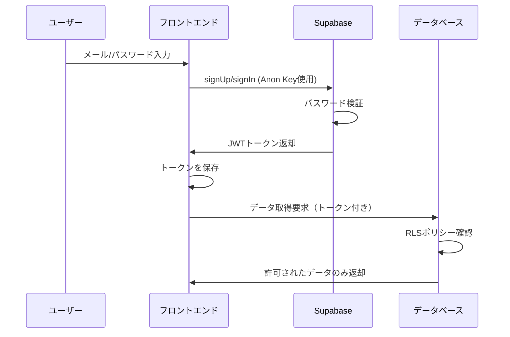

# Supabase認証とセキュリティの仕組み

## 1. Supabaseとは

Supabaseは、オープンソースのFirebase代替サービスです。以下の機能を提供：
- **認証（Auth）**: ユーザー管理とログイン機能
- **データベース（PostgreSQL）**: データの保存
- **リアルタイム**: データの同期
- **ストレージ**: ファイルの保存

## 2. 3種類のキーとその役割

### 🔑 キーの種類

| キー名 | 公開可否 | 用途 | 権限レベル |
|--------|----------|------|------------|
| **URL** | ✅ 公開OK | APIエンドポイント | - |
| **Anon Key** | ✅ 公開OK | フロントエンドで使用 | 制限付き |
| **Service Key** | ❌ 秘密 | バックエンドで使用 | 管理者権限 |

### 実際の形式
```javascript
// URL（公開OK）
https://xxxxx.supabase.co

// Anon Key（公開OK）
eyJhbGciOiJIUzI1NiIsInR5cCI6IkpXVCJ9.eyJpc3MiOiJzdXBhYmFzZS...

// Service Key（秘密！）
eyJhbGciOiJIUzI1NiIsInR5cCI6IkpXVCJ9.eyJpc3MiOiJzdXBhYmFzZS...
```

## 3. 認証フローの仕組み

### 📋 ユーザー登録・ログインの流れ



### 🔐 実装例

```javascript
// 1. Supabaseクライアントの初期化（Anon Key使用）
import { createClient } from '@supabase/supabase-js'

const supabase = createClient(
  'https://xxxxx.supabase.co',     // URL（公開OK）
  'eyJhbGc...'                      // Anon Key（公開OK）
)

// 2. ユーザー登録
const { user, error } = await supabase.auth.signUp({
  email: 'user@example.com',
  password: 'SecurePassword123!'
})

// 3. ログイン
const { user, session } = await supabase.auth.signInWithPassword({
  email: 'user@example.com',
  password: 'SecurePassword123!'
})

// 4. 認証されたユーザーとしてデータ取得
const { data } = await supabase
  .from('properties')
  .select('*')
// → 自分のデータのみ取得できる（RLSにより保護）
```

## 4. Row Level Security (RLS) の仕組み

### 🛡️ RLSとは
データベースレベルでアクセス制御を行う仕組みです。

### 実装例
```sql
-- propertiesテーブルのRLSを有効化
ALTER TABLE properties ENABLE ROW LEVEL SECURITY;

-- ポリシー：ユーザーは自分の物件のみ見れる
CREATE POLICY "Users can view own properties" 
ON properties FOR SELECT 
USING (auth.uid() = user_id);

-- ポリシー：ユーザーは自分の物件のみ作成できる
CREATE POLICY "Users can insert own properties" 
ON properties FOR INSERT 
WITH CHECK (auth.uid() = user_id);
```

### 🔍 動作の仕組み
```javascript
// ユーザーAがログイン中
const { data } = await supabase.from('properties').select('*')
// SQL実行時に自動的に WHERE user_id = 'ユーザーAのID' が追加される

// 結果：ユーザーAの物件のみ取得
[
  { id: 1, user_id: 'userA', name: 'Aさんの物件1' },
  { id: 2, user_id: 'userA', name: 'Aさんの物件2' }
]
// ユーザーBの物件は見えない！
```

## 5. なぜAnon Keyを公開しても安全なのか

### ✅ 安全な理由

1. **Anon Key単体では何もできない**
   - データベース接続のみ許可
   - 認証なしではデータアクセス不可

2. **ユーザー認証が必須**
   - メール/パスワードは各ユーザーが管理
   - 認証後にJWTトークンが発行される

3. **RLSによる保護**
   - データベースレベルで制御
   - SQLインジェクションも防げる

### ❌ Service Keyを公開すると危険な理由

```javascript
// Service Keyを使うと...
const supabase = createClient(url, serviceKey)

// RLSを無視して全データにアクセス可能！
const { data } = await supabase
  .from('properties')
  .select('*')
// → 全ユーザーのデータが取得できてしまう！
```

## 6. 環境変数の設定方法

### フロントエンド（Xserver）
```javascript
// ビルド時に埋め込まれる（公開される）
VITE_SUPABASE_URL=https://xxxxx.supabase.co
VITE_SUPABASE_ANON_KEY=eyJhbGc...
```

### バックエンド（Render）※必要な場合のみ
```javascript
// 環境変数として設定（公開されない）
SUPABASE_SERVICE_KEY=eyJhbGc...
```

## 7. セキュリティのベストプラクティス

### ✅ やるべきこと
1. RLSを必ず有効にする
2. 適切なポリシーを設定する
3. Service Keyは絶対に公開しない
4. HTTPSを使用する

### ❌ やってはいけないこと
1. Service Keyをフロントエンドで使用
2. RLSを無効にしたまま公開
3. 認証なしでのデータアクセスを許可
4. パスワードをコードに直接記載

## まとめ

Supabaseのセキュリティは「多層防御」で成り立っています：

1. **Anon Key** → 接続のみ許可（データアクセスは不可）
2. **ユーザー認証** → 個人を特定
3. **RLS** → データレベルでアクセス制御

この3つが組み合わさることで、Anon Keyを公開しても安全にアプリケーションを運用できます。