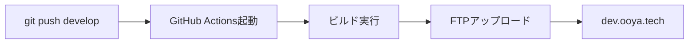
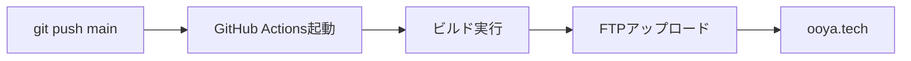

# GitHub Secrets設定ガイド

## 📝 Xserver FTP情報の確認方法

### 1. Xserverサーバーパネルにログイン
1. [Xserverアカウント](https://secure.xserver.ne.jp/xapanel/login/xserver/) にログイン
2. 「サーバー管理」をクリック

### 2. FTP情報を確認
- **サーバー情報** → 「アカウント情報」
  - ホスト名: `sv***.xserver.jp` 形式
  - ユーザー名: サーバーID
  - パスワード: サーバーパスワード

## 🔐 GitHub Secretsの設定手順

### ステップ1: リポジトリのSettingsを開く
```
GitHubリポジトリ → Settings → Secrets and variables → Actions
```

### ステップ2: 必要なSecretsを追加

#### 共通のFTP接続情報
```
FTP_HOST=sv123.xserver.jp
FTP_USERNAME=xs123456
FTP_PASSWORD=your-ftp-password
FTP_PORT=21
```

#### 開発環境用の環境変数
```
DEV_SUPABASE_URL=https://your-dev-project.supabase.co
DEV_SUPABASE_ANON_KEY=your-dev-anon-key
DEV_API_BASE_URL=https://dev-api.example.com
```

#### 本番環境用の環境変数（後で追加）
```
PROD_SUPABASE_URL=https://your-prod-project.supabase.co
PROD_SUPABASE_ANON_KEY=your-prod-anon-key
PROD_API_BASE_URL=https://api.example.com
```

## ⚠️ 重要な注意事項

### やってはいけないこと
- ❌ スペースや改行を含めない
- ❌ クォート（'や"）で囲まない
- ❌ 値の前後に空白を入れない

### 正しい例
```
✅ 正しい: FTP_HOST → sv123.xserver.jp
❌ 間違い: FTP_HOST → "sv123.xserver.jp"
❌ 間違い: FTP_HOST → sv123.xserver.jp 
```

## 🧪 設定の確認方法

### 1. テストデプロイ
```bash
# developブランチで小さな変更を加える
git checkout develop
echo "<!-- test -->" >> bolt_front/index.html
git add .
git commit -m "test: GitHub Actions deployment"
git push origin develop
```

### 2. Actionsタブで確認
1. GitHubリポジトリの「Actions」タブを開く
2. 「Deploy to Xserver (Development)」ワークフローを確認
3. 緑のチェックマーク ✅ が表示されれば成功

### 3. エラーが出た場合
- 🔴 **Authentication failed**: FTP情報を再確認
- 🔴 **Connection timeout**: FTP_HOSTとFTP_PORTを確認
- 🔴 **Permission denied**: サーバー側の権限を確認

## 📦 デプロイフロー

### develop → dev.ooya.tech


### main → ooya.tech（本番）


## 🔧 トラブルシューティング

### FTP接続できない場合
1. Xserverの「FTPアカウント設定」で接続制限を確認
2. 「すべて許可」に設定（GitHub ActionsのIPは動的なため）

### ファイルがアップロードされない場合
1. `server-dir`のパスを確認
2. Xserverのファイルマネージャーでディレクトリ構造を確認

### 環境変数が反映されない場合
1. Secretsの名前が正確か確認
2. ビルドログで環境変数が読み込まれているか確認